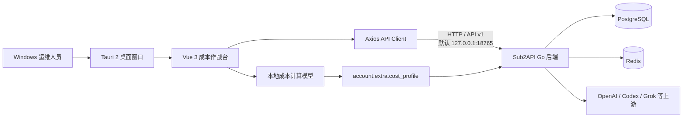

# Sub2API Cost Console 桌面成本作战台开发文档

> 文档版本：1.0  
> 桌面应用版本：0.2.12
> 适用平台：Windows 10/11 x64  
> 上游项目：[`Wei-Shaw/sub2api`](https://github.com/Wei-Shaw/sub2api)  
> 本项目：[`rw0104/sub2api-cost-console`](https://github.com/rw0104/sub2api-cost-console)

本文档面向需要继续开发、部署、调试和维护 Sub2API Cost Console 的开发者。项目在 Sub2API 管理端基础上增加了 Windows 桌面壳、三套成本运营面板、号码采购成本模型以及桌面端连接适配。

---

## 1. 项目目标

Sub2API Cost Console 用于集中观察上游账号、OAuth 号池、API 产出和采购成本。它不是独立的 API 中转后端，而是复用 Sub2API 后端、数据库、Redis、登录体系和管理 API 的桌面运维客户端。

核心目标：

- 将上游资产质量、额度、请求、Token、失败率、TTFT 和切号信息集中到单个桌面窗口。
- 提供资产总览、上游排行、OAuth 号池三套运营工作区。
- 号码加入系统时立即开始累计采购成本。
- 支持按小时、日、周、月和一次性费用计费。
- 同时展示人民币采购成本与 API 美元产出。
- 复用原有 Sub2API 账号管理、探测、仪表盘和 Ops 监控接口。
- 使用 Tauri 2 生成 Windows 桌面可执行文件。

非目标：

- 当前版本不会把 PostgreSQL、Redis 和 Go 后端嵌入桌面 EXE。
- 当前版本不替代 Sub2API 原有网页管理端。
- 当前版本不提供自动购买、自动续费或支付结算能力。
- 当前版本生成免安装 EXE，尚未默认启用 NSIS/MSI 安装器和代码签名。

---

## 2. 整体架构



分层说明：

| 层 | 技术 | 责任 |
|---|---|---|
| 桌面宿主 | Tauri 2、Rust、WebView2 | 创建窗口、加载前端资源、打包 EXE、提供原生窗口能力 |
| 展示层 | Vue 3、TypeScript、Tailwind CSS | 三套面板、筛选、表格、图表和交互 |
| 图表层 | Chart.js、vue-chartjs | API 产出、成本、质量趋势和预测曲线 |
| 数据接入 | Axios、现有 admin API | 登录、账号、今日统计、仪表盘和 Ops 数据 |
| 成本域 | TypeScript 纯函数 | 套餐识别、费率折算、累计成本、币种转换 |
| 服务端 | Go、Gin、Ent | 鉴权、账号、统计、调度、数据持久化 |
| 基础设施 | PostgreSQL、Redis | 业务数据、缓存、队列和限流 |

---

## 3. 技术栈与环境要求

### 3.1 前端与桌面端

- Node.js 20 或更高版本。
- pnpm 9。项目锁文件使用 pnpm 9，建议始终通过 `corepack pnpm@9` 执行。
- Vue 3.4。
- TypeScript 5.6。
- Vite 5。
- Tauri 2。
- Rust stable x86_64-pc-windows-msvc。
- Visual Studio 2022 C++ Build Tools。
- Microsoft Edge WebView2 Runtime。

### 3.2 后端

- Go 1.26.5，与 `backend/go.mod` 保持一致。
- PostgreSQL 15+，开发环境推荐 PostgreSQL 16。
- Redis 7+。
- 可访问需要接入的上游 API。

### 3.3 Windows 环境检查

```powershell
node --version
corepack pnpm@9 --version
rustc --version
cargo --version
go version
```

检查 Tauri 环境：

```powershell
cd frontend
corepack pnpm@9 exec tauri info
```

输出中应显示 WebView2、MSVC、Rust 和 Node 均可用。

---

## 4. 关键目录

```text
sub2api-cost-console/
├─ backend/                              # Sub2API Go 后端
├─ deploy/                               # Docker Compose 与部署配置
├─ frontend/
│  ├─ src/
│  │  ├─ api/
│  │  │  ├─ client.ts                   # Axios、鉴权刷新、桌面错误提示
│  │  │  └─ url.ts                      # Web/Tauri API 地址解析
│  │  ├─ features/cost-center/
│  │  │  ├─ model.ts                    # 成本域模型
│  │  │  ├─ useCostCenterData.ts        # 数据聚合 composable
│  │  │  ├─ components/
│  │  │  │  ├─ CostLineChart.vue        # 趋势折线图
│  │  │  │  └─ CostProfileInspector.vue # 成本配置检查器
│  │  │  └─ __tests__/model.spec.ts      # 成本模型单元测试
│  │  ├─ views/admin/CostCenterView.vue  # 三套桌面工作区
│  │  ├─ router/index.ts                 # 成本中心路由与桌面 hash 路由
│  │  └─ components/layout/AppSidebar.vue# 网页管理端入口
│  ├─ src-tauri/
│  │  ├─ Cargo.toml
│  │  ├─ Cargo.lock
│  │  ├─ build.rs
│  │  ├─ tauri.conf.json
│  │  ├─ capabilities/default.json
│  │  ├─ icons/
│  │  └─ src/main.rs
│  ├─ package.json
│  ├─ pnpm-lock.yaml
│  └─ vite.config.ts
└─ COST_CONSOLE_DEVELOPMENT.md
```

`frontend/src-tauri/target`、`frontend/src-tauri/gen` 和 `frontend/dist` 是构建产物，不应提交到 Git。

---

## 5. 三套工作区

桌面应用启动后进入 `/admin/cost-center?desktop=1`。页面顶部可切换三套工作区，也可以使用 `Ctrl/Cmd + 1/2/3`。

### 5.1 资产总览

对应 `overview` 工作区，重点回答“当前资产是否健康、每小时花多少钱、还能运行多久”。

主要指标：

- 综合质量分。
- 成功/失败请求数和失败率。
- 切号/恢复次数。
- TTFT P95。
- 当前 API 产出速率。
- 当前号码采购小时成本。
- 一小时综合成本。
- 最近一小时消耗和 API 产出。
- 当前可调度余额与预计可用时间。
- 资产、质量和上游占比环形图。
- API 消耗速率、实时成本和综合评分趋势。

### 5.2 上游排行

对应 `upstreams` 工作区，重点回答“哪个账号表现最好、成本最低、是否需要探测或调整”。

主要能力：

- Codex、Grok、全部平台筛选。
- 账号名称搜索。
- 账号状态、评分、优先级、加入时间。
- 采购小时成本与累计采购成本。
- 今日账号成本、API 产出、请求和 Token。
- 探测延迟、失败/切号/恢复信息。
- 分组展示。
- 点击探测账号。
- 打开成本检查器并保存自定义成本。
- 跳转到原有账号管理页面新增上游。

### 5.3 OAuth 号池

对应 `oauth` 工作区，重点回答“每种套餐有多少号码、采购了多少钱、实际产出是否覆盖成本”。

主要能力：

- 按 Codex、Grok 或全部平台筛选。
- OAuth 账号数、已产出账号数、净采购成本。
- 实时成本和预测成本。
- API 产出速率和剩余预期曲线。
- Free、K12、Plus、Pro、Team、Business、Other 分组统计。
- 正常、限流和错误账号分布。
- 采购成本、平均单价、当前产出、实时/预期/初始成本。
- 请求数和 Token 数。

### 5.4 通用交互

- 自动刷新间隔可选。
- `Ctrl/Cmd + R` 立即刷新数据。
- `F11` 切换桌面全屏。
- `Escape` 关闭成本配置检查器。
- 请求未完成时显示加载状态。
- Ops 功能被后端关闭时，基础成本面板仍然可用。

---

## 6. 成本模型

成本中心同时维护两类口径，不能混为一个算法：

| 口径 | 适用对象 | 主要实现 | 含义 |
|---|---|---|---|
| 固定采购成本 | OAuth、setup-token 等按套餐采购的账号 | `frontend/src/features/cost-center/model.ts` | 账号月费、周费或一次性采购款随时间摊销 |
| 按量模型成本 | API Key、官方 API、中转站及其他按量上游 | 后端 `PricingService`、`ModelPricingResolver`、`BillingService` | 按实际模型、Token、缓存、图片/按次价格和渠道倍率核算 |

`actual_cost` 表示 Sub2API 对用户侧的实际计费；`total_cost` 表示目录或渠道口径的标准成本；`account_stats_cost` 表示应用账号倍率后的上游账号成本。前端只聚合 `usage_logs` 中已经落账的值，不根据账号名称猜测费用。

### 6.1 固定采购成本的计费周期

```ts
type BillingCycle = 'hourly' | 'daily' | 'weekly' | 'monthly' | 'one_time'
```

折算小时数：

| 周期 | 小时数 |
|---|---:|
| hourly | 1 |
| daily | 24 |
| weekly | 168 |
| monthly | 730 |
| one_time | 不折算小时费率 |

### 6.2 默认订阅套餐成本

默认值以美元月成本保存，展示为人民币时再使用当前 USD/CNY 参考汇率换算：

| 套餐 | 默认月成本 |
|---|---:|
| Free | $0 |
| K12 | $0 |
| Plus | $20 |
| Pro | $100 |
| Team | $25 |
| Business | $25 |
| Unknown | $0 |

这些只是订阅账号的采购成本默认值，不是 OpenAI、DeepSeek、Claude 等模型的 Token 单价。需要调整时修改 `DEFAULT_MONTHLY_PRICES_USD`，同时更新单元测试和本文档；实际账单与地区差异应通过账号成本档案覆盖。

### 6.3 账号计费模式与套餐识别

账号类型先决定成本路径：

- `oauth`、`setup-token`：默认按固定订阅采购成本摊销。
- `apikey`、`upstream`、`bedrock`、`service_account`：按量模型成本；成本档案只表示可选固定开销，不替代 Token 计价。

固定订阅账号再依次检查以下套餐字段：

系统依次检查以下字段：

1. `account.extra.plan_type`
2. `account.extra.subscription_tier`
3. `account.credentials.plan_type`
4. `account.credentials.subscription_tier`
5. `account.credentials.plan`
6. `account.credentials.subscription_plan`
7. `account.credentials.tier`
8. `account.parent_plan_type`

名称会转为小写并去除多余分隔符，支持 `chatgpt_plus`、`plus_plan`、`education`、`edu` 等别名。

### 6.4 固定采购成本的开始时间

没有自定义成本配置时：

```text
started_at = account.created_at
```

因此号码或账号写入 Sub2API 后，会从加入时间立即开始累计成本。

自定义 `started_at` 不允许早于账号 `created_at`。未来时间不会提前产生费用。

### 6.5 固定采购成本公式

除一次性费用外：

```text
hourly_rate = amount / billing_cycle_hours
elapsed_hours = max(0, now - started_at) / 3,600,000
accrued_cost = hourly_rate × elapsed_hours
```

一次性费用：

```text
now < started_at  => accrued_cost = 0
now >= started_at => accrued_cost = amount
```

### 6.6 多厂商按量模型成本

按量计费不是 OpenAI 专用。后端对所有能够产生真实 `usage_logs` 的上游使用同一条解析链：

```text
渠道自定义价格/区间价
  → 每日自动同步的 LiteLLM 聚合目录
  → 安装包内置目录与代码兜底价
```

计价维度包括输入 Token、输出 Token、缓存创建、缓存读取、图片输入/输出、长上下文区间，以及按次或按图片档位。渠道还可以按模型通配符覆盖价格并叠加账号倍率。当前界面能够识别并归类 OpenAI、Anthropic/Claude、DeepSeek、Google/Gemini、xAI/Grok、Mistral、Meta/Llama、Alibaba/Qwen、Z.ai/GLM、Moonshot/Kimi、MiniMax、Cohere、Perplexity 和其他兼容中转。

远程自动价格源是 LiteLLM 社区聚合目录，不等同于逐家厂商官网的权威账单。自动任务默认每 10 分钟检查一次本地目录年龄，但自动下载间隔为 24 小时；管理员可手动立即同步。网络不可用时使用本地缓存和随安装包发布的离线目录。生产结算应优先使用渠道合同价或实际账单，并通过渠道自定义价格覆盖目录价。

中转站只有在响应中返回可归属到实际模型的完整 usage 时才能精确按 Token 核算。若缺少 usage、缓存拆分或真实上游模型，界面必须标记“价格缺失/历史回退”，不能制造精确成本。

### 6.7 币种换算

USD/CNY 参考汇率由 `exchangeRate.ts` 获取，并在 `localStorage` 缓存 12 小时。两条网络源和有效缓存均不可用时才回退到：

```text
1 USD = 7.2 CNY
```

回退常量为 `CNY_PER_USD`。界面同时展示汇率来源、价格日期和缓存时间，避免把兜底值误认为实时汇率。

### 6.8 固定成本档案的持久化结构

自定义成本保存到账号 `extra.cost_profile`：

```json
{
  "cost_profile": {
    "amount": 140,
    "currency": "CNY",
    "billing_cycle": "monthly",
    "started_at": "2026-08-04T12:00:00.000Z"
  }
}
```

保存时会合并当前 `account.extra`，避免主动丢弃已有字段。

### 6.9 输入校验

自定义配置只有满足以下条件才会被采用：

- `amount` 是有限数字且不小于 0。
- `currency` 是 `CNY` 或 `USD`。
- `billing_cycle` 属于允许集合。
- `started_at` 是有效时间。
- 开始时间不早于账号创建时间。

配置无效时会安全回退到套餐默认成本。

---

## 7. 数据接入与 API

数据聚合入口是 `useCostCenterData()`。每次刷新会并行请求账号、管理仪表盘和 Ops 快照，再批量加载账号今日统计。

### 7.1 使用的接口

| 用途 | 方法 | 路径 |
|---|---|---|
| 账号列表 | GET | `/api/v1/admin/accounts` |
| 批量今日统计 | POST | `/api/v1/admin/accounts/today-stats/batch` |
| 保存成本配置 | PUT | `/api/v1/admin/accounts/:id` |
| 账号连通性探测 | POST | `/api/v1/admin/accounts/:id/test` |
| 管理仪表盘快照 | GET | `/api/v1/admin/dashboard/snapshot-v2` |
| Ops 仪表盘快照 | GET | `/api/v1/admin/ops/dashboard/snapshot-v2` |

这些接口要求管理员登录。桌面应用复用现有 JWT、refresh token 和 `localStorage` 会话逻辑。

### 7.2 并行加载策略

```text
Promise.allSettled
├─ accounts.list
├─ dashboard.getSnapshotV2
└─ ops.getDashboardSnapshotV2
      └─ accounts.getBatchTodayStats（账号成功后）
```

采用 `Promise.allSettled` 的原因是 Ops 监控可能被关闭，Ops 请求失败不应导致整个成本面板不可用。

### 7.3 竞态控制

每次刷新递增 `requestSequence`。只有最后一次请求可以写入页面状态，避免用户快速切换时间范围时旧请求覆盖新请求。

### 7.4 时间范围

UI 支持：

- 本地自然日
- 最近 1 分钟、5 分钟、30 分钟
- 最近 1 小时、6 小时、24 小时
- 最近 7 天、1 个月

本地自然日使用用户时区的起止边界，不等同于滚动 24 小时。管理仪表盘使用 `start_date`、`end_date` 和 `granularity`，Ops 接口使用 `time_range`；上游内核不支持精确分钟参数时，桌面控制台从真实 `usage_logs` 聚合短窗口。

---

## 8. 桌面 API 地址解析

实现位于 `frontend/src/api/url.ts`。

解析优先级：

1. 构建环境变量 `VITE_API_BASE_URL`。
2. Tauri 运行时 `localStorage['sub2api.desktop.backendUrl']`。
3. Tauri 默认值 `http://127.0.0.1:18765/api/v1`。
4. 普通网页默认相对路径 `/api/v1`。

这样可以保证：

- 网页版继续使用同源 API。
- 桌面版默认访问冷门本地端口 `18765`。
- 远程服务器场景可以覆盖地址。

修改运行时地址后需要重启桌面应用，因为 Axios 实例在模块初始化时确定 `baseURL`。

---

## 9. 本地后端配置

### 9.1 使用端口 18765

PowerShell 临时设置：

```powershell
cd backend
$env:SERVER_PORT="18765"
go run ./cmd/server
```

也可以在 `backend/config.yaml` 中设置：

```yaml
server:
  host: 127.0.0.1
  port: 18765
```

首次启动且没有配置文件时，在浏览器访问：

```text
http://127.0.0.1:18765
```

按安装向导配置 PostgreSQL、Redis 和初始管理员账号。

### 9.2 CORS

桌面 WebView 与 Go 后端属于跨源请求。后端配置必须允许 Tauri 来源：

```yaml
cors:
  allowed_origins:
    - http://tauri.localhost
    - tauri://localhost
  allow_credentials: true
```

不要在 `allow_credentials: true` 时使用通配符 `*`。生产环境应只允许实际需要的来源。

### 9.3 健康检查

```powershell
Invoke-WebRequest http://127.0.0.1:18765/health -UseBasicParsing
Invoke-WebRequest http://127.0.0.1:18765/api/v1/settings/public -UseBasicParsing
```

端口检查：

```powershell
Test-NetConnection 127.0.0.1 -Port 18765
```

---

## 10. 安装依赖

```powershell
git clone https://github.com/rw0104/sub2api-cost-console.git
cd sub2api-cost-console/frontend
corepack pnpm@9 install --frozen-lockfile
```

必须使用与锁文件兼容的 pnpm 9。不要混用 npm、Yarn 和不同主版本的 pnpm 修改 `node_modules`。

Rust 依赖由 Cargo 自动安装：

```powershell
cargo check --manifest-path src-tauri/Cargo.toml
```

---

## 11. 开发运行

### 11.1 启动后端

```powershell
cd D:\path\to\sub2api-cost-console\backend
$env:SERVER_PORT="18765"
go run ./cmd/server
```

### 11.2 启动桌面开发模式

另开一个 PowerShell：

```powershell
cd D:\path\to\sub2api-cost-console\frontend
corepack pnpm@9 desktop:dev
```

Tauri 会执行：

```text
corepack pnpm@9 dev --host 127.0.0.1
```

Vite 开发服务器地址为 `http://127.0.0.1:3000`，Tauri 加载该地址并使用 hash 路由。

### 11.3 只运行网页版

```powershell
cd frontend
corepack pnpm@9 dev
```

网页版开发代理仍使用上游项目默认的 `http://localhost:8080`。桌面端口 `18765` 不会改变原有 Web 部署行为。

---

## 12. 路由与窗口

管理路由：

```text
/admin/cost-center
```

路由要求：

- `requiresAuth: true`
- `requiresAdmin: true`

浏览器使用 `createWebHistory`，Tauri 使用 `createWebHashHistory`。桌面窗口初始 URL：

```text
index.html#/admin/cost-center?desktop=1
```

未登录时会进入登录/注册流程，成功后返回成本作战台。

默认窗口：

| 参数 | 值 |
|---|---:|
| 宽度 | 1600 |
| 高度 | 980 |
| 最小宽度 | 1180 |
| 最小高度 | 720 |
| 可调整大小 | 是 |
| 默认全屏 | 否 |

---

## 13. 构建

### 13.1 类型检查与桌面前端构建

```powershell
cd frontend
corepack pnpm@9 typecheck
corepack pnpm@9 build:desktop
```

桌面构建模式与普通 Web 构建的区别：

- `base` 使用 `./`，支持从 Tauri 资源目录加载。
- 输出目录为 `frontend/dist`。
- 普通 Web 构建仍输出到 `backend/internal/web/dist`。

### 13.2 Rust 检查

```powershell
cargo check --offline --manifest-path src-tauri/Cargo.toml
```

首次构建没有完整缓存时去掉 `--offline`。

### 13.3 正式桌面构建

```powershell
corepack pnpm@9 desktop:build
```

输出文件：

```text
frontend/src-tauri/target/release/sub2api-cost-console.exe
```

第一次编译 Tauri、WebView2 和 Windows 依赖可能需要数分钟。

### 13.4 安装器

当前 `tauri.conf.json` 使用：

```json
{
  "bundle": {
    "active": false,
    "targets": "all"
  }
}
```

如果需要 NSIS 安装器，可改为：

```json
{
  "bundle": {
    "active": true,
    "targets": ["nsis"]
  }
}
```

发布给外部用户前建议配置 Windows 代码签名证书、自动更新策略和版本号管理。

---

## 14. 测试与质量检查

### 14.1 成本模型测试

```powershell
corepack pnpm@9 vitest run src/features/cost-center/__tests__/model.spec.ts
```

覆盖内容：

- 套餐识别。
- 默认价格。
- 自定义价格覆盖。
- 开始时间不得早于加入时间。
- 未来开始时间成本为 0。
- 一次性费用。
- 周期折算。
- 币种换算和金额格式化。

### 14.2 API 客户端回归测试

```powershell
corepack pnpm@9 vitest run src/api/__tests__/client.spec.ts src/api/__tests__/user.spec.ts
```

### 14.3 类型检查

```powershell
corepack pnpm@9 typecheck
```

### 14.4 ESLint

```powershell
corepack pnpm@9 exec eslint src/features/cost-center src/views/admin/CostCenterView.vue src/api/url.ts src/api/client.ts src/router/index.ts --ext .vue,.ts
```

### 14.5 Rust

```powershell
cargo check --manifest-path src-tauri/Cargo.toml
```

### 14.6 建议的提交前验证顺序

```text
1. pnpm typecheck
2. 成本模型测试
3. API 客户端测试
4. ESLint
5. build:desktop
6. cargo check
7. desktop:build
8. 启动 EXE 做人工冒烟测试
```

---

## 15. UI 开发约定

### 15.1 视觉语言

- 深色工业仪表盘风格。
- 背景使用细网格纹理。
- 主强调色为荧光黄绿色。
- 金色表示 API 产出或采样速率。
- 蓝色表示成本或预测值。
- 红色/橙色表示错误、限流和风险。
- 数据字体优先使用 `Cascadia Mono`。
- 控件保持紧凑，减少大圆角卡片和过度留白。

### 15.2 响应式断点

- 1450px：压缩顶部和 KPI 网格。
- 1180px：双栏/单栏重排，匹配桌面最小窗口宽度。
- 760px：工具栏、表格和面板进入窄屏布局。

### 15.3 图表

所有成本中心趋势图通过 `CostLineChart.vue` 统一：

- Lime：当前值或质量趋势。
- Gold：API 产出或采样值。
- Blue：滚动值或成本预测。
- 使用低透明度填充。
- 网格线保持弱对比。
- Tooltip 使用深色背景。

新增图表时优先扩展通用组件，不要在页面中重复注册 Chart.js 模块。

---

## 16. 增加新套餐

以增加 `enterprise` 为例：

1. 在 `CostPlan` 联合类型中增加 `enterprise`。
2. 在 `DEFAULT_MONTHLY_PRICES_USD` 增加默认价格。
3. 在 `KNOWN_PLANS` 增加套餐名。
4. 在 `CostCenterView.vue` 的套餐排序中增加该值。
5. 更新成本模型测试。
6. 更新本文档默认价格表。

不要只修改 UI 分组，否则账户会显示在 `other`，但不会获得正确默认成本。

---

## 17. 增加新平台

以增加新平台 `example` 为例：

1. 确认后端 `AccountPlatform` 已支持。
2. 在账号创建与管理 API 中完成平台接入。
3. 在成本页面平台筛选中加入新选项。
4. 确认平台账号的套餐字段能被 `inferPlan` 识别。
5. 为平台账号补充探测和统计数据。
6. 测试全部、单平台和 OAuth 过滤结果。

平台接入必须先完成后端能力，桌面页面不会直接保存上游密钥。

---

## 18. 安全注意事项

- 不要在前端或 Tauri 配置中写入上游密钥、数据库密码或管理员密码。
- 管理 API 必须继续要求管理员权限。
- 桌面端 refresh token 仍保存在 WebView `localStorage`，不要在不可信 Windows 用户会话中使用。
- CORS 只允许精确的 Tauri 来源和可信管理域名。
- 不要为方便调试永久设置 `allowed_origins: ['*']`。
- 发布前应为 Tauri 配置 CSP；当前 `csp: null` 是兼容原有前端的过渡配置。
- 发布外部版本时使用代码签名，降低 Windows SmartScreen 告警。
- 成本配置写入 `account.extra` 前必须保留原有字段。
- 日志和截图中应遮盖账号、Token、代理凭据和上游 URL。

---

## 19. 常见故障

### 19.1 桌面端显示 Network error

正式安装包会自动启动受管 Go 内核。启动阶段先观察“本地内核”引导页，再检查：

```powershell
Test-NetConnection 127.0.0.1 -Port 18765
Invoke-WebRequest http://127.0.0.1:18765/health -UseBasicParsing
```

如果端口不可达：

- 在启动引导页点击“重新启动内核”。
- 确认安装目录包含 `sub2api-backend.exe`。
- 查看引导页展示的内核日志和用户数据目录。
- 检查 Windows 防火墙和端口占用。

如果健康检查成功但桌面仍失败：

- 检查 `cors.allowed_origins`。
- 确认存在 `http://tauri.localhost`。
- 确认 `allow_credentials: true`。
- 使用 `desktop:dev` 查看 WebView 控制台。

### 19.2 打开 EXE 后进入注册页

说明本地 WebView 没有有效登录会话。先保证后端可达，然后：

- 已安装的系统使用管理员账号登录。
- 全新后端先完成安装向导和初始管理员创建。
- 不要在桌面端重复创建普通账号来代替初始管理员。

### 19.3 构建提示无法删除 EXE

通常是旧程序仍在运行：

```powershell
Get-Process -Name sub2api-cost-console -ErrorAction SilentlyContinue
Get-Process -Name sub2api-cost-console -ErrorAction SilentlyContinue | Stop-Process -Force
```

关闭后重新执行 `desktop:build`。

### 19.4 pnpm 提示无 TTY 或需要删除 node_modules

使用固定版本：

```powershell
corepack pnpm@9 install --frozen-lockfile
```

Tauri 的 `beforeBuildCommand` 已固定为 `corepack pnpm@9 build:desktop`。

### 19.5 Tauri 提示 icon.ico 不存在

确认文件存在：

```text
frontend/src-tauri/icons/icon.ico
```

需要重新生成时：

```powershell
cd frontend
corepack pnpm@9 exec tauri icon ..\assets\logo.svg
```

### 19.6 Ops 面板没有质量数据

基础账号和成本数据正常，但质量、错误或 TTFT 缺失，通常表示 Ops 被关闭。检查后端配置：

```yaml
ops:
  enabled: true
```

### 19.7 修改 API 地址后没有生效

API 地址在 Axios 模块初始化时读取。修改 `VITE_API_BASE_URL` 或 `sub2api.desktop.backendUrl` 后需要完全退出并重新打开桌面应用。

---

## 20. 性能与容量

当前账号列表每次最多加载 1,000 条。账号数继续增长时建议：

- 后端提供成本中心专用聚合接口。
- 表格启用虚拟滚动。
- 将账号成本和今日统计合并为单次服务端查询。
- 对图表点进行时间桶聚合。
- 避免每次刷新为每个账号单独请求统计。
- 保持批量今日统计接口，禁止退化为 N+1 请求。

自动刷新间隔不宜过短。大规模部署建议 1 到 5 分钟，并使用 Ops 预聚合表。

---

## 21. 当前限制与后续路线

### 21.1 当前限制

- Go 后端已由桌面端作为 sidecar 管理；快速安装依赖可用的 Docker 引擎，高级连接仍需用户提供本机或远程 PostgreSQL 与 Redis/Valkey。
- 默认汇率是固定值，不是实时金融汇率。
- 部分账号级失败/恢复信息是由账号状态字段推导，不是完整事件流。
- 默认套餐价格是项目级常量，不是后台全局配置。
- Windows Authenticode 证书需由发布者额外购买和配置；当前已提供 Tauri/Minisign 更新签名和 SHA-256 清单。

### 21.2 建议路线

1. 增加受管 Docker 数据服务的备份、恢复、升级和显式卸载入口。
2. 将套餐成本配置迁移到后端数据库和管理员设置。
3. 增加汇率服务及历史汇率快照。
4. 增加号码成本预算、超限提醒和月度报表。
5. 增加账号成本与 API 收益的毛利分析。
6. 配置受信任的 Windows Authenticode EV/OV 证书，进一步降低 SmartScreen 告警。
7. 为三套工作区增加端到端视觉回归测试。

---

## 22. 发布检查清单

### 代码

- [ ] `pnpm-lock.yaml` 与 `package.json` 同步。
- [ ] TypeScript 类型检查通过。
- [ ] 成本模型测试通过。
- [ ] API 客户端测试通过。
- [ ] ESLint 通过。
- [ ] Cargo check 通过。
- [ ] 桌面正式构建通过。

### 功能

- [ ] 端口 18765 健康检查成功。
- [ ] 管理员可以登录。
- [ ] 三套工作区可以切换。
- [ ] Codex/Grok 筛选正确。
- [ ] 新号码从 `created_at` 开始计费。
- [ ] 自定义成本能够保存并在刷新后恢复。
- [ ] 账号探测可用。
- [ ] Ops 关闭时页面可以降级运行。
- [ ] 自动刷新和快捷键可用。
- [ ] 首次启动自动进入初始化向导，初始化后受管内核自动重启。
- [ ] 内核更新失败时自动回滚上一版。

### 安全与发布

- [ ] CORS 仅包含可信来源。
- [ ] 构建产物不包含密钥。
- [ ] 图标和版本号正确。
- [ ] EXE 人工启动测试通过。
- [ ] 对外安装包提供 SHA-256；正式公开分发时配置 Authenticode。
- [ ] `Wei-Shaw/sub2api` 最新 Release API、`checksums.txt` 和 Windows x64 资产可匿名访问。
- [ ] 安装器允许选择安装目录和桌面快捷方式。
- [ ] 安装器/升级/回滚流程已验证。

---

## 23. 贡献流程

建议使用功能分支：

```powershell
git switch -c codex/feature-name
```

提交前执行质量检查，然后提交：

```powershell
git add -A
git commit -m "feat: improve desktop cost console"
git push -u origin codex/feature-name
```

提交说明建议使用 Conventional Commits：

- `feat:` 新功能。
- `fix:` 缺陷修复。
- `docs:` 文档。
- `test:` 测试。
- `refactor:` 重构。
- `chore:` 构建、依赖和工具链。

---

## 24. 许可证与上游同步

本项目基于 `Wei-Shaw/sub2api` 开发，原项目许可证、版权声明和第三方依赖许可证继续适用。同步上游前应：

1. 添加或保留上游 remote。
2. 拉取上游主分支。
3. 在独立分支完成合并或 rebase。
4. 重点回归路由、API client、`vite.config.ts` 和账号类型。
5. 重新执行桌面构建与成本模型测试。

示例：

```powershell
git remote add upstream https://github.com/Wei-Shaw/sub2api.git
git fetch upstream
git switch main
git merge upstream/main
```

发生冲突时不要直接覆盖成本中心文件，应逐项检查上游 API 类型和鉴权变化。

---

## 25. 快速命令索引

```powershell
# 后端
cd backend
$env:SERVER_PORT="18765"
go run ./cmd/server

# 安装前端依赖
cd ../frontend
corepack pnpm@9 install --frozen-lockfile

# 桌面开发
corepack pnpm@9 desktop:dev

# 类型检查
corepack pnpm@9 typecheck

# 成本测试
corepack pnpm@9 vitest run src/features/cost-center/__tests__/model.spec.ts

# 桌面构建
corepack pnpm@9 desktop:build

# 输出文件
Get-Item src-tauri/target/release/sub2api-cost-console.exe
```

完成以上配置后，Sub2API Cost Console 会以 Windows 桌面应用形式连接本地 `18765` 端口的 Sub2API 后端，并在管理员登录后提供完整的资产质量、上游账号和 OAuth 号池成本视图。

---

## 26. 受管内核与注册链路

桌面版不再假设用户已经手工启动 Go 后端。Tauri 启动时执行以下流程：

1. 探测 `127.0.0.1:18765`；若已有 Sub2API 服务则直接连接，不重复启动进程。
2. 若端口未占用，启动安装包中的 `sub2api-backend.exe`。
3. 为受管内核设置 `DATA_DIR`、`SERVER_HOST=127.0.0.1`、`SERVER_PORT=18765` 和 `SUB2API_DESKTOP=1`。
4. 轮询 `/setup/status`，就绪前显示原生风格启动诊断页，不进入注册页。
5. 全新安装自动导航到 `/setup`，连接 PostgreSQL、Redis 并创建初始管理员。
6. 安装完成后后端主动退出；Tauri 监督器检测到退出并自动以正式模式重新启动。
7. 正式服务就绪后才开放登录、注册和成本面板。

首次安装服务器与正式服务器在桌面模式都会精确允许：

```text
http://tauri.localhost
https://tauri.localhost
tauri://localhost
```

不得使用 `*` 替代这些来源。受管配置位于 Windows 用户应用数据目录，不写入 Program Files，也不会随升级被覆盖。

关键文件：

```text
backend/cmd/server/main.go                         # 首次安装 CORS
backend/internal/config/config.go                 # 正式模式桌面 CORS
backend/internal/pkg/sysutil/restart.go           # 桌面监督器重启协议
frontend/src-tauri/src/desktop_runtime.rs         # sidecar 生命周期、健康检查和回滚
frontend/src/features/desktop/DesktopBackendGate.vue
frontend/scripts/prepare-desktop-sidecar.mjs      # Windows 内核构建
```

冒烟测试至少应验证：

```powershell
Invoke-RestMethod http://127.0.0.1:18765/setup/status

$headers = @{
  Origin = 'http://tauri.localhost'
  'Access-Control-Request-Method' = 'POST'
  'Access-Control-Request-Headers' = 'content-type'
}
Invoke-WebRequest -Method Options `
  http://127.0.0.1:18765/setup/install `
  -Headers $headers -UseBasicParsing
```

预检必须返回 `204`，并包含 `Access-Control-Allow-Origin: http://tauri.localhost`。

## 27. 桌面版本与上游内核更新

### 27.1 版本边界

系统维护三个独立版本：

| 字段 | 来源 | 作用 |
|---|---|---|
| `desktop_version` | `src-tauri/tauri.conf.json` / Cargo package | Tauri、Vue 和安装结构 |
| `core_version` | `frontend/CORE_VERSION`、Go 编译 `main.Version` 与签名清单 | 当前桌面包实际绑定的 Sub2API 上游基线；本次为 `0.1.172` |
| `upstream_commit` | `frontend/UPSTREAM_SUB2API_COMMIT` 与签名清单 | 绑定的上游完整 Git 提交，避免只显示一个无法核对的版本号 |
| `algorithm_version` | `frontend/ALGORITHM_VERSION` | 成本折算、起算边界和累计规则 |

版本面板同时显示桌面版本、上游内核基线、上游提交和成本算法版本。不能仅根据桌面版本或上游内核版本推断成本规则。桌面整包与上游内核分别使用独立更新源，用户从同一个“版本与更新”面板检查和安装。

### 27.2 桌面版本边界

当前版本已恢复 Tauri updater 插件、`updater:default` 权限和固定 endpoint，`createUpdaterArtifacts=true`。客户端匿名访问 `rw0104/sub2api-cost-console` 公开 Release 的 `latest.json`，不会把 GitHub Token 写入桌面程序。

桌面安装器采用 `currentUser` 模式，显示原生安装目录页，并在完成页允许用户选择是否创建桌面快捷方式。自动更新只接受 `tauri.conf.json` 内置公钥验证通过的签名 NSIS 资产；发现更新后仍由用户确认安装，避免工作中被强制重启。

### 27.3 内核通道

内核扫描使用固定的官方公开入口：

```text
https://api.github.com/repos/Wei-Shaw/sub2api/releases/latest
https://github.com/Wei-Shaw/sub2api/releases/download/<tag>/checksums.txt
https://github.com/Wei-Shaw/sub2api/releases/download/<tag>/sub2api_<version>_windows_amd64.zip
```

该仓库公开可匿名读取，不需要用户登录 GitHub。启动约 2 秒后自动扫描，此后每 6 小时扫描；手动“检查更新”调用同一服务。发现新版后由用户确认下载，避免工作中被强制重启。

安全顺序：

1. 解析官方最新 Release，要求严格的 `v<semver>` 标签和 Windows x64 资产。
2. 只接受固定 `Wei-Shaw/sub2api` 仓库的 HTTPS 下载路径。
3. 读取官方 `checksums.txt`，下载 ZIP 到 `pending` 并实时报告字节进度。
4. 校验 ZIP 的 SHA-256，只提取根目录 `sub2api.exe`，拒绝异常大小和异常路径。
5. 执行待更新内核 `--version`，核对 Release 版本和真实十六进制提交号。
6. 保留当前内核到 `previous`，重启时原子激活 `pending`。
7. 新内核必须在 30 秒内通过健康检查；失败时恢复 `previous`。
8. 用户也可从版本面板手动回滚上一版内核。
9. 桌面内置内核与活动内核按版本、提交和 SHA-256 三项识别；桌面升级后身份不同会要求用户选择，恢复内置内核时沿用同一套停止、验证和回滚状态机，不得手工删除 `core\active`。

更新程序绝不对源码目录执行 `git pull`，也不接受其他仓库或缺少官方校验文件的 Release 资产。

### 27.4 算法可追溯性

每条 `account.extra.cost_profile` 保存：

```json
{
  "amount": 20,
  "currency": "USD",
  "billing_cycle": "monthly",
  "started_at": "2026-08-04T10:00:00.000Z",
  "algorithm_version": "1.4.0"
}
```

旧数据缺少版本时显示 `legacy-unversioned`，不会被静默归类为当前算法。修改固定订阅/API 按量分流、模型/渠道价格优先级、730 小时、汇率、起算边界或累计公式时必须：

1. 提升 `frontend/ALGORITHM_VERSION`。
2. 更新成本模型测试。
3. 在 Release Notes 中说明规则变化和生效边界。
4. 不回写历史成本档案的算法版本。

### 27.5 上游响应模型审计

Sub2API `0.1.172` 为 `usage_logs` 增加 `upstream_response_model` 与三态 `upstream_model_mismatch`。桌面成本算法 `1.4.0` 同时保留用户请求模型、实际发往上游模型和上游响应声明模型：

1. 请求时的渠道匹配和价格快照使用实际发往上游模型。
2. 响应声明模型只用于审计和可选汇总维度，不允许重算历史成本。
3. `NULL` 表示旧记录或响应未声明模型，不能计入“一致”。
4. 当前账号池与历史调用严格分离；删除账号或切换池模型不会清除旧 `usage_logs`。
5. Dashboard `model_source` 支持 `requested/upstream/response/mapping`；用量、趋势、模型、分组和 Snapshot 支持 `upstream_model_mismatch` 筛选。
6. 成本控制台显示首次/最近调用时间、上游响应声明和审计状态，并提供“仅看不一致”。

数据库新增 `194_add_usage_log_upstream_response_model.sql` 和 `195_add_usage_log_upstream_model_mismatch_index_notx.sql`。本项目原有 `194_preserve_usage_logs_when_accounts_deleted.sql` 继续保留；迁移器以完整文件名记录执行状态，所以相同数字前缀不会互相覆盖。完整字段、SQL 口径和验收清单见 `docs/UPSTREAM_RESPONSE_MODEL_AUDIT.md`。

## 28. 安装包分发与发布 CI

本地可构建 NSIS 安装包；因为启用了 updater 产物，发布构建必须提供与 `tauri.conf.json` 公钥对应的私钥：

```powershell
cd frontend
$env:TAURI_SIGNING_PRIVATE_KEY = Get-Content C:\secure\updater.key -Raw
corepack pnpm@9 desktop:build
```

输出目录：

```text
frontend/src-tauri/target/release/bundle/nsis/
```

分享时同时提供安装包 SHA-256、版本号、上游版权和 LGPL 源码获取地址。`TAURI_SIGNING_PRIVATE_KEY` 只允许保存在发布机或 GitHub Actions Secret 中，不得写入仓库、日志或安装包。Tauri updater 签名不等同于 Authenticode；未配置 Windows 代码签名证书时系统仍可能提示“未知发布者”。

`.github/workflows/desktop-release.yml` 在推送与桌面版本一致的 `v*` 标签或手动触发时生成 GitHub Release。流水线会：

1. 固定 pnpm、Go 1.26.5 和 Rust 工具链。
2. 构建后端嵌入 Web UI。
3. 编译 Windows x86_64 Go sidecar。
4. 构建 NSIS 安装包并生成安装包 SHA-256。
5. 使用 Actions Secret 中的 Tauri 私钥生成安装包签名与 `latest.json`。
6. 可选执行 Authenticode 代码签名。
7. 将安装器、签名、校验文件、许可证与源代码获取说明上传到稳定 Release。
8. 将同一批资产保存为 GitHub Actions Artifact。

不再发布本项目自定义 `core-channel`；内核版本和校验材料由 `Wei-Shaw/sub2api` 官方 Release 提供。本项目只负责固定来源验证、下载、切换和回滚。

发布命令：

```powershell
# 仓库恢复后，使用 tauri.conf.json 中的版本创建安装包 Release
gh workflow run desktop-release.yml --repo rw0104/sub2api-cost-console

# 或推送同版本标签
git tag v0.2.12
git push origin v0.2.12

```

发布后验证：

```powershell
gh release view v0.2.12 --repo rw0104/sub2api-cost-console
gh release download v0.2.12 --repo rw0104/sub2api-cost-console --pattern INSTALLER_SHA256SUMS.txt
```

---

## 29. 数据服务安装策略与双部署模式

### 29.1 为什么当前核心仍使用 PostgreSQL 与 Redis/Valkey

Sub2API 不是只读的个人数据查看器，而是包含用户、账号、API Key、配额、计费、调度、并发控制、队列、限流和定时任务的长期运行服务。当前 Go/Ent 数据层、迁移、备份与查询均按 PostgreSQL 实现；Redis 同时承担缓存、限流、调度状态和分布式协调职责。因此 MySQL、MongoDB 或 SQLite 都不是修改一个连接字符串即可替换的后端。

- MySQL 仍是需要安装和维护的客户端/服务器数据库，并不会改善普通 Windows 用户的安装体验；切换还需要适配 SQL 方言、迁移、索引、JSON 查询和回归测试。
- MongoDB 可以作为未来的数据导入源或独立适配器，但无法直接承接 Ent 的关系模型、外键、事务、现有 SQL 迁移及 Redis 的协调语义。
- SQLite 非常适合单机桌面程序。SQLite 官方也把设备本地、低写入并发、无需网络共享的数据列为优势场景；但它同时说明多客户端网络访问、高写入并发和多服务器网站更适合客户端/服务器数据库。参见 [SQLite Appropriate Uses](https://www.sqlite.org/whentouse.html)。

### 29.2 桌面程序与嵌入式数据库不是同一概念

桌面壳只决定窗口、进程和安装体验，并不自动把服务端数据层变成 SQLite。单用户、本机、单进程应用可以把 SQLite 随程序分发；本项目内核还承担多账号调度、并发控制、队列、限流和持续网关请求，因此当前仍保留 PostgreSQL 与 Redis/Valkey 的事务和协调语义。若未来提供 SQLite 模式，它必须是功能边界明确的独立存储后端，而不是替换连接字符串。

### 29.3 第三方参考与许可证边界

公开开发文档只记录本项目自身的技术决策，不以其他项目的当前实现作为长期事实依据。可以参考通用的信息架构、指标命名和交互思路；引入任何第三方代码、样式或资产前必须单独核对其许可证、版权声明和商业使用限制，并在仓库中保留必要的归属信息。

### 29.4 当前已实现的安装决策

首次启动由 Tauri/Rust 原生层执行环境检测，前端只展示结果和采集用户选择：

| 模式 | 适用用户 | 自动行为 | 不会做的事 |
| --- | --- | --- | --- |
| 快速安装 | 已安装并启动 Docker、尚无现成数据服务的新用户 | 拉取固定镜像，创建 PostgreSQL + Valkey 容器、随机密码、独立卷并验证连接 | 不安装 Docker，不覆盖同名容器，不绑定公网，不复用未知端口 |
| 高级连接 | 已有 Docker 容器、本地服务、NAS、服务器或云数据库的用户 | 填写并测试 PostgreSQL 与 Redis/Valkey 连接，后端可在授权账号下创建目标 PostgreSQL 数据库 | 不修改既有容器，不代管远程数据库，不保存未验证配置 |

快速安装固定使用：

```text
postgres:16.14-alpine       127.0.0.1:15432 -> 5432
valkey/valkey:8.1.9-alpine  127.0.0.1:16379 -> 6379
```

受管容器分别命名为 `sub2api-cost-postgres` 与 `sub2api-cost-valkey`。若 Docker 不存在、引擎未启动、保留端口被占用或同名容器已存在，流程立即停止并转为明确的高级连接提示。失败清理仅作用于本次生成的容器和随机命名卷，不删除用户已有资源。

“自动在 Docker 创建 SQL”归入快速安装；高级连接保持无副作用，专门用于已有基础设施。这个划分避免高级用户仅想测试连接时，程序却意外创建第二套数据库。

PostgreSQL 官方 Windows 下载页提供适合被其他应用安装程序集成的二进制压缩包，但本版本暂不把它静默复制为 Windows 服务：初始化、升级、权限、卸载和备份都需要明确的生命周期管理。Valkey 官方目前没有原生 Windows 发行版，Windows 用户通常通过 WSL 或 Docker 使用，因此快速安装只在 Docker 引擎可用时创建 Valkey 容器。参考 [PostgreSQL Windows 下载说明](https://www.postgresql.org/download/windows/) 和 [Valkey 安装说明](https://valkey.io/topics/installation/)。

### 29.5 网页端与桌面端双模式

当前代码支持同一 Vue/Go 业务层的两种部署形态：

1. **网页/服务器模式**：部署 Go 服务和 Web UI，连接外部 PostgreSQL 与 Redis/Valkey，适合多用户、远程访问、容器编排与持续运行。
2. **Windows 桌面模式**：Tauri 管理本地 Go sidecar。可选择 Docker 快速安装或高级连接；受管服务只监听回环地址，桌面端口固定为 `127.0.0.1:18765`。

浏览器环境不会获得本机进程管理权限，因此不会显示可执行的 Docker 快速安装；它只使用高级连接/服务器部署配置。这是安全边界，不是功能缺失。

### 29.6 SQLite 本地模式的可行演进

技术上可以增加真正“零外部数据库”的桌面本地模式，但必须作为独立存储后端开发，不能把当前 `postgres` 驱动直接改名为 `sqlite`。建议按以下边界推进：

1. 抽象持久化接口，消除 PostgreSQL 专属 SQL、迁移、锁和 JSON 查询。
2. 为 SQLite 建立独立 schema/migration，并使用 WAL、单写入队列和崩溃恢复测试。
3. 将 Redis 的限流、队列、调度锁与缓存分成接口；桌面单节点使用进程内实现和 SQLite 持久化，服务器模式继续使用 Redis/Valkey。
4. 建立功能矩阵，SQLite 模式明确禁用多实例、横向扩容、远程直连数据库和分布式任务。
5. 提供 PostgreSQL ↔ SQLite 的导出、导入、备份、算法版本和审计记录迁移。

在以上工作完成前，不能把 SQLite 或 MongoDB 暴露为可选择但不完整的数据库类型。当前发布版本以 PostgreSQL + Redis/Valkey 为唯一经过验证的核心数据合同。
