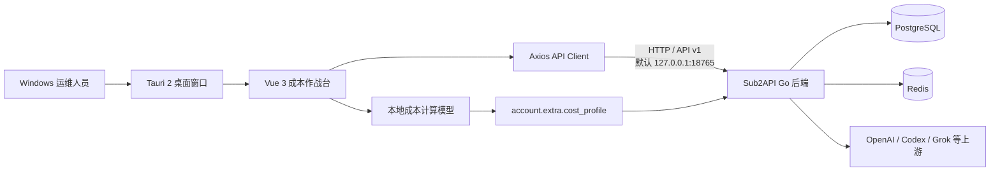

# Sub2API Cost Console 桌面成本作战台开发文档

> 文档版本：1.0  
> 桌面应用版本：0.1.0  
> 适用平台：Windows 10/11 x64  
> 上游项目：[`Wei-Shaw/sub2api`](https://github.com/Wei-Shaw/sub2api)  
> 本项目：[`renqw2023/sub2api-cost-console`](https://github.com/renqw2023/sub2api-cost-console)

本文档面向需要继续开发、部署、调试和维护 Sub2API Cost Console 的开发者。项目在 Sub2API 管理端基础上增加了 Windows 桌面壳、三套成本运营面板、号码采购成本模型以及桌面端连接适配。

---

## 1. 项目目标

Sub2API Cost Console 用于集中观察上游账号、OAuth 号池、API 产出和采购成本。它不是独立的 API 中转后端，而是复用 Sub2API 后端、数据库、Redis、登录体系和管理 API 的桌面运维客户端。

核心目标：

- 将上游资产质量、额度、请求、Token、失败率、TTFT 和切号信息集中到单个桌面窗口。
- 提供资产总览、上游排行、OAuth 号池三套运营工作区。
- 号码加入系统时立即开始累计采购成本。
- 支持按小时、日、周、月和一次性费用计费。
- 同时展示人民币采购成本与 API 美元产出。
- 复用原有 Sub2API 账号管理、探测、仪表盘和 Ops 监控接口。
- 使用 Tauri 2 生成 Windows 桌面可执行文件。

非目标：

- 当前版本不会把 PostgreSQL、Redis 和 Go 后端嵌入桌面 EXE。
- 当前版本不替代 Sub2API 原有网页管理端。
- 当前版本不提供自动购买、自动续费或支付结算能力。
- 当前版本生成免安装 EXE，尚未默认启用 NSIS/MSI 安装器和代码签名。

---

## 2. 整体架构



分层说明：

| 层 | 技术 | 责任 |
|---|---|---|
| 桌面宿主 | Tauri 2、Rust、WebView2 | 创建窗口、加载前端资源、打包 EXE、提供原生窗口能力 |
| 展示层 | Vue 3、TypeScript、Tailwind CSS | 三套面板、筛选、表格、图表和交互 |
| 图表层 | Chart.js、vue-chartjs | API 产出、成本、质量趋势和预测曲线 |
| 数据接入 | Axios、现有 admin API | 登录、账号、今日统计、仪表盘和 Ops 数据 |
| 成本域 | TypeScript 纯函数 | 套餐识别、费率折算、累计成本、币种转换 |
| 服务端 | Go、Gin、Ent | 鉴权、账号、统计、调度、数据持久化 |
| 基础设施 | PostgreSQL、Redis | 业务数据、缓存、队列和限流 |

---

## 3. 技术栈与环境要求

### 3.1 前端与桌面端

- Node.js 20 或更高版本。
- pnpm 9。项目锁文件使用 pnpm 9，建议始终通过 `corepack pnpm@9` 执行。
- Vue 3.4。
- TypeScript 5.6。
- Vite 5。
- Tauri 2。
- Rust stable x86_64-pc-windows-msvc。
- Visual Studio 2022 C++ Build Tools。
- Microsoft Edge WebView2 Runtime。

### 3.2 后端

- Go 1.26.5，与 `backend/go.mod` 保持一致。
- PostgreSQL 15+，开发环境推荐 PostgreSQL 16。
- Redis 7+。
- 可访问需要接入的上游 API。

### 3.3 Windows 环境检查

```powershell
node --version
corepack pnpm@9 --version
rustc --version
cargo --version
go version
```

检查 Tauri 环境：

```powershell
cd frontend
corepack pnpm@9 exec tauri info
```

输出中应显示 WebView2、MSVC、Rust 和 Node 均可用。

---

## 4. 关键目录

```text
sub2api-cost-console/
├─ backend/                              # Sub2API Go 后端
├─ deploy/                               # Docker Compose 与部署配置
├─ frontend/
│  ├─ src/
│  │  ├─ api/
│  │  │  ├─ client.ts                   # Axios、鉴权刷新、桌面错误提示
│  │  │  └─ url.ts                      # Web/Tauri API 地址解析
│  │  ├─ features/cost-center/
│  │  │  ├─ model.ts                    # 成本域模型
│  │  │  ├─ useCostCenterData.ts        # 数据聚合 composable
│  │  │  ├─ components/
│  │  │  │  ├─ CostLineChart.vue        # 趋势折线图
│  │  │  │  └─ CostProfileInspector.vue # 成本配置检查器
│  │  │  └─ __tests__/model.spec.ts      # 成本模型单元测试
│  │  ├─ views/admin/CostCenterView.vue  # 三套桌面工作区
│  │  ├─ router/index.ts                 # 成本中心路由与桌面 hash 路由
│  │  └─ components/layout/AppSidebar.vue# 网页管理端入口
│  ├─ src-tauri/
│  │  ├─ Cargo.toml
│  │  ├─ Cargo.lock
│  │  ├─ build.rs
│  │  ├─ tauri.conf.json
│  │  ├─ capabilities/default.json
│  │  ├─ icons/
│  │  └─ src/main.rs
│  ├─ package.json
│  ├─ pnpm-lock.yaml
│  └─ vite.config.ts
└─ COST_CONSOLE_DEVELOPMENT.md
```

`frontend/src-tauri/target`、`frontend/src-tauri/gen` 和 `frontend/dist` 是构建产物，不应提交到 Git。

---

## 5. 三套工作区

桌面应用启动后进入 `/admin/cost-center?desktop=1`。页面顶部可切换三套工作区，也可以使用 `Ctrl/Cmd + 1/2/3`。

### 5.1 资产总览

对应 `overview` 工作区，重点回答“当前资产是否健康、每小时花多少钱、还能运行多久”。

主要指标：

- 综合质量分。
- 成功/失败请求数和失败率。
- 切号/恢复次数。
- TTFT P95。
- 当前 API 产出速率。
- 当前号码采购小时成本。
- 一小时综合成本。
- 最近一小时消耗和 API 产出。
- 当前可调度余额与预计可用时间。
- 资产、质量和上游占比环形图。
- API 消耗速率、实时成本和综合评分趋势。

### 5.2 上游排行

对应 `upstreams` 工作区，重点回答“哪个账号表现最好、成本最低、是否需要探测或调整”。

主要能力：

- Codex、Grok、全部平台筛选。
- 账号名称搜索。
- 账号状态、评分、优先级、加入时间。
- 采购小时成本与累计采购成本。
- 今日账号成本、API 产出、请求和 Token。
- 探测延迟、失败/切号/恢复信息。
- 分组展示。
- 点击探测账号。
- 打开成本检查器并保存自定义成本。
- 跳转到原有账号管理页面新增上游。

### 5.3 OAuth 号池

对应 `oauth` 工作区，重点回答“每种套餐有多少号码、采购了多少钱、实际产出是否覆盖成本”。

主要能力：

- 按 Codex、Grok 或全部平台筛选。
- OAuth 账号数、已产出账号数、净采购成本。
- 实时成本和预测成本。
- API 产出速率和剩余预期曲线。
- Free、K12、Plus、Pro、Team、Business、Other 分组统计。
- 正常、限流和错误账号分布。
- 采购成本、平均单价、当前产出、实时/预期/初始成本。
- 请求数和 Token 数。

### 5.4 通用交互

- 自动刷新间隔可选。
- `Ctrl/Cmd + R` 立即刷新数据。
- `F11` 切换桌面全屏。
- `Escape` 关闭成本配置检查器。
- 请求未完成时显示加载状态。
- Ops 功能被后端关闭时，基础成本面板仍然可用。

---

## 6. 成本模型

成本模型位于 `frontend/src/features/cost-center/model.ts`，使用纯函数实现，便于测试和复用。

### 6.1 计费周期

```ts
type BillingCycle = 'hourly' | 'daily' | 'weekly' | 'monthly' | 'one_time'
```

折算小时数：

| 周期 | 小时数 |
|---|---:|
| hourly | 1 |
| daily | 24 |
| weekly | 168 |
| monthly | 730 |
| one_time | 不折算小时费率 |

### 6.2 默认套餐成本

默认价格为人民币月成本：

| 套餐 | 默认月成本 |
|---|---:|
| Free | ¥0 |
| K12 | ¥30 |
| Plus | ¥140 |
| Pro | ¥1,400 |
| Team | ¥210 |
| Business | ¥210 |
| Unknown | ¥0 |

需要调整默认值时修改 `DEFAULT_MONTHLY_PRICES_CNY`，同时更新单元测试和本文档。

### 6.3 套餐识别优先级

系统依次检查以下字段：

1. `account.extra.plan_type`
2. `account.extra.subscription_tier`
3. `account.credentials.plan_type`
4. `account.credentials.subscription_tier`
5. `account.credentials.plan`
6. `account.credentials.subscription_plan`
7. `account.credentials.tier`
8. `account.parent_plan_type`

名称会转为小写并去除多余分隔符，支持 `chatgpt_plus`、`plus_plan`、`education`、`edu` 等别名。

### 6.4 开始计费时间

没有自定义成本配置时：

```text
started_at = account.created_at
```

因此号码或账号写入 Sub2API 后，会从加入时间立即开始累计成本。

自定义 `started_at` 不允许早于账号 `created_at`。未来时间不会提前产生费用。

### 6.5 小时成本公式

除一次性费用外：

```text
hourly_rate = amount / billing_cycle_hours
elapsed_hours = max(0, now - started_at) / 3,600,000
accrued_cost = hourly_rate × elapsed_hours
```

一次性费用：

```text
now < started_at  => accrued_cost = 0
now >= started_at => accrued_cost = amount
```

### 6.6 币种换算

当前固定汇率：

```text
1 USD = 7.2 CNY
```

常量为 `CNY_PER_USD`。如需实时汇率，应增加服务端汇率源、更新时间和失败回退，不建议在组件中直接请求第三方汇率 API。

### 6.7 持久化结构

自定义成本保存到账号 `extra.cost_profile`：

```json
{
  "cost_profile": {
    "amount": 140,
    "currency": "CNY",
    "billing_cycle": "monthly",
    "started_at": "2026-08-04T12:00:00.000Z"
  }
}
```

保存时会合并当前 `account.extra`，避免主动丢弃已有字段。

### 6.8 输入校验

自定义配置只有满足以下条件才会被采用：

- `amount` 是有限数字且不小于 0。
- `currency` 是 `CNY` 或 `USD`。
- `billing_cycle` 属于允许集合。
- `started_at` 是有效时间。
- 开始时间不早于账号创建时间。

配置无效时会安全回退到套餐默认成本。

---

## 7. 数据接入与 API

数据聚合入口是 `useCostCenterData()`。每次刷新会并行请求账号、管理仪表盘和 Ops 快照，再批量加载账号今日统计。

### 7.1 使用的接口

| 用途 | 方法 | 路径 |
|---|---|---|
| 账号列表 | GET | `/api/v1/admin/accounts` |
| 批量今日统计 | POST | `/api/v1/admin/accounts/today-stats/batch` |
| 保存成本配置 | PUT | `/api/v1/admin/accounts/:id` |
| 账号连通性探测 | POST | `/api/v1/admin/accounts/:id/test` |
| 管理仪表盘快照 | GET | `/api/v1/admin/dashboard/snapshot-v2` |
| Ops 仪表盘快照 | GET | `/api/v1/admin/ops/dashboard/snapshot-v2` |

这些接口要求管理员登录。桌面应用复用现有 JWT、refresh token 和 `localStorage` 会话逻辑。

### 7.2 并行加载策略

```text
Promise.allSettled
├─ accounts.list
├─ dashboard.getSnapshotV2
└─ ops.getDashboardSnapshotV2
      └─ accounts.getBatchTodayStats（账号成功后）
```

采用 `Promise.allSettled` 的原因是 Ops 监控可能被关闭，Ops 请求失败不应导致整个成本面板不可用。

### 7.3 竞态控制

每次刷新递增 `requestSequence`。只有最后一次请求可以写入页面状态，避免用户快速切换时间范围时旧请求覆盖新请求。

### 7.4 时间范围

UI 支持：

- 1 小时
- 6 小时
- 24 小时
- 7 天

管理仪表盘使用 `start_date`、`end_date` 和 `granularity`，Ops 接口使用 `time_range`。7 天范围在 Ops 快照中回退为 24 小时，长期趋势由管理仪表盘提供。

---

## 8. 桌面 API 地址解析

实现位于 `frontend/src/api/url.ts`。

解析优先级：

1. 构建环境变量 `VITE_API_BASE_URL`。
2. Tauri 运行时 `localStorage['sub2api.desktop.backendUrl']`。
3. Tauri 默认值 `http://127.0.0.1:18765/api/v1`。
4. 普通网页默认相对路径 `/api/v1`。

这样可以保证：

- 网页版继续使用同源 API。
- 桌面版默认访问冷门本地端口 `18765`。
- 远程服务器场景可以覆盖地址。

修改运行时地址后需要重启桌面应用，因为 Axios 实例在模块初始化时确定 `baseURL`。

---

## 9. 本地后端配置

### 9.1 使用端口 18765

PowerShell 临时设置：

```powershell
cd backend
$env:SERVER_PORT="18765"
go run ./cmd/server
```

也可以在 `backend/config.yaml` 中设置：

```yaml
server:
  host: 127.0.0.1
  port: 18765
```

首次启动且没有配置文件时，在浏览器访问：

```text
http://127.0.0.1:18765
```

按安装向导配置 PostgreSQL、Redis 和初始管理员账号。

### 9.2 CORS

桌面 WebView 与 Go 后端属于跨源请求。后端配置必须允许 Tauri 来源：

```yaml
cors:
  allowed_origins:
    - http://tauri.localhost
    - tauri://localhost
  allow_credentials: true
```

不要在 `allow_credentials: true` 时使用通配符 `*`。生产环境应只允许实际需要的来源。

### 9.3 健康检查

```powershell
Invoke-WebRequest http://127.0.0.1:18765/health -UseBasicParsing
Invoke-WebRequest http://127.0.0.1:18765/api/v1/settings/public -UseBasicParsing
```

端口检查：

```powershell
Test-NetConnection 127.0.0.1 -Port 18765
```

---

## 10. 安装依赖

```powershell
git clone https://github.com/renqw2023/sub2api-cost-console.git
cd sub2api-cost-console/frontend
corepack pnpm@9 install --frozen-lockfile
```

必须使用与锁文件兼容的 pnpm 9。不要混用 npm、Yarn 和不同主版本的 pnpm 修改 `node_modules`。

Rust 依赖由 Cargo 自动安装：

```powershell
cargo check --manifest-path src-tauri/Cargo.toml
```

---

## 11. 开发运行

### 11.1 启动后端

```powershell
cd D:\path\to\sub2api-cost-console\backend
$env:SERVER_PORT="18765"
go run ./cmd/server
```

### 11.2 启动桌面开发模式

另开一个 PowerShell：

```powershell
cd D:\path\to\sub2api-cost-console\frontend
corepack pnpm@9 desktop:dev
```

Tauri 会执行：

```text
corepack pnpm@9 dev --host 127.0.0.1
```

Vite 开发服务器地址为 `http://127.0.0.1:3000`，Tauri 加载该地址并使用 hash 路由。

### 11.3 只运行网页版

```powershell
cd frontend
corepack pnpm@9 dev
```

网页版开发代理仍使用上游项目默认的 `http://localhost:8080`。桌面端口 `18765` 不会改变原有 Web 部署行为。

---

## 12. 路由与窗口

管理路由：

```text
/admin/cost-center
```

路由要求：

- `requiresAuth: true`
- `requiresAdmin: true`

浏览器使用 `createWebHistory`，Tauri 使用 `createWebHashHistory`。桌面窗口初始 URL：

```text
index.html#/admin/cost-center?desktop=1
```

未登录时会进入登录/注册流程，成功后返回成本作战台。

默认窗口：

| 参数 | 值 |
|---|---:|
| 宽度 | 1600 |
| 高度 | 980 |
| 最小宽度 | 1180 |
| 最小高度 | 720 |
| 可调整大小 | 是 |
| 默认全屏 | 否 |

---

## 13. 构建

### 13.1 类型检查与桌面前端构建

```powershell
cd frontend
corepack pnpm@9 typecheck
corepack pnpm@9 build:desktop
```

桌面构建模式与普通 Web 构建的区别：

- `base` 使用 `./`，支持从 Tauri 资源目录加载。
- 输出目录为 `frontend/dist`。
- 普通 Web 构建仍输出到 `backend/internal/web/dist`。

### 13.2 Rust 检查

```powershell
cargo check --offline --manifest-path src-tauri/Cargo.toml
```

首次构建没有完整缓存时去掉 `--offline`。

### 13.3 正式桌面构建

```powershell
corepack pnpm@9 desktop:build
```

输出文件：

```text
frontend/src-tauri/target/release/sub2api-cost-console.exe
```

第一次编译 Tauri、WebView2 和 Windows 依赖可能需要数分钟。

### 13.4 安装器

当前 `tauri.conf.json` 使用：

```json
{
  "bundle": {
    "active": false,
    "targets": "all"
  }
}
```

如果需要 NSIS 安装器，可改为：

```json
{
  "bundle": {
    "active": true,
    "targets": ["nsis"]
  }
}
```

发布给外部用户前建议配置 Windows 代码签名证书、自动更新策略和版本号管理。

---

## 14. 测试与质量检查

### 14.1 成本模型测试

```powershell
corepack pnpm@9 vitest run src/features/cost-center/__tests__/model.spec.ts
```

覆盖内容：

- 套餐识别。
- 默认价格。
- 自定义价格覆盖。
- 开始时间不得早于加入时间。
- 未来开始时间成本为 0。
- 一次性费用。
- 周期折算。
- 币种换算和金额格式化。

### 14.2 API 客户端回归测试

```powershell
corepack pnpm@9 vitest run src/api/__tests__/client.spec.ts src/api/__tests__/user.spec.ts
```

### 14.3 类型检查

```powershell
corepack pnpm@9 typecheck
```

### 14.4 ESLint

```powershell
corepack pnpm@9 exec eslint src/features/cost-center src/views/admin/CostCenterView.vue src/api/url.ts src/api/client.ts src/router/index.ts --ext .vue,.ts
```

### 14.5 Rust

```powershell
cargo check --manifest-path src-tauri/Cargo.toml
```

### 14.6 建议的提交前验证顺序

```text
1. pnpm typecheck
2. 成本模型测试
3. API 客户端测试
4. ESLint
5. build:desktop
6. cargo check
7. desktop:build
8. 启动 EXE 做人工冒烟测试
```

---

## 15. UI 开发约定

### 15.1 视觉语言

- 深色工业仪表盘风格。
- 背景使用细网格纹理。
- 主强调色为荧光黄绿色。
- 金色表示 API 产出或采样速率。
- 蓝色表示成本或预测值。
- 红色/橙色表示错误、限流和风险。
- 数据字体优先使用 `Cascadia Mono`。
- 控件保持紧凑，减少大圆角卡片和过度留白。

### 15.2 响应式断点

- 1450px：压缩顶部和 KPI 网格。
- 1180px：双栏/单栏重排，匹配桌面最小窗口宽度。
- 760px：工具栏、表格和面板进入窄屏布局。

### 15.3 图表

所有成本中心趋势图通过 `CostLineChart.vue` 统一：

- Lime：当前值或质量趋势。
- Gold：API 产出或采样值。
- Blue：滚动值或成本预测。
- 使用低透明度填充。
- 网格线保持弱对比。
- Tooltip 使用深色背景。

新增图表时优先扩展通用组件，不要在页面中重复注册 Chart.js 模块。

---

## 16. 增加新套餐

以增加 `enterprise` 为例：

1. 在 `CostPlan` 联合类型中增加 `enterprise`。
2. 在 `DEFAULT_MONTHLY_PRICES_CNY` 增加默认价格。
3. 在 `KNOWN_PLANS` 增加套餐名。
4. 在 `CostCenterView.vue` 的套餐排序中增加该值。
5. 更新成本模型测试。
6. 更新本文档默认价格表。

不要只修改 UI 分组，否则账户会显示在 `other`，但不会获得正确默认成本。

---

## 17. 增加新平台

以增加新平台 `example` 为例：

1. 确认后端 `AccountPlatform` 已支持。
2. 在账号创建与管理 API 中完成平台接入。
3. 在成本页面平台筛选中加入新选项。
4. 确认平台账号的套餐字段能被 `inferPlan` 识别。
5. 为平台账号补充探测和统计数据。
6. 测试全部、单平台和 OAuth 过滤结果。

平台接入必须先完成后端能力，桌面页面不会直接保存上游密钥。

---

## 18. 安全注意事项

- 不要在前端或 Tauri 配置中写入上游密钥、数据库密码或管理员密码。
- 管理 API 必须继续要求管理员权限。
- 桌面端 refresh token 仍保存在 WebView `localStorage`，不要在不可信 Windows 用户会话中使用。
- CORS 只允许精确的 Tauri 来源和可信管理域名。
- 不要为方便调试永久设置 `allowed_origins: ['*']`。
- 发布前应为 Tauri 配置 CSP；当前 `csp: null` 是兼容原有前端的过渡配置。
- 发布外部版本时使用代码签名，降低 Windows SmartScreen 告警。
- 成本配置写入 `account.extra` 前必须保留原有字段。
- 日志和截图中应遮盖账号、Token、代理凭据和上游 URL。

---

## 19. 常见故障

### 19.1 桌面端显示 Network error

先检查后端是否运行：

```powershell
Test-NetConnection 127.0.0.1 -Port 18765
Invoke-WebRequest http://127.0.0.1:18765/health -UseBasicParsing
```

如果端口不可达：

- 启动 Go 后端。
- 确认 `SERVER_PORT=18765`。
- 检查 Windows 防火墙和端口占用。

如果健康检查成功但桌面仍失败：

- 检查 `cors.allowed_origins`。
- 确认存在 `http://tauri.localhost`。
- 确认 `allow_credentials: true`。
- 使用 `desktop:dev` 查看 WebView 控制台。

### 19.2 打开 EXE 后进入注册页

说明本地 WebView 没有有效登录会话。先保证后端可达，然后：

- 已安装的系统使用管理员账号登录。
- 全新后端先完成安装向导和初始管理员创建。
- 不要在桌面端重复创建普通账号来代替初始管理员。

### 19.3 构建提示无法删除 EXE

通常是旧程序仍在运行：

```powershell
Get-Process -Name sub2api-cost-console -ErrorAction SilentlyContinue
Get-Process -Name sub2api-cost-console -ErrorAction SilentlyContinue | Stop-Process -Force
```

关闭后重新执行 `desktop:build`。

### 19.4 pnpm 提示无 TTY 或需要删除 node_modules

使用固定版本：

```powershell
corepack pnpm@9 install --frozen-lockfile
```

Tauri 的 `beforeBuildCommand` 已固定为 `corepack pnpm@9 build:desktop`。

### 19.5 Tauri 提示 icon.ico 不存在

确认文件存在：

```text
frontend/src-tauri/icons/icon.ico
```

需要重新生成时：

```powershell
cd frontend
corepack pnpm@9 exec tauri icon ..\assets\logo.svg
```

### 19.6 Ops 面板没有质量数据

基础账号和成本数据正常，但质量、错误或 TTFT 缺失，通常表示 Ops 被关闭。检查后端配置：

```yaml
ops:
  enabled: true
```

### 19.7 修改 API 地址后没有生效

API 地址在 Axios 模块初始化时读取。修改 `VITE_API_BASE_URL` 或 `sub2api.desktop.backendUrl` 后需要完全退出并重新打开桌面应用。

---

## 20. 性能与容量

当前账号列表每次最多加载 1,000 条。账号数继续增长时建议：

- 后端提供成本中心专用聚合接口。
- 表格启用虚拟滚动。
- 将账号成本和今日统计合并为单次服务端查询。
- 对图表点进行时间桶聚合。
- 避免每次刷新为每个账号单独请求统计。
- 保持批量今日统计接口，禁止退化为 N+1 请求。

自动刷新间隔不宜过短。大规模部署建议 1 到 5 分钟，并使用 Ops 预聚合表。

---

## 21. 当前限制与后续路线

### 21.1 当前限制

- 后端、PostgreSQL 和 Redis 需要单独运行。
- 默认汇率是固定值，不是实时金融汇率。
- 部分账号级失败/恢复信息是由账号状态字段推导，不是完整事件流。
- 默认套餐价格是项目级常量，不是后台全局配置。
- `bundle.active` 关闭，只生成 EXE。
- 未集成自动更新和签名。

### 21.2 建议路线

1. 增加桌面连接设置页和后端健康检查。
2. 将套餐成本配置迁移到后端数据库和管理员设置。
3. 增加汇率服务及历史汇率快照。
4. 增加号码成本预算、超限提醒和月度报表。
5. 增加账号成本与 API 收益的毛利分析。
6. 增加 NSIS 安装器、代码签名和自动更新。
7. 评估将 Go 后端作为 Tauri sidecar 的可行性。
8. 为三套工作区增加端到端视觉回归测试。

---

## 22. 发布检查清单

### 代码

- [ ] `pnpm-lock.yaml` 与 `package.json` 同步。
- [ ] TypeScript 类型检查通过。
- [ ] 成本模型测试通过。
- [ ] API 客户端测试通过。
- [ ] ESLint 通过。
- [ ] Cargo check 通过。
- [ ] 桌面正式构建通过。

### 功能

- [ ] 端口 18765 健康检查成功。
- [ ] 管理员可以登录。
- [ ] 三套工作区可以切换。
- [ ] Codex/Grok 筛选正确。
- [ ] 新号码从 `created_at` 开始计费。
- [ ] 自定义成本能够保存并在刷新后恢复。
- [ ] 账号探测可用。
- [ ] Ops 关闭时页面可以降级运行。
- [ ] 自动刷新和快捷键可用。

### 安全与发布

- [ ] CORS 仅包含可信来源。
- [ ] 构建产物不包含密钥。
- [ ] 图标和版本号正确。
- [ ] EXE 人工启动测试通过。
- [ ] 外部发布版本已签名。
- [ ] 安装器/升级/回滚流程已验证。

---

## 23. 贡献流程

建议使用功能分支：

```powershell
git switch -c codex/feature-name
```

提交前执行质量检查，然后提交：

```powershell
git add -A
git commit -m "feat: improve desktop cost console"
git push -u origin codex/feature-name
```

提交说明建议使用 Conventional Commits：

- `feat:` 新功能。
- `fix:` 缺陷修复。
- `docs:` 文档。
- `test:` 测试。
- `refactor:` 重构。
- `chore:` 构建、依赖和工具链。

---

## 24. 许可证与上游同步

本项目基于 `Wei-Shaw/sub2api` 开发，原项目许可证、版权声明和第三方依赖许可证继续适用。同步上游前应：

1. 添加或保留上游 remote。
2. 拉取上游主分支。
3. 在独立分支完成合并或 rebase。
4. 重点回归路由、API client、`vite.config.ts` 和账号类型。
5. 重新执行桌面构建与成本模型测试。

示例：

```powershell
git remote add upstream https://github.com/Wei-Shaw/sub2api.git
git fetch upstream
git switch main
git merge upstream/main
```

发生冲突时不要直接覆盖成本中心文件，应逐项检查上游 API 类型和鉴权变化。

---

## 25. 快速命令索引

```powershell
# 后端
cd backend
$env:SERVER_PORT="18765"
go run ./cmd/server

# 安装前端依赖
cd ../frontend
corepack pnpm@9 install --frozen-lockfile

# 桌面开发
corepack pnpm@9 desktop:dev

# 类型检查
corepack pnpm@9 typecheck

# 成本测试
corepack pnpm@9 vitest run src/features/cost-center/__tests__/model.spec.ts

# 桌面构建
corepack pnpm@9 desktop:build

# 输出文件
Get-Item src-tauri/target/release/sub2api-cost-console.exe
```

完成以上配置后，Sub2API Cost Console 会以 Windows 桌面应用形式连接本地 `18765` 端口的 Sub2API 后端，并在管理员登录后提供完整的资产质量、上游账号和 OAuth 号池成本视图。
