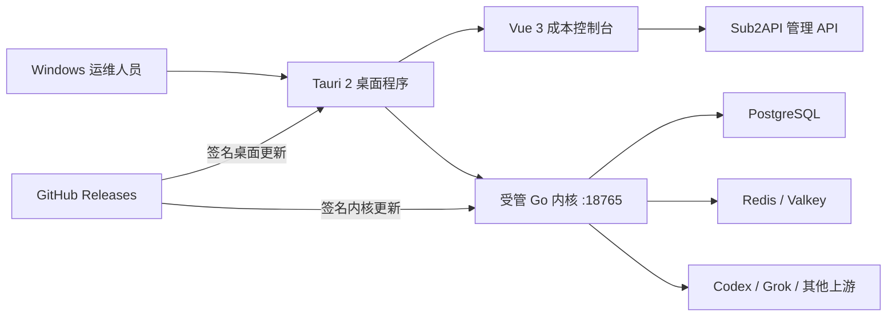

<div align="center">


# Sub2API Cost Console

**面向 Sub2API 的 Windows 桌面成本运营控制台**

[](https://github.com/renqw2023/sub2api-cost-console/releases/latest)
[](https://tauri.app/)
[](https://vuejs.org/)
[](https://go.dev/)
[](LICENSE)

[下载 Windows 版本](https://github.com/renqw2023/sub2api-cost-console/releases/latest) · [完整开发文档](COST_CONSOLE_DEVELOPMENT.md) · [上游项目](https://github.com/Wei-Shaw/sub2api)

</div>

> [!IMPORTANT]
> **这是社区维护的非官方衍生项目。** 本仓库基于 [Wei-Shaw/sub2api](https://github.com/Wei-Shaw/sub2api) 开发，不代表上游作者或维护者发布的官方桌面版本。Sub2API 原始项目、原始代码及其版权归上游作者和贡献者所有；本仓库保留上游的 LGPL-3.0-or-later 许可证和版权声明。

## 项目简介

Sub2API Cost Console 将 Sub2API 的网关、账号管理和运营数据整合为一个 Windows 桌面工具，重点解决“账号加入后花了多少钱、产生了多少 API 价值、哪个上游最稳定、号池还能使用多久”这类运营问题。

桌面程序使用 Tauri 2 承载 Vue 3 界面，并管理本地 Go 内核。首次启动时会检查 `127.0.0.1:18765`：如果已有兼容的 Sub2API 服务则直接连接，否则启动安装包内置的受管内核。受管配置和业务数据保存在 Windows 用户应用数据目录，升级桌面程序时不会覆盖。

本项目适合：

- 维护多个 Codex、Grok 或其他上游账号的个人及团队。
- 需要把采购成本、API 产出、请求质量和账号状态放在同一个界面的运维人员。
- 需要对成本算法、软件版本和内核更新进行可追溯管理的部署场景。

## 核心能力

### 三个成本运营面板

| 工作区 | 主要用途 | 关键指标 |
| --- | --- | --- |
| 资产与实时成本 | 查看全局资产、消耗速度和可用时间 | 采样速率、滚动速率、实时成本、滚动成本、余额、TTFT、成功率 |
| 上游质量与排行 | 比较账号质量并定位异常上游 | 综合评分、失败率、切号恢复、产出、Token、探测成本、账号状态 |
| OAuth 号池成本 | 衡量不同套餐号池的投入产出 | 采购成本、平均单价、实时/预期成本、API 美元产出、请求数、Token |

支持 `Ctrl/Cmd + 1/2/3` 快速切换工作区。面板数据按周期自动刷新，敏感账号信息在展示和截图中应当脱敏。

### 号码加入即开始计算成本

系统默认使用账号的 `created_at` 作为成本起算时间。因此，号码或账号写入 Sub2API 后即开始累计采购成本，不需要额外启动计时器。

```text
hourly_rate = amount / billing_cycle_hours
elapsed_hours = max(0, now - started_at) / 3,600,000
accrued_cost = hourly_rate × elapsed_hours
```

支持 `hourly`、`daily`、`weekly`、`monthly` 和 `one_time` 五种计费周期。自定义成本配置写入 `account.extra.cost_profile`，不会覆盖账号已有的 `extra` 数据。默认月成本、套餐识别优先级、汇率和边界条件参见[成本模型文档](COST_CONSOLE_DEVELOPMENT.md#6-成本模型)。

每项指标的实测来源、推导公式、当前号池与历史数据边界参见[成本数据真实性与口径](docs/COST_DATA_PROVENANCE.md)。

### 可追溯的三版本体系

| 版本 | 当前值 | 作用 |
| --- | --- | --- |
| Desktop | `0.2.4` | Tauri 2 桌面壳、Vue 界面和安装结构 |
| Core | `0.1.170-21-g825ca7b1` | 当前桌面包绑定的 Sub2API 上游基线（上游提交 `825ca7b1fc9335f904bc077f051de815fb61e47f`） |
| Algorithm | `1.0.0` | 成本折算、起算边界和累计规则 |

每条成本档案记录其算法版本。旧数据如果没有版本会显示为 `legacy-unversioned`，不会被静默归类为当前算法。

> 版本边界：`Core` 显示当前桌面包实际绑定的上游 Sub2API 基线，不追随上游最新发布自动变更；`Algorithm` 是本项目成本规则版本，不冒充上游版本。后续在版本面板手动执行内核更新时，清单中的上游版本和提交会一并显示并写入本地状态。

### 双通道安全更新

- **桌面更新**：启动后检查，并每 6 小时检查一次 GitHub Releases 的 `latest.json`。
- **内核更新**：桌面壳保持不变，只下载新的受管 Go 内核，校验完成后重启桌面端并切换内核。
- **完整性校验**：更新清单、内核和安装包提供签名及 SHA-256 校验文件。
- **失败回滚**：保留上一版内核；新内核必须在 30 秒内通过健康检查，否则自动恢复上一版本。
- **发布原子性**：版本化资产先上传，签名清单最后替换，客户端只会看到完整的旧版本或新版本。

更新程序不会对源码目录执行 `git pull`，也不会运行未签名的 Release 资产。

## 系统架构



| 层级 | 技术 | 职责 |
| --- | --- | --- |
| 桌面宿主 | Tauri 2、Rust、WebView2 | 窗口、受管内核生命周期、更新、回滚 |
| 前端 | Vue 3、TypeScript、Pinia、Chart.js | 三套面板、成本模型、图表和版本面板 |
| 后端 | Go、Gin、Ent | 鉴权、账号、调度、统计和 API 网关 |
| 数据层 | PostgreSQL、Redis/Valkey | 持久化、缓存和运行状态 |
| 发布 | GitHub Actions、Tauri updater | Windows NSIS、签名、校验和 Releases |

## 安装与使用

### 使用 Windows 安装包

1. 打开 [Releases](https://github.com/renqw2023/sub2api-cost-console/releases/latest)。
2. 下载最新的 Windows NSIS 安装包，并使用同一 Release 中的 `INSTALLER_SHA256SUMS.txt` 核对文件。
3. 安装并启动 Sub2API Cost Console。
4. 首次启动先选择数据服务方式：
   - **快速安装（推荐新用户）**：需要 Docker Desktop 已安装且引擎正在运行。程序自动创建固定版本的 PostgreSQL 与 Valkey 容器、随机密码和独立数据卷，只映射到 `127.0.0.1:15432` 与 `127.0.0.1:16379`。
   - **高级连接**：连接已有的本地、Docker、NAS、服务器或云端 PostgreSQL 15+ 与 Redis 7+/Valkey。已经有数据库容器的用户应选择此模式，程序不会覆盖或删除现有数据。
5. 如果未检测到可用 Docker、Docker 未启动、保留端口冲突或发现同名容器，快速安装会停止并明确引导到高级连接；程序不会静默安装 Windows 服务或不受支持的 Valkey 替代品。
6. 在安装向导中完成连接验证和初始管理员配置。
7. 登录后进入成本控制台；新增上游账号后，成本从账号加入时间开始累计。

快速安装下载并固定使用 `postgres:16.14-alpine` 与 `valkey/valkey:8.1.9-alpine`。Docker 镜像、容器和数据卷独立于桌面程序升级；卸载桌面程序不会自动删除业务数据。

桌面内核默认只监听：

```text
http://127.0.0.1:18765
```

如果端口已存在兼容的 Sub2API 服务，桌面端会复用该服务而不重复启动受管内核。

### 从源码运行

开发环境需要 Windows 10/11、Node.js 24、pnpm 9、Go 1.26、Rust stable、MSVC 构建工具、WebView2、PostgreSQL 15+ 和 Redis 7+。

```powershell
git clone https://github.com/renqw2023/sub2api-cost-console.git
cd sub2api-cost-console/frontend
corepack pnpm@9 install --frozen-lockfile
corepack pnpm@9 desktop:dev
```

构建 NSIS 安装包：

```powershell
cd frontend
corepack pnpm@9 desktop:build
```

主要输出位于：

```text
frontend/src-tauri/target/release/sub2api-cost-console.exe
frontend/src-tauri/target/release/bundle/nsis/
```

## 配置与数据

- 桌面 API 基址默认值：`http://127.0.0.1:18765/api/v1`。
- 服务只绑定回环地址，不应直接暴露到公网。
- Tauri WebView 来源白名单为 `http://tauri.localhost`、`https://tauri.localhost` 和 `tauri://localhost`。
- 数据库密码、Redis 密码、管理员凭据和上游 Token 不得提交到仓库。
- 受管配置位于 Windows 用户应用数据目录，不写入 `Program Files`。
- 自定义成本位于账号的 `extra.cost_profile` 中。

## 开发与测试

```powershell
cd frontend

# 类型检查
corepack pnpm@9 typecheck

# 成本模型及前端测试
corepack pnpm@9 test:run

# 代码检查
corepack pnpm@9 lint:check
```

后端测试：

```powershell
cd backend
go test ./...
```

修改以下规则时必须同步提升 `frontend/ALGORITHM_VERSION`、补充测试并在 Release Notes 中说明生效边界：

- 计费周期折算小时数。
- 人民币/美元换算规则。
- 账号开始计费时间。
- 累计成本公式和一次性费用边界。

更完整的目录说明、API、打包、更新、故障排查和发布流程见 [COST_CONSOLE_DEVELOPMENT.md](COST_CONSOLE_DEVELOPMENT.md)。

## 发布流程

仓库包含两个 Windows 发布工作流：

- `.github/workflows/desktop-release.yml`：构建桌面安装包、更新清单、安装器校验文件以及配套内核资产。
- `.github/workflows/core-release.yml`：只发布受管内核，不重新安装桌面壳；安装内核后桌面端自动重启。

发布所需私钥只能存储在 GitHub Actions Secrets：

```text
TAURI_SIGNING_PRIVATE_KEY
TAURI_SIGNING_PRIVATE_KEY_PASSWORD
```

仓库和 CI 日志中只能出现公钥。Tauri/Minisign 更新签名不等同于 Windows Authenticode 代码签名；如需消除 Windows 发布者警告，还应单独配置受信任的 Authenticode 证书。

## 与上游同步

本项目保留上游 remote，并在合并后重新执行前端、后端、成本算法和桌面构建测试。

```powershell
git remote add upstream https://github.com/Wei-Shaw/sub2api.git
git fetch upstream
git merge upstream/main
```

同步冲突需要逐项检查，尤其不要直接覆盖 `frontend/src/features/cost-center/`、`frontend/src-tauri/`、自动更新工作流和成本版本文件。

## 上游、许可证与版权

### 上游项目

- 项目：[`Wei-Shaw/sub2api`](https://github.com/Wei-Shaw/sub2api)
- 说明：AI API Gateway Platform for Subscription Quota Distribution
- 许可证：[GNU Lesser General Public License v3.0 or later](LICENSE)
- 上游 README 版权声明：`Copyright (c) 2026 Wesley Liddick`

### 版权归属

- Sub2API 原始项目、原始源代码、原始文档和原始品牌资产的版权归 **Wesley Liddick、Wei-Shaw/sub2api 贡献者及各自权利人**所有。
- 本仓库新增的桌面成本控制台、成本算法扩展、更新与回滚实现、文档以及原创 Logo 的版权归 `renqw2023/sub2api-cost-console` 贡献者所有。
- 本仓库不主张拥有上游项目的版权，也不暗示得到上游作者的官方背书或合作授权。
- 对上游代码的复制、修改和分发继续受 LGPL-3.0-or-later 约束；第三方依赖和品牌分别遵循其自身许可证与权利声明。

完整文本见 [LICENSE](LICENSE)，补充归属说明见 [NOTICE.md](NOTICE.md)。分发二进制或修改版本时，请同时保留许可证、版权通知、源代码获取方式以及 LGPL 要求的其他材料。

## 使用风险与免责声明

使用本项目连接第三方服务可能受到相应服务商条款、地区法律和账号政策的限制。使用者应自行阅读并遵守相关协议和法律法规，并自行承担账号限制、服务中断、数据丢失或其他风险。本项目仅按“现状”提供，不承诺适用于任何特定用途。

---

<div align="center">

Sub2API Cost Console 是基于 [Wei-Shaw/sub2api](https://github.com/Wei-Shaw/sub2api) 的社区衍生项目。

</div>
