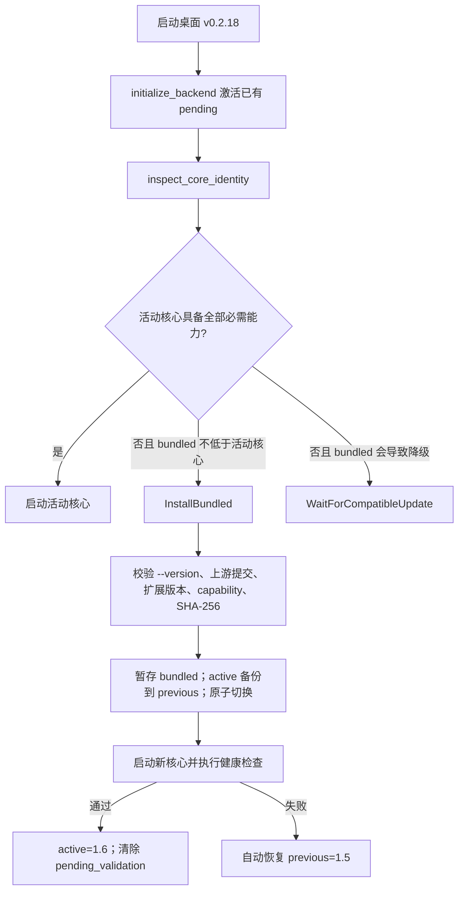

# 1.6 核心能力升级门禁修复报告

> 发布注意：本地已生成桌面 `v0.2.18` EXE 与 NSIS 安装包，但本机没有 `TAURI_SIGNING_PRIVATE_KEY`，因此本地产物没有生成 Tauri updater 签名。正式分发必须使用配置了 GitHub Secrets 的 `Desktop Release` 工作流生成签名和 `latest.json`，不能把本地未签名包作为自动更新源。

本次修复确保已安装 1.5 活动核心的客户端在启动 0.2.18 后，自动、安全地切换到具备经济采样能力的 1.6 内置核心。修复不调整 Sub2API Token 输入、输出、缓存计费公式、模型价格或采购摊销公式。

## 版本结果

| 组件 | 修复后版本 | 说明 |
| --- | --- | --- |
| 桌面客户端 | `0.2.18` | 0.2.17 已存在正式标签，修复版使用新发布身份 |
| Sub2API 上游 | `0.1.173` | 上游提交 `29009f0b2ea14edf3b11ae2564fb617ff91a03b4` |
| 成本算法 | `1.6.0` | 监控与经济聚合语义升级，不是 Token 调价 |
| 经济预测 | `1.0.0` | 持久化累积采样与稳定区间差分 |
| 成本扩展 | `1.1.0` | 新增经济采样运行能力 |
| 必需能力 | `account_cost_loss_ledger.v1` | 不可变成本损失账本 |
| 必需能力 | `account_economics_sampling.v1` | 经济采样、单位经济性与预测快照 |

## 根因与修复

故障包含三个连续问题，缺少任意一层修复都会继续运行旧核心：

1. 1.6 新增了 `/api/v1/admin/accounts/economics/snapshot` 和迁移 221，但没有新增 capability，也没有提升扩展版本。旧 1.5 核心因此被误判为兼容。
2. `CORE_CAPABILITIES` 增加第二行后，`build.rs` 把原始换行写入 Cargo 环境指令。Cargo 指令按行解析，只保留第一项 capability，第二项会被静默丢弃。
3. 桌面启动只激活已经存在的 pending 核心，没有执行 `inspect_core_identity` 返回的 `InstallBundled` 动作。因此即使门禁正确识别旧核心，启动流程仍不会主动替换它。

对应修复：

- `frontend/CORE_CAPABILITIES` 新增 `account_economics_sampling.v1`。
- `frontend/CORE_EXTENSION_VERSION` 从 `1.0.0` 提升至 `1.1.0`。
- `frontend/src-tauri/build.rs` 在写入 `SUB2API_CORE_CAPABILITIES` 前，将多行能力规范化为单行空格分隔值。
- `frontend/src-tauri/src/main.rs` 在启动后端前检查核心身份；动作是 `InstallBundled` 时，调用现有的校验、暂存、备份、激活和健康回滚流程。
- `frontend/src-tauri/src/desktop_runtime.rs` 增加旧 1.5 核心升级回归测试，并要求只有完整能力集合才能声明当前算法版本。
- `backend/cmd/server/main_version_test.go` 固化 `--version` 对扩展 1.1.0 和两个 capability 的输出契约。
- `backend/internal/service/account_economics_test.go` 使用独立的仓储边界桩，避免无 `unit` build tag 时 service 测试无法编译。

## 启动调用路径



## Evidence → Finding → Path

### E-001：回归测试在修复前真实失败

- observed_at: 2026-08-11
- source_type: command
- source_ref: `frontend/src-tauri/src/desktop_runtime.rs`
- repro_command:

```powershell
cargo test --manifest-path frontend/src-tauri/Cargo.toml legacy_1_5_core_is_replaced_when_desktop_requires_economics_sampling
```

- raw_excerpt:

```text
left: None
right: InstallBundled
```

### E-002：旧客户端实际运行 1.5 核心

- observed_at: 2026-08-11
- source_type: file + log
- source_ref: `%APPDATA%/com.sub2api.cost-console/core/state.json`
- repro_command:

```powershell
Get-Content -Raw "$env:APPDATA\com.sub2api.cost-console\core\state.json"
Select-String -Path "$env:APPDATA\com.sub2api.cost-console\backend\logs\sub2api.log" -SimpleMatch '/api/v1/admin/accounts/economics/snapshot'
```

- raw_excerpt:

```text
algorithm_version=1.5.0
extension_version=1.0.0
capabilities=account_cost_loss_ledger.v1
GET /api/v1/admin/accounts/economics/snapshot -> 404
```

### E-003：新版 sidecar 报告完整能力

- observed_at: 2026-08-11
- source_type: command
- source_ref: `frontend/src-tauri/binaries/sub2api-backend-x86_64-pc-windows-msvc.exe`
- repro_command:

```powershell
& frontend/src-tauri/binaries/sub2api-backend-x86_64-pc-windows-msvc.exe --version
```

- raw_excerpt:

```text
Sub2API 0.1.173 (... extension: 1.1.0, capabilities: account_cost_loss_ledger.v1|account_economics_sampling.v1)
```

### E-004：真实启动完成 1.5 → 1.6 切换

- observed_at: 2026-08-11
- source_type: process + file hash
- source_ref: `%APPDATA%/com.sub2api.cost-console/core/state.json`
- repro_command:

```powershell
Get-Content -Raw "$env:APPDATA\com.sub2api.cost-console\core\state.json"
Get-FileHash -Algorithm SHA256 "$env:APPDATA\com.sub2api.cost-console\core\active\sub2api-backend.exe"
Get-FileHash -Algorithm SHA256 frontend/src-tauri/target/release/sub2api-backend.exe
```

- raw_excerpt:

```text
active.algorithm_version=1.6.0
active.extension_version=1.1.0
active.capabilities=account_cost_loss_ledger.v1|account_economics_sampling.v1
active.sha256=a77ea0cbc18201cc9374356154792daf0e1b3773ad31eb409bb6a8d12be05431
bundled.sha256=a77ea0cbc18201cc9374356154792daf0e1b3773ad31eb409bb6a8d12be05431
previous.algorithm_version=1.5.0
pending_validation=false
last_error=null
```

### E-005：迁移表可写、路由可用并持续采样

- observed_at: 2026-08-11
- source_type: HTTP log
- source_ref: `%APPDATA%/com.sub2api.cost-console/backend/logs/sub2api.log`
- repro_command:

```powershell
Select-String -Path "$env:APPDATA\com.sub2api.cost-console\backend\logs\sub2api.log" -SimpleMatch '/api/v1/admin/accounts/economics/snapshot'
```

- raw_excerpt:

```text
2026-08-11T18:25:12+08:00 GET /api/v1/admin/accounts/economics/snapshot -> 200
2026-08-11T18:25:42+08:00 GET /api/v1/admin/accounts/economics/snapshot -> 200
2026-08-11T18:26:12+08:00 GET /api/v1/admin/accounts/economics/snapshot -> 200
2026-08-11T18:27:21+08:00 GET /api/v1/admin/accounts/economics/snapshot -> 200
2026-08-11T18:28:12+08:00 GET /api/v1/admin/accounts/economics/snapshot -> 200
```

`GetSnapshot` 在返回前依次执行 `UpsertSample` 与 `ListSamples`。因此认证请求持续返回 200，证明迁移 221 创建的 `account_economics_samples` 表在实际运行数据库中可写、可读；无认证请求返回 401 而不是旧核心的 404，也证明路由已经注册。

### F-001：1.6 核心发布能力门禁不完整

- severity: high
- category: design
- status: validated
- evidence_ids: [E-001, E-002, E-003, E-004, E-005]
- location: `frontend/src-tauri/src/main.rs`, `frontend/src-tauri/src/desktop_runtime.rs`, `frontend/src-tauri/build.rs`
- impact: 新前端与旧核心组合运行，经济快照持续 404，图表没有持久化样本，版本窗口仍显示 1.5。
- confidence: high
- remediation: 使用版本化 capability 契约，在启动后端前执行内置核心协调，并在构建边界规范化多项能力。

### P-001：从旧核心到可回滚的新核心

- path_type: callflow
- start: AppData 中存在活动 1.5 核心
- goal: 运行具备经济采样能力的 1.6 核心
- steps:
  1. 桌面读取活动记录和内置记录，发现缺少 `account_economics_sampling.v1`（E-001、E-002）。
  2. 校验内置核心报告扩展 1.1.0、两个 capability、目标上游提交和 SHA-256（E-003）。
  3. 备份 1.5 到 previous，原子切换 1.6 到 active，并启动健康检查（E-004）。
  4. 经济快照持续返回 200，运行时采样表可写、可读（E-005）。
- residual_risks: 本地缺少 updater 私钥；签名发布必须由 GitHub Actions 完成。

## 测试与构建记录

以下测试均在修复后通过：

```powershell
cargo fmt --manifest-path frontend/src-tauri/Cargo.toml --check
cargo test --manifest-path frontend/src-tauri/Cargo.toml

Set-Location backend
go test ./cmd/server ./internal/service ./internal/repository ./migrations -count=1

Set-Location ../frontend
corepack pnpm@9 typecheck
corepack pnpm@9 test:run
```

本地构建产物：

| 产物 | SHA-256 |
| --- | --- |
| `frontend/src-tauri/target/release/sub2api-cost-console.exe` | `6357D61ED97A97441AA521EF4391687337643E281879D882EA86C29DC2134FAC` |
| `frontend/src-tauri/target/release/bundle/nsis/Sub2API Cost Console_0.2.18_x64-setup.exe` | `FEDA1960A67858269974DABE1D862631204A3B3FEBE816550773C58BD82B4A45` |
| `frontend/src-tauri/target/release/sub2api-backend.exe` | `A77EA0CBC18201CC9374356154792DAF0E1B3773AD31EB409BB6A8D12BE05431` |

Tauri/NSIS 编译和打包成功，随后 updater 签名阶段因本机没有私钥返回非零退出码。远端发布工作流必须验证：

1. 仓库 Secrets 中存在 `TAURI_SIGNING_PRIVATE_KEY` 和对应密码。
2. 生成 `.sig`、`latest.json` 和安装包 SHA-256。
3. 安装 0.2.18 后版本中心显示桌面 `v0.2.18`、成本扩展 `v1.1.0`、成本算法 `v1.6.0`。
4. 保留 previous 1.5 核心，便于新核心健康检查失败时自动回滚。
