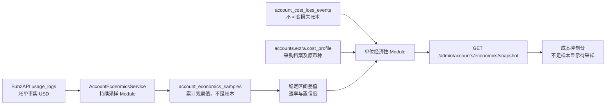

# 成本经济算法 1.6 开发与部署说明

本文记录成本控制台 1.6 的问题证据、架构决策、实现边界、数据口径、迁移方式和验收标准。目标不是调整 Token 单价，而是修复图表窗口、账号健康、币种语义和经济预测长期失真的问题。

## 1. 版本结论

本次发布将统一成本算法版本提升为 `ALGORITHM_VERSION=1.6.0`，并新增独立预测版本 `ECONOMICS_PROJECTION_VERSION=1.0.0`。

升级内容包括：真实时间窗口、当前账号健康语义、持久化累计采样、稳定区间速率、账号池单位经济性、数据完整度和预测置信度。以下计费事实没有变化：

- Sub2API 的输入 Token、输出 Token、缓存读取、缓存写入计费公式；
- 请求发生时保存的模型价格快照；
- `account_stats_cost`、`total_cost`、`actual_cost` 的账单含义；
- 用户配置采购金额、周期和起算时间的摊销公式；
- 已保存档案和旧损失事件自己的历史 `algorithm_version`。

因此，1.6 是“监控与经济聚合语义升级”，不是 Token 调价。后端新生成的默认成本档案和损失事件使用 1.6.0；历史记录不会被批量改写。

## 2. Evidence → Finding → Path

| Evidence | Finding | Path |
| --- | --- | --- |
| 页面曾以“今日累计产出 ÷ 已经过小时数”计算当前速率，并继续乘剩余小时或 730 小时 | 页面停留时间不是采样窗口；账号增删、刚启动、短时突增都会让预测严重失真 | 删除单点线性速率；后端保存相邻累计样本，只对稳定成员区间求差值 |
| 最近 1 分钟、1 小时与当天曾共用日期边界或旧快照 | 下拉窗口变化但查询语义不变，图表看起来完全不动 | 最近窗口使用精确起止时间与分钟桶；当天使用 `Asia/Shanghai` 自然日边界；旧内核由 `usage_logs` 精确回退 |
| OpenAI 429、K12/工作区 402 在部分路径仍显示正常 | “启用”状态与“当前可调度”状态被混用 | 当前健康同时检查持久状态、429 reset、overload、临时不可调度、到期与主动探测结果 |
| 用户保存 `2.5 CNY` 后，部分 API 指标旁显示美元符号 | 数值和币种标签在展示层被错误合并 | 采购档案保留原币种；只有显式 `CNY/USD` 汇率边界允许换算；API 产出和上游 Token 成本始终为 USD |
| [api2business runtime monitor](https://github.com/api2business/api2business/blob/master/src/oauth-runtime-monitor.ts) 保存累计产出和采样时间，并在成员变化或累计倒退时跳过区间 | 连续采样比单页线性预测更可靠，且能明确返回“样本不足” | 引入 `AccountEconomicsService` Module 和观察表 `account_economics_samples` |
| [api2business economics](https://github.com/api2business/api2business/blob/master/src/oauth-economics.ts) 区分采购 CNY、实际 API 产出 USD 和健康状态 | 单位经济性应建立在明确币种和当前状态上 | 输出每 1 USD 产出的采购成本、贡献结果、回本比例与预计回本时间 |
| [Sub2API usage stats](https://github.com/Wei-Shaw/sub2api/blob/main/backend/internal/repository/usage_log_repo_stats.go) 已按请求快照汇总实际用户费用和账号成本 | 不应复制或替换成熟的 Token 计费内核 | 继续读取 `usage_logs.actual_cost` 与 `COALESCE(account_stats_cost,total_cost) × account_rate_multiplier` |

## 3. 1.6 架构



### 3.1 Module 与 Interface

`AccountEconomicsService` 是经济采样和聚合的 Module。其主要 Interface 为：

- `AccountEconomicsRepository.SumUsageTotals`：读取现有 `usage_logs` 的累计用户产出与账号成本；
- `AccountEconomicsRepository.UpsertSample`：按范围和分钟桶保存累计观察值；
- `AccountEconomicsRepository.ListSamples`：读取所选观察窗口；
- `AccountCostLossService.ListStates`：读取现有追加式损失账本；
- `GET /api/v1/admin/accounts/economics/snapshot`：向桌面端提供统一快照。

Repository 是存储 Adapter，页面 API 是消费 Adapter。计算规则集中在一个 Module 中，页面不再直接执行经济 SQL，也不维护第二套账本；这提高了 Locality、测试 Leverage 和替换存储实现时的 Seam 清晰度。

### 3.2 采样表边界

迁移 `221_account_economics_samples.sql` 新增观察表，保存：

- `sampled_at` 与一分钟 `sample_bucket`；
- `scope_key` 与账号成员 SHA-256；
- 正常、限流、错误账号数量；
- 累计 `actual_cost` USD；
- 累计账号 Token 成本 USD。

该表不保存采购账单、不接收人工退款、不参与结算。相同范围同一分钟更新为最新累计值，后台每分钟采样，保留 90 天。平台子范围在成本页面打开或刷新时采样；全池范围由后端定时采样。

## 4. 算法与币种口径

### 4.1 稳定区间速率

对按时间排序的相邻样本 `previous → current`，只有同时满足以下条件才是有效区间：

- 成员哈希相同；
- 账号数量相同；
- 间隔不少于 15 秒；
- 累计 API 产出和累计账号成本均未倒退。

```text
billed_usd_per_hour = Σ(current.billed_usd - previous.billed_usd)
                      / Σ(interval_hours)

account_cost_usd_per_hour = Σ(current.account_cost_usd - previous.account_cost_usd)
                            / Σ(interval_hours)

capacity_adjustment = latest.normal_accounts / weighted_average.normal_accounts
capacity_adjusted_rate = observed_rate × capacity_adjustment
```

至少需要两个稳定区间。否则速率、综合小时成本和剩余预期返回 `null`，页面显示“待采样”，而不是 `$0.00`。覆盖不足 15 分钟为低置信度，15 分钟至 1 小时为中置信度，覆盖至少 1 小时为高置信度。账号增删或累计倒退只增加 `reset_intervals`，不会制造产出；剩余预期使用当前正常账号数相对稳定区间加权平均正常账号数修正后的速率。

### 4.2 单位经济性

```text
economic_cost_cny = procurement_accrued_cny + impairment_loss_cny

gross_margin_before_procurement_cny =
    billed_usd × cny_per_usd
  - account_cost_usd × cny_per_usd

contribution_margin_cny =
    gross_margin_before_procurement_cny - economic_cost_cny

cny_per_billed_usd = economic_cost_cny / billed_usd
payback_ratio = gross_margin_before_procurement_cny / economic_cost_cny

projected_contribution_cny_per_hour =
    (billed_usd_per_hour - account_cost_usd_per_hour) × cny_per_usd
  - procurement_hourly_cny

estimated_payback_hours =
    max(0, economic_cost_cny - gross_margin_before_procurement_cny)
  / projected_contribution_cny_per_hour
```

分母为零、稳定采样不足或预计小时贡献不为正时，对应比例或回本时间返回 `null`。自定义 `2.5 CNY` 一次性采购保持 `2.5 CNY`；自定义 `2.5 USD` 才在明确汇率边界换算为人民币。

### 4.3 账号健康

账号状态按“当前是否可调度”计算，而不是只看数据库 `status=active`：

- `rate_limited`：429 reset 或 overload 尚未结束；
- `error`：inactive/error、手动不可调度、到期、临时不可调度或终局 402/401；
- `normal`：以上条件均不存在且当前可调度。

健康账号比例随样本返回，用于解释预测置信度；1.6 不引入未经历史验证的套餐理想产出，也不按假定的 Plus、K12、Team 目标值制造收入。

## 5. API 契约

请求：

```http
GET /api/v1/admin/accounts/economics/snapshot
    ?scope=codex
    &platform=openai
    &account_ids=12,18,27
    &window_hours=1
    &cny_per_usd=7.20
    &exchange_rate_source=network
```

核心响应字段：

```json
{
  "algorithm_version": "1.6.0",
  "projection_version": "1.0.0",
  "health": {
    "account_count": 3,
    "normal_count": 1,
    "rate_limited_count": 1,
    "error_count": 1
  },
  "actual": {
    "billed_usd": 20.0,
    "account_cost_usd": 5.0,
    "economic_cost_cny": 230.0,
    "cny_per_billed_usd": 11.5,
    "estimated_payback_hours": 2.27
  },
  "projection": {
    "confidence": "high",
    "valid_intervals": 2,
    "reset_intervals": 0,
    "coverage_hours": 1.0,
    "billed_usd_per_hour": 10.0
  },
  "data_quality": {
    "status": "complete",
    "sample_count": 3,
    "invalid_cost_profile_count": 0
  }
}
```

## 6. 未接入的 api2business 设计

本次只参考其持续采样和单位经济性，不直接移植项目：

- 不接入 JSONL/YAML 采购账本，本项目继续使用数据库成本档案和不可变损失账本；
- 不接入 `idealApiUsdPerAccount` 套餐理想产出，历史样本不足时不设置经营目标默认值；
- 不接入钱包估值和外部中转余额策略；
- 不替换 Sub2API Token 计费、模型目录、请求价格快照与倍率算法。

若未来积累了足够的分套餐历史数据，可将“预期产出策略”作为独立 2.x Module 评审，不能混入账单事实或 1.0.0 预测实现。

## 7. 测试与验收

自动测试覆盖：

- 稳定三样本计算真实小时速率；
- 成员变化和累计倒退后不返回伪速率；
- CNY 采购额保持 CNY，只有 USD 档案才换算；
- OpenAI 429 计入限流，终局工作区 402 计入错误；
- Repository 分别读取 `actual_cost` 与账号成本快照列；
- 迁移只创建观察表，不创建第二采购账本；
- 前端把 1 分钟、1 小时、7 天和 30 天原样传给预测窗口；
- 样本不足时页面显示“待采样”，不显示伪 `$0.00`。

人工验收步骤：

1. 应用迁移并启动后端，等待至少三个一分钟样本。
2. 在成本控制台依次选择 1 分钟、1 小时和当天；短窗口样本不足时应显示“待采样”，不是沿用旧数字。
3. 新增或删除一个账号；下一相邻区间应进入 `reset_intervals`，稳定后再恢复速率。
4. 对 OpenAI 账号触发 429；状态应显示限流，reset 到期后自动恢复。
5. 对工作区停用的账号确认 402；状态应显示错误/不可调度，不得显示正常。
6. 保存 `amount=2.5,currency=CNY`；采购经济成本增加人民币 2.5，不得显示美元 2.5。

## 8. 部署、回滚与兼容性

部署顺序：先应用数据库迁移，再发布 Go 后端，最后发布 Vue 桌面前端。新前端在经济快照接口不可用时保留事实图表和确定性采购数据，但预测显示等待采样。

回滚时可以先回滚前端和后端；`account_economics_samples` 是只读观察历史，保留不会影响 1.5 账单逻辑。确认不再需要历史采样后，才可在独立维护窗口删除该表；常规应用回滚不得删除 `usage_logs`、`account_cost_loss_events` 或成本档案。

版本兼容规则：

- 1.5 历史成本档案和损失事件保持原版本；
- 1.6 新事件和默认档案标记 1.6.0；
- Token 单价调整仍需单独变更价格目录、计费测试和发布说明；
- 预测规则变更优先提升 `ECONOMICS_PROJECTION_VERSION`；若对外经济含义也变化，再同步提升 `ALGORITHM_VERSION`。
