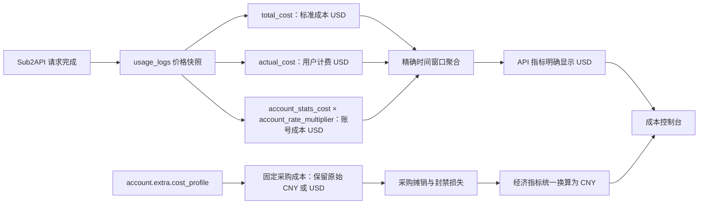

# 成本控制与账号监控异常修复报告

本文总结 2026-08-11 完成的成本控制台、趋势图表与上游账号健康状态修复，并明确本次变更是否构成成本算法升级。

> [!IMPORTANT]
> 修复代码已经通过测试和生产构建，但当前仍在运行的旧桌面程序与旧后端进程不会自动获得这些变更。发布时必须重新构建、替换并重启后端和桌面端。
>
> 本次没有修改历史 `usage_logs`，没有数据库结构迁移，也没有重新计算已经保存的 Token 价格快照。

## 结论

本次**升级了监控、时间窗口聚合和账号状态判定算法**，但**没有修改 Sub2API 的 Token 计费公式或模型单价算法**。

| 层级 | 是否升级 | 结论 |
| --- | --- | --- |
| Token 输入、输出、缓存 Token 计价 | 否 | 继续使用 Sub2API 请求发生时保存的价格快照 |
| API 标准成本、用户计费、账号成本口径 | 否 | 公式未改变，只消除了展示和时间边界混用 |
| 固定采购成本与币种处理 | 语义修复 | CNY/USD 领域被明确隔离，未改变采购摊销公式 |
| 趋势图时间窗口聚合 | 是 | 修复无时区时间、窗口不精确回退和刷新竞争 |
| “今日”统计边界 | 是 | 改为使用桌面用户本地自然日，不再混用服务器时区 |
| 账号健康状态算法 | 是 | 统一纳入实时探测、429、402、过载、临时停调度和模型限流 |
| 封禁损失确认入口 | 增强 | `deactivated_workspace` 识别提前为终局事件，计算公式不变 |

因此，在本报告第一阶段修复完成时，代码中的成本算法版本仍为 `1.5.0`：

- [`frontend/ALGORITHM_VERSION`](../frontend/ALGORITHM_VERSION)
- [`AccountCostLossAlgorithmVersion`](../backend/internal/service/account_cost_loss.go)

后续产品已决定将持续采样、趋势窗口、自然日边界、健康状态判定和单位经济性纳入统一算法版本，因此第二阶段已提升为 `1.6.0`，同时增加独立的经济预测版本 `1.0.0`。这仍是“观测与聚合语义升级”，不是 Token 价格调整。实施详情见[成本经济算法 1.6 开发与部署说明](2026-08-11_cost-economics-1.6-development.md)。

## 修复范围

本次问题由四条相互叠加的数据链缺陷造成，不是单一图表组件故障。

| 范围 | 修复前 | 修复后 |
| --- | --- | --- |
| 趋势时间 | 后端无时区字符串被浏览器按本地时间解析 | 无偏移趋势时间按 UTC 解释，窗口内数据不再被错误过滤 |
| 窗口切换 | 刷新期间切换 1 分钟/1 小时等范围会被直接丢弃 | 新范围进入刷新队列，当前请求完成后立即加载最终选择 |
| 非精确快照 | 只在缺少时间字段时回退 | 时间边界与请求不一致时也从真实 `usage_logs` 重聚合 |
| 今日统计 | 使用服务器 `Asia/Shanghai` 自然日 | 前端传入用户本地零点的 RFC3339 时间 |
| 固定采购成本 | 与 API 美元成本放在同一展示语义中 | 固定采购成本保留 CNY，API 成本明确为 USD |
| OpenAI OAuth 用量 | 错误调用仅支持 Anthropic 的被动额度接口 | Anthropic OAuth/SetupToken 使用 passive，其余使用 active |
| 429 | 部分探测失败未落入当前限流状态 | 有重置时间使用真实重置点，无信号时使用短冷却兜底 |
| 402 封闭空间 | 只识别 `detail.code`，且可能被临时规则提前截获 | 支持多种错误结构与消息，终局判定优先于其他策略 |
| 页面健康状态 | 主要依赖 `status` 和是否存在 `rate_limited_at` | 判断重置是否仍有效，并纳入探测、过载、临时停调度、模型限流 |

### 修复后的成本数据流



## 根因与修复

### 恢复真实趋势图

后端趋势 SQL 返回类似 `2026-08-11 07:00:00` 的时间字符串，但没有 `Z` 或时区偏移。运行数据库按 UTC 聚合，浏览器此前按本地时间构造 `Date`，导致每个点整体偏移，并在填充滚动窗口时被过滤掉。

修复包括：

- 在 [`usageWindow.ts`](../frontend/src/features/cost-center/usageWindow.ts) 中将无偏移趋势时间按 UTC 构造。
- 在 [`useCostCenterData.ts`](../frontend/src/features/cost-center/useCostCenterData.ts) 中验证快照的真实起止时间；不精确时从 `usage_logs` 分页聚合。
- 在 [`CostCenterView.vue`](../frontend/src/views/admin/CostCenterView.vue) 中加入刷新队列，保证用户最终选择的范围一定执行。
- 保留没有请求的真实零桶，移动平均只作为派生曲线，不改变请求数、Token 或成本总额。

### 统一“今日”的自然日边界

服务器配置使用 `Asia/Shanghai`，桌面运行在 `America/Los_Angeles`。旧实现把服务器“今日”与用户界面“今日”混在同一页面，因此同一时刻会出现日期错位和看似异常的成本总额。

修复后的调用链为：

1. 桌面端计算用户本地当天 `00:00:00`。
2. 转成带时区含义的 RFC3339/ISO 时间。
3. 通过 `/admin/accounts/today-stats/batch` 的可选 `start_time` 传给后端。
4. 后端从这个精确时刻聚合账号请求、Token 与成本快照。

相关实现：

- [`getBatchTodayStats`](../frontend/src/api/admin/accounts.ts)
- [`GetBatchTodayStats`](../backend/internal/handler/admin/account_handler.go)
- [`GetWindowStatsBatch`](../backend/internal/service/account_usage_service.go)

### 隔离采购币种与 API 美元成本

用户保存的 `2.5 CNY` 固定采购档案不应该变成 `$2.5`。正确的数据领域如下：

```text
standard_api_cost_usd = SUM(total_cost)
user_billed_usd = SUM(actual_cost)
account_token_cost_usd = SUM(
  COALESCE(account_stats_cost, total_cost) * COALESCE(account_rate_multiplier, 1)
)

fixed_procurement_cost = cost_profile.amount in cost_profile.currency
fixed_procurement_cny = convert(fixed_procurement_cost, cost_profile.currency, CNY)

combined_economic_cost_cny = fixed_procurement_cny
                           + convert(account_token_cost_usd, USD, CNY)
```

本次没有重新实现 Token 价格计算。Sub2API 已经在请求发生时保存输入、输出、缓存 Token 和账号倍率对应的价格快照，成本中心直接消费这些快照。这样可以避免模型价格目录更新后反向篡改历史成本。

参考实现：

- [Sub2API usage stats repository](https://github.com/Wei-Shaw/sub2api/blob/main/backend/internal/repository/usage_log_repo_stats.go)
- [api2business OAuth economics](https://github.com/api2business/api2business/blob/master/src/oauth-economics.ts)

`api2business` 的可取之处是明确区分 `costCny` 采购成本和 `api_amount_usd` API 使用金额；本项目采用了这个领域边界，但保留 Sub2API 作为 Token 计费权威来源。

### 修复 429 与 402 状态漏报

账号当前状态现在按照以下优先级判定：

1. 最近一次真实上游探测失败。
2. 后端已经确认的永久错误或终局封禁。
3. 尚未到期的全局 429 限流。
4. 尚未到期的临时停调度、过载或模型级限流。
5. `schedulable=false`。
6. 只有上述条件均不存在时才显示“可调度”。

过去仅凭 `rate_limited_at` 是否存在会产生两个方向的错误：过期限流仍显示受限，以及未落库的真实 429 仍显示正常。新逻辑使用未来的 `rate_limit_reset_at` 判断当前限流，并让探测失败立即覆盖页面状态。

后端同时完成以下增强：

- OpenAI 的 Responses、Chat Completions 和 Compact 探测失败统一进入 `RateLimitService`。
- 429 无明确重置时间时使用可配置短冷却，防止账号立即重新进入调度池。
- 402 `deactivated_workspace` 支持 `detail.code`、`error.code`、顶层 `code/type` 及明确消息文本。
- 已停用 workspace 的终局判定在临时错误规则和自定义策略之前执行。
- 终局事件继续进入现有成本损失账本；没有改变未摊销损失公式。

相关实现：

- [`reconcileOpenAIProbeFailure`](../backend/internal/service/account_test_service.go)
- [`isOpenAIWorkspaceDeactivated`](../backend/internal/service/ratelimit_service.go)
- [`describeCurrentAccountState`](../frontend/src/features/cost-center/upstreamTable.ts)

## 算法取舍

### 为什么继续使用 Sub2API Token 计算

继续使用 Sub2API 是本次评审后的明确决定，原因包括：

- Token 数量来自实际上游请求结果，不需要桌面端推测。
- `total_cost`、`actual_cost`、`account_stats_cost` 和 `account_rate_multiplier` 是请求发生时的快照。
- 能正确保留输入、输出、缓存读、缓存写等不同价格维度。
- 历史账单不受未来模型目录价格变化影响。
- 后端已有批量 SQL 聚合，前端只负责窗口过滤、标签和可视化。

### 从 api2business 借鉴什么

本次只借鉴经济与监控层原则：

- 采购成本和 API 使用金额使用显式币种字段。
- 健康状态只认可尚未过期的限流与停调度信号。
- 预测应建立在连续真实样本或差值上，不能把静态累计值直接当速率。
- 预期产出必须受到账号当前状态修正。

参考：[api2business runtime monitor](https://github.com/api2business/api2business/blob/master/src/oauth-runtime-monitor.ts)。

没有采用其算法替换 Sub2API Token 计费，因为两者解决的问题不同：Sub2API 负责请求级计费事实，api2business 更偏向采购经济性和运行时预测。

## Evidence → Finding → Path

**Evidence records**

### E-001

- title: 运行库存在真实请求与成本记录
- observed_at: 2026-08-11
- source_type: command
- source_ref: `sub2api-cost-postgres.usage_logs`
- content_hash: n/a
- artifact_path: n/a
- repro_command: |

  ```powershell
  docker exec sub2api-cost-postgres psql -U sub2api -d sub2api -c "SELECT COUNT(*) AS rows_24h, ROUND(SUM(actual_cost)::numeric, 6) AS billed_usd FROM usage_logs WHERE created_at >= NOW() - INTERVAL '24 hours';"
  ```

- raw_excerpt: 首次观察到最近 24 小时有 759 条 `usage_logs`；最终复核时滚动窗口仍有 728 条、用户计费 `86.623541 USD`，因此全零趋势不是无请求导致。滚动数量会随查询时间变化。
- linked_workitem: n/a
- supersedes: none

### E-002

- title: 上海自然日聚合可以复现截图成本
- observed_at: 2026-08-11
- source_type: command
- source_ref: `usage_logs.created_at` 与服务器 `Asia/Shanghai` 配置
- content_hash: n/a
- artifact_path: n/a
- repro_command: |

  ```powershell
  docker exec sub2api-cost-postgres psql -U sub2api -d sub2api -c "SET TIME ZONE 'Asia/Shanghai'; SELECT ROUND(SUM(COALESCE(account_stats_cost,total_cost) * COALESCE(account_rate_multiplier,1))::numeric, 3) FROM usage_logs WHERE created_at >= DATE_TRUNC('day', NOW());"
  ```

- raw_excerpt: 查询结果与截图中的 `$20.582` 一致，证明页面混用了服务器和桌面自然日。
- linked_workitem: n/a
- supersedes: none

### E-003

- title: 固定采购档案在数据库中仍保留 CNY
- observed_at: 2026-08-11
- source_type: command
- source_ref: `accounts.extra.cost_profile`
- content_hash: n/a
- artifact_path: n/a
- repro_command: |

  ```powershell
  docker exec sub2api-cost-postgres psql -U sub2api -d sub2api -c "SELECT id, extra->'cost_profile' AS cost_profile FROM accounts WHERE extra ? 'cost_profile';"
  ```

- raw_excerpt: 账号 17 的档案为 `amount: 2.5, currency: CNY, algorithm_version: 1.5.0`；错误发生在展示与指标语义层，而不是保存时改成 USD。
- linked_workitem: n/a
- supersedes: none

### E-004

- title: OpenAI OAuth 被错误使用 passive usage
- observed_at: 2026-08-11
- source_type: log
- source_ref: 运行后端日志与 `useCostCenterData.ts`
- content_hash: n/a
- artifact_path: n/a
- repro_command: |

  ```powershell
  Set-Location frontend
  pnpm test:run -- src/features/cost-center/__tests__/useCostCenterData.spec.ts
  ```

- raw_excerpt: 修复前 `/api/v1/admin/accounts/423/usage` 周期性返回 500，错误为 passive usage 仅支持 Anthropic OAuth/SetupToken；旧运行日志不会由修复后的代码重新产生，回归测试验证新的来源选择规则。
- linked_workitem: n/a
- supersedes: none

### E-005

- title: 修复后的自动化验证全部通过
- observed_at: 2026-08-11
- source_type: command
- source_ref: frontend/backend test and build commands
- content_hash: n/a
- artifact_path: n/a
- repro_command: |

  ```powershell
  Set-Location frontend
  pnpm test:run -- src/features/cost-center/__tests__
  pnpm typecheck
  pnpm build:desktop

  Set-Location ../backend
  go test -tags=unit ./internal/service ./internal/handler/admin -count=1
  go build ./cmd/server
  ```

- raw_excerpt: 成本中心 9 个测试文件、104 项测试通过；后端相关包、类型检查和生产构建通过。
- linked_workitem: n/a
- supersedes: none

**Findings**

### F-001

- title: 无时区趋势桶与刷新竞争导致图表长期不变化
- severity: high
- category: design
- status: validated
- evidence_ids: [E-001, E-005]
- location: `frontend/src/features/cost-center/usageWindow.ts:70`; `frontend/src/views/admin/CostCenterView.vue:1043`
- impact: 有真实请求时仍可能展示全零趋势；切换窗口无法触发最终范围加载。
- confidence: high
- repro_steps:
  1. 在 UTC 数据库写入滚动窗口内的 usage log。
  2. 在 Pacific 桌面端加载无偏移趋势时间并在刷新期间切换范围。
- remediation: 无偏移时间按 UTC 解析；校验快照边界；刷新期间排队最终选择。
- optional_attack:

### F-002

- title: 服务器自然日与用户自然日混用导致今日成本错位
- severity: high
- category: design
- status: validated
- evidence_ids: [E-002]
- location: `frontend/src/features/cost-center/useCostCenterData.ts:295`; `backend/internal/handler/admin/account_handler.go:2461`
- impact: 用户看到的“今日”成本可能属于服务器时区的另一自然日。
- confidence: high
- repro_steps:
  1. 将服务器配置为 `Asia/Shanghai`。
  2. 在 `America/Los_Angeles` 桌面端跨日界线查询今日成本。
- remediation: 由客户端传入本地日零点的精确 RFC3339 `start_time`。
- optional_attack:

### F-003

- title: 固定采购币种与 API 美元指标语义混用
- severity: high
- category: design
- status: validated
- evidence_ids: [E-003, E-005]
- location: `frontend/src/views/admin/CostCenterView.vue:107`
- impact: 用户保存的人民币采购成本可能被理解为同数值美元 API 成本。
- confidence: high
- repro_steps:
  1. 保存 `amount=2.5,currency=CNY` 的自定义成本档案。
  2. 对比固定采购指标与 API Token 成本指标。
- remediation: 保留档案币种；API 指标显式为 USD；仅在经济总成本处换算为 CNY。
- optional_attack:

### F-004

- title: 429 与已停用 workspace 未完整进入当前账号状态
- severity: high
- category: design
- status: validated
- evidence_ids: [E-004, E-005]
- location: `backend/internal/service/account_test_service.go:2151`; `backend/internal/service/ratelimit_service.go:274`; `frontend/src/features/cost-center/upstreamTable.ts:73`
- impact: 真实受限或已封闭账号仍可能显示正常并重新参与调度。
- confidence: high
- repro_steps:
  1. 让 OpenAI 探测返回 429，或返回包含 `deactivated_workspace` 的 402。
  2. 刷新成本中心并观察账号健康状态。
- remediation: 探测统一进入 RateLimitService；终局 402 优先识别；前端使用有效期与探测结果合并状态。
- optional_attack:

**Paths**

### P-001

- title: 趋势数据从真实 usage log 到图表的修复路径
- path_type: callflow
- start: Sub2API 完成上游请求
- goal: 桌面端显示与所选范围一致的真实成本趋势
- steps:
  1. action: 保存请求 Token 和价格快照到 `usage_logs`；evidence: E-001；finding: none
  2. action: 校验 dashboard snapshot 是否匹配精确窗口；evidence: E-001；finding: F-001
  3. action: 不匹配时按日志时间过滤并重新分桶；evidence: E-005；finding: F-001
  4. action: 将 USD API 指标和 CNY 采购指标分别呈现；evidence: E-003；finding: F-003
- residual_risks: 单窗口超过 25,000 条日志时兼容聚合会停止并提示，不会展示不完整总额；后续应评估后端原生精确区间 API。

### P-002

- title: 上游错误到账号健康状态的修复路径
- path_type: callflow
- start: 真实上游探测返回非 2xx
- goal: 页面和调度器使用一致的当前账号状态
- steps:
  1. action: OpenAI 探测失败进入统一错误处理；evidence: E-004；finding: F-004
  2. action: 429 写入重置时间或短冷却；evidence: E-005；finding: F-004
  3. action: 明确的 402 deactivated workspace 写入终局错误与损失账本；evidence: E-005；finding: F-004
  4. action: 前端合并持久化状态、有效期和最近探测结果；evidence: E-005；finding: F-004
- residual_risks: 无上游探测且长期没有业务流量的账号不会凭空发现远端封禁；需要保留周期性真实探测或健康任务。

## 验证与验收

自动验证结果：

| 检查 | 结果 |
| --- | --- |
| 成本中心 Vitest | 9 个文件、104 项测试通过 |
| 前端 TypeScript/Vue 类型检查 | 通过 |
| 改动文件 ESLint | 通过 |
| 桌面端 Vite 生产构建 | 通过 |
| 后端 service/admin handler 单元测试 | 通过 |
| Go server 编译 | 通过 |
| `git diff --check` | 通过 |

上线后应执行以下验收：

1. 在持续有请求的账号池中依次切换 1 分钟、5 分钟、1 小时、24 小时，确认曲线和横轴同时变化。
2. 在桌面本地午夜前后核对“今日”请求数与数据库精确起始时间。
3. 保存一个 `2.5 CNY` 成本档案，确认固定采购指标显示人民币，API Token 指标仍显示美元。
4. 对测试账号模拟或触发 429，确认页面显示当前限流且到期后恢复。
5. 对隔离测试账号返回 `error.code=deactivated_workspace` 的 402，确认账号进入错误状态且不会继续调度。
6. 核对终局损失账本只记录明确封禁事件，普通临时 402/429 不产生封禁损失。

## 发布与回滚

发布步骤：

1. 构建并替换后端 server。
2. 构建并替换桌面前端资源或完整安装包。
3. 重启后端和桌面端，等待首次真实账号探测完成。
4. 执行上述验收清单。

不需要数据库迁移。若必须回滚，可恢复旧后端和旧桌面资源；新增的 `start_time` 是可选字段，旧客户端仍能调用批量今日统计接口。已经写入的正常 429 冷却会按重置时间自动失效，明确的终局封禁记录应保留，不应因代码回滚而删除。

## 后续建议

- 让后端趋势 API 直接返回 RFC3339 时间或 Unix 时间戳，彻底取消无时区字符串。
- 将窗口精确性、价格目录版本和状态判定版本分别暴露，避免一个 `ALGORITHM_VERSION` 承担过多语义。
- 为周期性健康检查增加连续失败阈值和探测时间展示，区分“最近一次失败”与“长期不可用”。
- 在发布流水线固定执行成本中心 104 项测试与 402/429 后端回归测试。
- 保持 Sub2API 价格快照为账单事实源；预测层可以继续参考 api2business 的连续样本与状态修正方法。
