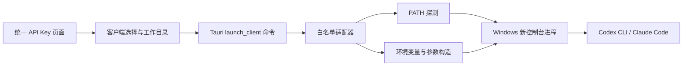

# Windows 原生客户端启动器分析与开发计划

## 结论

本项目批准增加 Windows 原生轻量客户端启动器。首版面向统一 API 使用场景，支持 Codex CLI 与 Claude Code；后续按同一适配器接口扩展 Cursor、OpenCode 和 Grok CLI。

本功能只负责把当前 API 服务的 Base URL/API Key 传给用户已经安装的客户端并启动它。用户在“API 接入中心”选中的 API Key 决定本次进程使用哪一个 Sub2API 路由；账号文件接管、自动切号、账号池和多实例生命周期管理不在本项目范围内。

## 当前实现状态

Windows 原生启动器已完成首版和后续适配器扩展：

| 客户端 | 启动方式 | 认证范围 | 兼容性边界 |
| --- | --- | --- | --- |
| ChatGPT Desktop | 探测经典安装、OpenAI.Codex/OpenAI.ChatGPT MSIX 包，并通过 AUMID 启动 | 不注入 Sub2API API Key | ChatGPT Desktop 是独立的官方客户端，不等同于 Codex CLI，也不提供统一 API 自定义端点 |
| Codex CLI | `-c` 结构化 provider 参数 | 进程级 `SUB2API_CODEX_API_KEY` | 需要 Responses API 路由 |
| Claude Code | 新控制台进程 | 进程级 `ANTHROPIC_BASE_URL` / `ANTHROPIC_AUTH_TOKEN` | 需要 Anthropic Messages 路由 |
| Cursor Agent | `--endpoint` | 进程级 `CURSOR_API_KEY` | Cursor Agent 使用自有 Agent 协议，OpenAI 兼容接口不自动等价 |
| OpenCode | `OPENCODE_CONFIG_CONTENT` 运行时配置 | 进程级 `SUB2API_OPENCODE_API_KEY` | 按密钥分组选择 OpenAI、Anthropic、Gemini、Antigravity 或 Grok provider |
| Grok CLI | `--model grok-4.5` | 进程级 `GROK_MODELS_BASE_URL` / `XAI_API_KEY` | 需要 `/v1/models` 和对应的 OpenAI 兼容 API |

OpenCode 使用内联运行时配置而不是临时文件。官方文档将 `OPENCODE_CONFIG_CONTENT` 作为高优先级运行时覆盖，因此不会写入项目或用户配置文件；API Key 仍只放在子进程环境变量中。

Windows PATH 探测优先选择 `.exe`、`.cmd`、`.bat`，跳过 npm 生成的无扩展名 POSIX `#!/bin/sh` shim。后者在 Windows 上直接执行会返回 `ERROR_BAD_EXE_FORMAT (193)`；`.cmd`/`.bat` 则通过 `cmd.exe` 新控制台启动。

## 多账号与多上游处理边界

启动器复用统一 API 内核的路由，而不是自己实现一套账号池：

1. 用户在“API 接入中心”选择一个启用中的 API Key。
2. 前端读取该 Key 绑定的分组平台（`openai`、`anthropic`、`gemini`、`antigravity`、`grok` 或 `composite`），将其作为 `gateway_profile` 传给 Tauri。
3. Tauri 只为本次子进程注入 Base URL 和 API Key。后续请求回到 Sub2API 内核，由内核按 API Key、分组、额度和既有调度规则选择实际上游账号。

因此，Claude、Cursor、Grok 等客户端可以使用不同的 Sub2API API Key 分别启动；更换账号/分组的正确方式是选择另一个 API Key 后重新启动。启动器不会读取或覆盖客户端自己的登录文件，不会把多个账号合并进客户端，也不会在后台自动切号。

当前适配器的协议处理如下：ChatGPT Desktop 只负责独立程序探测和启动；Codex 使用 Responses 路由，Claude Code 使用 Anthropic Messages 路由，Cursor Agent 使用 `--endpoint` 和 `CURSOR_API_KEY`（仍受 Cursor 自有 Agent 协议限制），Grok 使用 `GROK_MODELS_BASE_URL` 和 `XAI_API_KEY`，OpenCode 根据分组平台生成对应的运行时 provider。页面中的模型选择用于接口测试和复制配置；原生启动器对 OpenCode/Grok 使用适配器默认模型，不会修改用户模型文件。

协议依据：[Cursor Agent authentication](https://docs.cursor.com/en/cli/reference/authentication)、[OpenCode config](https://dev.opencode.ai/docs/config)、[Grok custom models](https://github.com/xai-org/grok-build/blob/main/crates/codegen/xai-grok-pager/docs/user-guide/11-custom-models.md)。

## Evidence → Finding → Path

| Evidence | Finding | Path |
| --- | --- | --- |
| Tauri Builder 已初始化 shell、opener、process 和 updater 插件 | 桌面端已有原生进程入口，不需要引入新的桌面框架 | `frontend/src-tauri/src/main.rs` |
| Tauri bundle 已携带 `sub2api-backend` Go sidecar | 当前安装包的主要体积来自统一 API 内核，而不是桌面 UI | `frontend/src-tauri/tauri.conf.json` |
| 使用密钥弹窗已经生成 Codex、Claude Code、Gemini、Grok 和 OpenCode 配置 | 客户端协议和环境变量映射已有业务依据，可抽取为启动适配器 | `frontend/src/components/keys/UseKeyModal.vue` |
| API 接入中心提供 API Key、分组平台和网关诊断 | 原生启动器必须挂在用户实际使用的入口，并使用当前选中 Key 的路由上下文 | `frontend/src/features/cost-center/components/CostApiAccessPanel.vue` |
| Keys 页面通过 `ccswitch://` 把 API Key 放入外部协议导入 | 当前流程依赖外部客户端管理器；原生启动器可以直接在本机启动，避免新增外部依赖 | `frontend/src/views/user/KeysView.vue`、`frontend/src/utils/ccswitchImport.ts` |
| 当前 Windows NSIS 安装包约 29.21 MB；桌面壳 release 可执行文件约 19.91 MB | 不捆绑第三方客户端时，启动器增量预计很小；资源增长主要来自被启动的客户端进程 | 当前 `frontend/src-tauri/target/release/bundle/nsis` 构建产物 |
| `cockpit-tools` 将客户端路径探测、终端启动、凭据注入、窗口控制和多实例合并在通用进程体系中 | 可以借鉴“适配器 + 生命周期”思路，但不应复制其完整范围 | [cockpit-tools README](https://github.com/jlcodes99/cockpit-tools) |

## 范围决策

### 首版包含

- Windows 桌面端。
- ChatGPT Desktop、Codex CLI、Claude Code。
- 从 `PATH` 探测客户端可执行文件。
- ChatGPT Desktop 额外探测常见 Windows 安装目录、OpenAI MSIX 包和开始菜单 AUMID。
- 用户选择工作目录。
- 使用当前统一 API 的 Base URL 和 API Key 启动客户端。
- 预览启动计划，显示检测到的客户端和失败原因。
- 通过 Tauri 命令执行，前端不能提交任意可执行文件和任意 shell 脚本。
- 记录最近一次工作目录，但不保存 API Key。

### 后续扩展

- 客户端路径设置和更完整的终端选择。
- 启动结果、退出状态和前台窗口提示。
- Cursor/OpenCode/Grok 的协议和模型列表随上游版本变化进行兼容性维护。

### Windows 工作目录与终端启动修复

- 工作目录不再依赖空白手填框：桌面端启动器加载时通过 `native_working_directory` 显示当前检测到的绝对目录，并提供 Windows 原生“选择目录”对话框；用户也可以恢复检测目录。
- 启动按钮在目录检测完成前保持禁用，避免把未初始化路径提交给 Tauri。
- Windows CLI 不再把标准输入重定向到 `NUL`。Codex、Claude Code、Cursor、OpenCode 和 Grok CLI 均在独立 PowerShell 窗口中以交互式 stdin/stdout/stderr 启动，窗口保持打开以便使用 CLI。
- PowerShell 采用自适应选择：优先使用稳定版 PowerShell 7 (`pwsh.exe`)，未检测到时回退到系统 Windows PowerShell 5.1 (`powershell.exe`)；不捆绑 PowerShell，也不要求用户额外安装才能使用启动器。
- PowerShell 命令对 `.cmd`/`.bat` 路径使用调用运算符 `&`，避免 OpenCode npm shim 被当作普通字符串而无法执行。
- Claude Code 首次进入工作目录可能显示 “Yes, I trust this folder” 安全确认。这是 Claude Code 自身的目录信任流程，选择 `1` 并回车后继续，不应判定为启动失败。
- ChatGPT Desktop 仍作为独立的 GUI 程序直接启动，不与 Codex CLI 合并；两者在客户端列表中分别检测、分别显示。检测同时覆盖经典安装目录、OpenAI 的 MSIX 包（例如 `OpenAI.Codex_*\\app\\ChatGPT.exe`）以及应用包清单/开始菜单 AUMID 回退，不再只依赖 PATH 别名或可访问的 `WindowsApps` 目录。

### 内存核查

先前对当前 Windows 测试机的单次进程快照显示，桌面壳本身占用远低于后端和被启动的 CLI。该快照不是版本回归结论，后续已用旧版/新版顺序启动进行受控对比。

| 进程 | 工作集 | 私有内存 | 判断 |
| --- | ---: | ---: | --- |
| `sub2api-cost-console.exe` | 约 32 MB | 约 7.7 MB | 桌面壳本身未见高占用 |
| `sub2api-backend.exe` | 约 528 MB | 约 576 MB | 后端占用较高，需要在冷启动/空闲/请求负载下继续基线测试，当前采样未显示持续增长 |
| `opencode.exe` | 约 772 MB | 约 1.36 GB | 当前最高占用来自被启动的 OpenCode/Node 进程，不是启动器壳；应单独按 OpenCode 版本和项目规模排查 |

该快照只能确认当时运行状态，不能单独证明内存泄漏。OpenCode 和后端的数值会随项目、请求和缓存变化，不能用来判断启动器自身的增量。

### 升级前后桌面壳内存对比

对比对象：旧安装副本 `D:\Sub2API Cost Console\sub2api-cost-console.exe`（SHA-256 `642DE9BCE55E6298835CF3B77DAFC78E6CDF6644AD9B64E5DF7AD61D1D94016A`）与本次升级 Release 二进制（SHA-256 `B78B7E164315453F29E8AD440D73F4245470F655031CC011FB90BFD75AE52BCF`）。两者文件版本元数据均为 `0.2.22`，因此以文件哈希和代码内容区分版本。

两者在同一台 Windows 机器上顺序启动，复用已经运行的后端端口；只统计 `sub2api-cost-console.exe`，每 500 ms 采样一次，共 40 次，取启动约 10 秒后的 20 个样本中位数：

| 指标 | 升级前 | 升级后 | 差值 |
| --- | ---: | ---: | ---: |
| 稳定工作集（中位数） | 31.71 MB | 31.71 MB | +0.00 MB |
| 稳定私有内存（中位数） | 8.02 MB | 8.00 MB | -0.02 MB |
| 启动采样峰值工作集 | 141.67 MB | 141.69 MB | +0.02 MB |
| 启动采样峰值私有内存 | 118.23 MB | 118.21 MB | -0.02 MB |
| 稳定线程数 | 21 | 21 | 0 |

结论：本次原生客户端启动器、PowerShell 自适应探测、ChatGPT MSIX 探测和目录提示增加的代码，没有带来可测量的桌面壳运行时内存增长；稳定工作集差值为 0，峰值差值约 0.02 MB，属于采样/系统调度波动。后端和 OpenCode 的内存应另行做冷启动、空闲、连续请求和退出回落测试。

### 明确不做

- 不读取、覆盖或迁移用户已有账号文件。
- 不自动切号，不代替客户端登录。
- 不复制账号目录，不提供多账号多实例。
- 不捆绑 Codex、Claude、Cursor 等第三方客户端。
- 不在 Web 浏览器模式开启本机进程权限。

## 技术方案



Rust 侧建议提供三个窄接口：

```text
list_native_clients() -> ClientAvailability[]
preview_native_client_launch(request) -> LaunchPreview
launch_native_client(request) -> LaunchReceipt
```

`request.client_id` 和 `request.gateway_profile` 只能是受支持的枚举值。Base URL 必须是 `http` 或 `https`，工作目录必须是现有目录，API Key 只存在于本次 Tauri IPC 和子进程环境中，不写日志、不拼接到命令行、不放入 URL。

Codex 使用结构化 `-c` 参数和进程级环境覆盖，不修改用户默认 `~/.codex`；Claude Code 使用子进程环境变量，不写入用户全局设置文件；OpenCode 使用 `OPENCODE_CONFIG_CONTENT`，进程退出后不留下配置文件。

## 任务规划

1. 抽取客户端启动协议和共享类型。
2. 为 Codex、Claude Code、Cursor、OpenCode、Grok 编写行为测试：客户端目录、Base URL 校验、环境变量、Windows 命令计划、OpenCode profile 和拒绝未知客户端。
3. 实现 Rust 启动器模块并注册 Tauri 命令。
4. 在“使用密钥”弹窗和桌面端“API 接入中心”增加客户端选择、启动预览和启动按钮。
5. 保留复制配置和 CCS 导入作为兼容路径。
6. 增加 Web 模式降级提示，阻止浏览器调用本机启动器。
7. 运行 Rust 测试、Vue 单元测试、TypeScript 类型检查和桌面构建验证。

## 开发计划与验收标准

### 阶段一：Codex tracer bullet

- 给定合法 Base URL、Key 和工作目录，能生成 Codex 启动计划。
- 缺少 Key、非法 URL、不存在目录和未知客户端必须失败。
- 测试不能暴露真实 Key；日志和错误文本不能包含 Key。

### 阶段二：Claude Code

- 生成 `ANTHROPIC_BASE_URL` 和 `ANTHROPIC_AUTH_TOKEN` 环境变量。
- Windows 上通过新控制台启动 `claude`/`claude.cmd`，不经由未转义的用户 shell 字符串。
- PATH 中没有客户端时，界面显示安装/路径提示而不是静默失败。

### 阶段三：Cursor、OpenCode、Grok

- Cursor Agent 通过 `--endpoint` 和 `CURSOR_API_KEY` 启动，并在界面明确提示协议兼容性。
- OpenCode 通过 `OPENCODE_CONFIG_CONTENT` 注入运行时 provider，按当前分组选择 API 协议和默认模型，不触碰用户或项目配置文件。
- Grok CLI 通过 `GROK_MODELS_BASE_URL`、`XAI_API_KEY` 和 `--model grok-4.5` 启动。

### 阶段四：界面与回归

- 用户在“使用密钥”弹窗或桌面端“API 接入中心”选择 ChatGPT Desktop、Codex CLI、Claude Code、Cursor、OpenCode 或 Grok 后可以预览并启动。
- 切换 API Key 后，启动请求使用新 Key 对应的分组平台；不会沿用上一次进程的凭据。
- Web 模式不显示可执行启动操作。
- 复制配置、CCS 导入和原有 API Key 流程不回归。

## 体积与风险控制

只增加 Rust/TypeScript 适配器，不增加新 sidecar 和客户端安装包，预期不会明显增加安装包大小。不得为了实现启动器引入完整账号数据库、后台 WebSocket、进程扫描或多实例依赖。OpenCode 配置通过进程环境变量传递，避免临时文件和清理线程的额外状态。

主要风险是凭据泄露和 shell 注入，因此实现必须使用结构化 `Command` 参数、白名单客户端、敏感字段脱敏错误处理，并以 Windows 桌面端为权限边界。任何需要修改客户端全局认证文件的能力必须另行评审，不得在本计划中顺手加入。

## cockpit-tools 复用边界

`cockpit-tools` 可作为交互和适配器行为的参考，尤其是客户端探测、终端启动和窗口体验。但其仓库声明 CC BY-NC-SA 4.0；“本项目当前不商业化”只能覆盖当前使用场景，不能自动消除署名、相同方式共享、衍生作品和再分发限制，也不能保证与本项目 LGPL 代码混合后的许可证兼容性。

因此本次首版只复用了行为思路，没有复制其源代码、依赖或多实例/账号管理模块。若未来确需复用具体代码，应把它隔离成保留原许可证和 NOTICE 的独立组件，并在合并前完成许可证审查。

## 变更记录

- 2026-08-15：根据分析结果批准轻量原生启动器；首版 Codex/Claude Code，后续 Cursor/OpenCode/Grok。
- 2026-08-15：确认统一 API 是本项目职责；账号接管、自动切号、多实例列为非目标。
- 2026-08-15：完成首版实现：`client_launcher.rs` 提供白名单客户端探测、启动预览和启动命令；Codex 使用 `-c` 结构化配置与进程级 `SUB2API_CODEX_API_KEY`，Claude Code 使用进程级 `ANTHROPIC_BASE_URL`/`ANTHROPIC_AUTH_TOKEN`。
- 2026-08-15：在桌面端“使用密钥”弹窗加入工作目录、客户端检查和启动操作；Web 模式不显示本机启动入口，复制配置和 CCS 导入继续保留。
- 2026-08-15：修正真实使用入口：桌面端“API 接入中心”加入原生启动区，启动请求绑定当前选中的 API Key 与分组平台；非 Tauri Web 模式隐藏本机启动操作。
- 2026-08-15：根据 Windows 实测修正 npm shim 探测：优先 `.exe/.cmd/.bat`，跳过无扩展名 POSIX shell shim，避免 OpenCode、Claude Code 等以 `ERROR_BAD_EXE_FORMAT (193)` 启动失败；新增 ChatGPT Desktop 与 Codex CLI 的独立枚举和启动计划。
- 2026-08-15：完成 Cursor、OpenCode、Grok 适配；按分组修正 OpenCode provider、`/v1`、`/v1beta` 和 Antigravity 路径；Cursor 页面增加自有协议兼容性警告。
- 2026-08-15：OpenCode 改用官方 `OPENCODE_CONFIG_CONTENT` 运行时配置，不生成临时配置文件。
- 2026-08-15：扩展 Rust 行为测试覆盖五种客户端和 OpenCode profile；Rust 49 项测试全部通过，前端 API 接入中心与使用密钥弹窗定向测试 24 项全部通过，TypeScript、全量 ESLint、格式检查和 `git diff --check` 通过。
- 2026-08-15：PowerShell 启动器改为优先探测稳定版 PowerShell 7，未安装时回退 Windows PowerShell 5.1；Claude Code 首次目录信任提示增加界面说明。
- 2026-08-15：扩展 ChatGPT Desktop 探测，覆盖 OpenAI Codex/ChatGPT MSIX 安装包的 `WindowsApps\\...\\app\\ChatGPT.exe`，并增加 `Get-AppxPackageManifest` 主查询与 `Get-StartApps` 兼容回退；探测会在 PowerShell 7 和 Windows PowerShell 5.1 之间自动回退，AUMID 通过白名单校验后使用 `explorer.exe shell:AppsFolder\\<AUMID>` 启动，避免 `WindowsApps` 权限、版本目录和 PowerShell 模块差异导致误报未安装。最终构建 `Sub2API Cost Console_0.2.22_x64-setup.exe`（29,219,465 bytes，SHA-256 `EF778023484129AB567DA846437AEA667BEA4992A62D345C8B39ADF7B7D84FCC`）和 release `.exe`（19,943,424 bytes，SHA-256 `CB2F27E09287F170221E3DFDDC19E31BAE0AC8C3046E812835F6333AE803ED73`）。NSIS 文件已生成，可用于本地安装测试；由于本机未配置 `TAURI_SIGNING_PRIVATE_KEY`，签名步骤使构建命令最终返回 1，本地产物不作为正式更新源。
