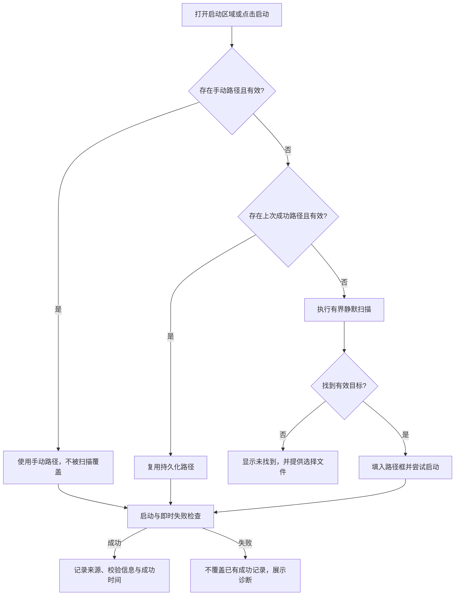

# 下一阶段开发计划：账号清理、客户端路径持久化与入口校正

> 状态：规划已落地，功能实现尚未开始  
> 制定日期：2026-08-16  
> 适用项目：Sub2API Cost Console 桌面端  
> 优先级：图一 → 图二 → 图三 → 图四可行性验证

## 0. 决策与边界

本阶段批准规划以下四项工作：

1. 成本中心支持单账号删除、多账号选择删除，以及安全选择已失效账号。
2. 原生启动器静默识别客户端真实启动目标，显示并持久化成功使用的路径；用户手动选择的路径具有最高优先级。
3. “Sub2API 设置”入口改为“Sub2API 账号管理”，跳转到 `/admin/accounts`。
4. 参考 cockpit-tools 的 Windows 客户端识别策略，独立实现路径发现、校验与启动；不直接复制其源码。

本阶段继续遵守既定产品边界：

- 不接管 `~/.codex`、`~/.claude`、客户端账号文件或浏览器会话。
- 不做自动切号。
- 不做多实例管理和独立用户数据目录注入。
- 不做 Electron 远程调试注入、二进制修改或未公开协议劫持。
- 不进行全盘递归扫描，不允许一次点击产生不受控的 PowerShell 或子进程风暴。
- ChatGPT Desktop 与 Codex CLI 继续作为两个独立客户端处理。

## 1. 交付结果

| 编号 | 交付项 | 用户结果 | 优先级 | 预计规模 |
|---|---|---|---|---|
| ACC-01 | 失效账号资格判定 | 能明确看到哪些账号可被“一键选择失效账号”选中 | P0 | M |
| ACC-02 | 单个与批量删除 | 能在成本中心删除一个或多个账号，并处理部分失败 | P0 | M |
| LAUNCH-01 | 路径字段语义拆分 | “项目工作目录”与“客户端程序路径”不再混为一谈 | P0 | S |
| LAUNCH-02 | 静默扫描与路径持久化 | 首次发现后显示真实路径，成功启动后保存，后续优先复用 | P0 | L |
| NAV-01 | 账号管理入口校正 | 点击入口直接打开 Sub2API 账号管理页 | P0 | S |
| RND-01 | 官方客户端能力验证 | 明确 ChatGPT Desktop 能否在不接管账号文件的前提下使用 Sub2API | P1 | M |
| REF-01 | cockpit-tools 策略对照 | 吸收可验证的识别思路，同时保留独立实现与许可记录 | P1 | M |

`S/M/L` 表示相对开发规模，不是发布时间承诺。

## 2. 证据链

### Evidence

#### E-001

- title: 成本中心已有账号分类入口，但缺少删除操作
- observed_at: 2026-08-16
- source_type: screenshot
- source_ref: `C:/Users/reki/AppData/Local/Temp/codex-clipboard-bc53c784-6f49-4844-b2f1-7a8101fcb445.png`
- content_hash: `D1911E43B0FA2D98981789CF11D0FD9DDA66FD5088198CA6A3BA62B00817FCB0`
- artifact_path: n/a（用户临时截图，未复制进仓库）
- repro_command: 打开“成本中心 → 上游资产与实时成本”
- raw_excerpt: 页面显示“全部 / Codex / DeepSeek 官方”等账号分类，没有删除入口。
- linked_workitem: ACC-01, ACC-02
- supersedes: none

#### E-002

- title: 启动器输入框显示工作目录，没有展示客户端真实路径
- observed_at: 2026-08-16
- source_type: screenshot
- source_ref: `C:/Users/reki/AppData/Local/Temp/codex-clipboard-52e323db-95a5-4e66-b9c6-c871ffa73d11.png`
- content_hash: `13114BE712523DA128E4F68342674E36DE3C5608954467EC89CCB3CBFA078F9F`
- artifact_path: n/a（用户临时截图，未复制进仓库）
- repro_command: 打开 API 密钥使用弹窗并进入 ChatGPT Desktop 启动区域
- raw_excerpt: 输入框标签为“工作目录”，值为 `.`，下方另行显示检测到的当前目录。
- linked_workitem: LAUNCH-01, LAUNCH-02
- supersedes: none

#### E-003

- title: Sub2API 入口文案与目标页面不一致
- observed_at: 2026-08-16
- source_type: screenshot
- source_ref: `C:/Users/reki/AppData/Local/Temp/codex-clipboard-4e68f0a0-3511-4931-a10a-a53d5708bb00.png`
- content_hash: `E27A9B1D7D2960CDE89A2D2EE901065E97BDD03600CFD2E66BF0FE7A84E206B8`
- artifact_path: n/a（用户临时截图，未复制进仓库）
- repro_command: 打开成本中心并点击顶部“Sub2API 设置”
- raw_excerpt: 当前入口显示“Sub2API 设置”。
- linked_workitem: NAV-01
- supersedes: none

#### E-004

- title: ChatGPT Desktop 卡片仅声明启动能力
- observed_at: 2026-08-16
- source_type: screenshot
- source_ref: `C:/Users/reki/AppData/Local/Temp/codex-clipboard-43c5ef43-ffe5-4f87-98f3-4ee33fdb6839.png`
- content_hash: `879552AF7F8C9F82E71300A565F31F93934CAAD10354FC35D1C73C93A4A4BF8C`
- artifact_path: n/a（用户临时截图，未复制进仓库）
- repro_command: 打开 ChatGPT Desktop 配置卡片
- raw_excerpt: 当前说明为“官方客户端不支持通过 Sub2API 注入 Base URL 或 API Key，此处仅提供本机启动”。
- linked_workitem: RND-01, REF-01
- supersedes: none

#### E-005

- title: 成本中心已经具备选择状态，但批量操作只有成本档案
- observed_at: 2026-08-16
- source_type: file
- source_ref: `frontend/src/views/admin/CostCenterView.vue:448`, `frontend/src/views/admin/CostCenterView.vue:1083`
- content_hash: n/a（源码随 Git 提交固定）
- artifact_path: `frontend/src/views/admin/CostCenterView.vue`
- repro_command: `rg -n "selectedAccountIds|toggleSelectAllVisible|openBulkCostProfile" frontend/src/views/admin/CostCenterView.vue`
- raw_excerpt: 已有行选择、全选当前筛选结果、清空选择；没有删除按钮和删除处理函数。
- linked_workitem: ACC-02
- supersedes: none

#### E-006

- title: 后端与账号管理页已有可复用的批量删除能力
- observed_at: 2026-08-16
- source_type: file
- source_ref: `backend/internal/handler/admin/account_handler.go:1580`, `frontend/src/api/admin/accounts.ts:970`, `frontend/src/views/admin/AccountsView.vue:1841`
- content_hash: n/a（源码随 Git 提交固定）
- artifact_path: `backend/internal/handler/admin/account_handler.go`, `frontend/src/api/admin/accounts.ts`, `frontend/src/views/admin/AccountsView.vue`
- repro_command: `rg -n "batch-delete|batchDelete" backend/internal/handler/admin/account_handler.go frontend/src/api/admin/accounts.ts frontend/src/views/admin/AccountsView.vue`
- raw_excerpt: 已有 `POST /api/v1/admin/accounts/batch-delete`、前端 API 封装和部分失败处理。
- linked_workitem: ACC-02
- supersedes: none

#### E-007

- title: 原生启动器每次重新发现可执行文件，只持久化工作目录
- observed_at: 2026-08-16
- source_type: file
- source_ref: `frontend/src/api/nativeClientLauncher.ts:41`, `frontend/src-tauri/src/client_launcher.rs:43`, `frontend/src-tauri/src/client_launcher.rs:405`, `frontend/src-tauri/src/client_launcher.rs:869`
- content_hash: n/a（源码随 Git 提交固定）
- artifact_path: `frontend/src/api/nativeClientLauncher.ts`, `frontend/src-tauri/src/client_launcher.rs`
- repro_command: `rg -n "workingDirectory|find_executable|NativeClientLaunchRequest" frontend/src/api/nativeClientLauncher.ts frontend/src-tauri/src/client_launcher.rs`
- raw_excerpt: 请求仅包含 `working_directory`；预览、列表和启动都会调用 `find_executable`；浏览器存储只保存工作目录。
- linked_workitem: LAUNCH-01, LAUNCH-02
- supersedes: none

#### E-008

- title: 当前 Sub2API 设置入口跳转到通用设置
- observed_at: 2026-08-16
- source_type: file
- source_ref: `frontend/src/views/admin/CostCenterView.vue:1305`
- content_hash: n/a（源码随 Git 提交固定）
- artifact_path: `frontend/src/views/admin/CostCenterView.vue`
- repro_command: `rg -n "openSub2APISettings" frontend/src/views/admin/CostCenterView.vue`
- raw_excerpt: `router.push('/admin/settings')`。
- linked_workitem: NAV-01
- supersedes: none

#### E-009

- title: cockpit-tools 使用多层 Windows 客户端路径发现并保存应用路径
- observed_at: 2026-08-16
- source_type: file
- source_ref: `https://github.com/jlcodes99/cockpit-tools/blob/main/crates/cockpit-core/src/modules/process.rs`, `https://github.com/jlcodes99/cockpit-tools/blob/main/src-tauri/src/modules/config.rs`
- content_hash: n/a（外部仓库持续更新，实施时固定审阅提交）
- artifact_path: n/a
- repro_command: `gh api -H "Accept: application/vnd.github.raw+json" "repos/jlcodes99/cockpit-tools/contents/crates/cockpit-core/src/modules/process.rs?ref=main"`
- raw_excerpt: 识别逻辑覆盖 ChatGPT.exe、Codex.exe、WindowsApps、Appx InstallLocation 和应用路径配置。
- linked_workitem: REF-01
- supersedes: none

#### E-010

- title: cockpit-tools README 对源码使用附加非商业和相同方式共享条件
- observed_at: 2026-08-16
- source_type: file
- source_ref: `https://github.com/jlcodes99/cockpit-tools/blob/main/README.md#许可证`
- content_hash: n/a（外部仓库持续更新，实施时固定审阅提交）
- artifact_path: n/a
- repro_command: `gh api -H "Accept: application/vnd.github.raw+json" "repos/jlcodes99/cockpit-tools/contents/README.md?ref=main"`
- raw_excerpt: README 声明默认采用 CC BY-NC-SA 4.0，并要求署名、非商业使用和相同方式共享。
- linked_workitem: REF-01
- supersedes: none

### Findings

#### F-001

- title: 成本中心无需重建选择系统，主要缺口是删除动作与安全规则
- severity: n/a_re
- category: design
- status: validated
- evidence_ids: [E-001, E-005, E-006]
- location: `frontend/src/views/admin/CostCenterView.vue`
- impact: 可以复用现有选择状态和批量删除接口，降低开发与回归风险。
- confidence: high
- repro_steps: 打开成本中心，勾选多个账号；当前只能批量设置成本档案。
- remediation: 在成本中心接入现有单删/批删 API，并增加危险操作确认、部分失败恢复和失效账号选择规则。

#### F-002

- title: “工作目录”与“客户端程序路径”被混淆是路径不显示、不保存的根因
- severity: n/a_re
- category: design
- status: validated
- evidence_ids: [E-002, E-007]
- location: `frontend/src/api/nativeClientLauncher.ts`, `frontend/src-tauri/src/client_launcher.rs`
- impact: 用户无法知道实际启动了哪个文件，扫描结果也不能成为下一次启动的稳定输入。
- confidence: high
- repro_steps: 检查启动请求结构和本地存储键；不存在 `executable_path`。
- remediation: 将项目工作目录与客户端启动目标拆成两个独立字段，并由 Tauri 层持久化启动目标。

#### F-003

- title: Sub2API 入口路由目标错误
- severity: n/a_re
- category: design
- status: validated
- evidence_ids: [E-003, E-008]
- location: `frontend/src/views/admin/CostCenterView.vue:1305`
- impact: 用户需要额外导航才能管理 Sub2API 账号。
- confidence: high
- repro_steps: 点击入口，观察路由进入 `/admin/settings`。
- remediation: 文案改为“Sub2API 账号管理”，路由改为 `/admin/accounts`。

#### F-004

- title: 当前识别能力的主要差距是持久化、候选优先级和手动覆盖，不是必须复制第三方实现
- severity: n/a_re
- category: design
- status: validated
- evidence_ids: [E-007, E-009]
- location: `frontend/src-tauri/src/client_launcher.rs`
- impact: 通过补齐状态模型和确定性发现顺序即可解决大部分“每次扫描、路径不显示、客户端找不到”问题。
- confidence: high
- repro_steps: 对比本项目 `find_executable` 与外部项目的路径配置和多层发现行为。
- remediation: 独立实现路径仓库、验证缓存、已知位置扫描、Appx/WindowsApps 解析和手动文件选择。

#### F-005

- title: 直接复制 cockpit-tools 源码不纳入本阶段方案
- severity: n/a_re
- category: other
- status: accepted_risk
- evidence_ids: [E-009, E-010]
- location: external repository
- impact: 直接复制会引入署名、非商业、相同方式共享、持续同步和范围污染风险；其中切号、账号文件接管、注入、多实例也违反当前产品边界。
- confidence: high
- repro_steps: 阅读外部项目 README 许可段和路径/账号管理模块。
- remediation: 只记录行为和候选来源，采用洁净的独立实现；若未来必须复用源码，先取得作者书面授权并完成许可证审阅。

### Paths

#### P-001

- title: 成本中心批量删除调用路径
- path_type: callflow
- start: 用户在上游资产表选择账号
- goal: 安全删除所选账号并准确反馈结果
- steps:
  1. action: 手动选择账号或点击“选择失效账号” — evidence: E-001, E-005 — finding: F-001
  2. action: 弹出危险操作确认，列出数量、平台和不可逆影响 — evidence: E-006 — finding: F-001
  3. action: 调用现有 `adminAPI.accounts.batchDelete(ids)` — evidence: E-006 — finding: F-001
  4. action: 刷新成本中心；删除成功项移出选择，失败项保留并显示原因 — evidence: E-006 — finding: F-001
- residual_risks: 删除接口的依赖账号、父子账号与历史数据约束必须纳入回归测试。

#### P-002

- title: 客户端启动目标解析与持久化路径
- path_type: callflow
- start: 用户打开原生启动区域或点击启动
- goal: 使用可解释、可复用且经过验证的启动目标
- steps:
  1. action: 优先验证用户手动选择的路径 — evidence: E-002, E-007 — finding: F-002
  2. action: 没有手动路径时验证上次成功启动的持久化路径 — evidence: E-007, E-009 — finding: F-004
  3. action: 缓存缺失或失效时执行有界静默扫描 — evidence: E-009 — finding: F-004
  4. action: 将解析结果填入“客户端程序路径/启动目标”框 — evidence: E-002 — finding: F-002
  5. action: 启动被操作系统接受且未立即失败后，保存扫描路径与成功时间 — evidence: E-007 — finding: F-002
- residual_risks: Store/Appx 应用可能只能得到 AppUserModelID；界面必须区分文件路径和应用启动标识。



#### P-003

- title: Sub2API 账号管理入口路径
- path_type: callflow
- start: 用户点击成本中心顶部入口
- goal: 打开账号管理页
- steps:
  1. action: 将入口文案改为“Sub2API 账号管理” — evidence: E-003 — finding: F-003
  2. action: 路由跳转到 `/admin/accounts` — evidence: E-008 — finding: F-003
- residual_risks: 若后续要保留平台筛选，应以查询参数扩展，不在首版阻塞基础跳转。

## 3. 开发任务拆解

### 3.1 删除失效账号和多账号

#### ACC-01：定义“失效账号”

“失效”不能等同于任意一次探测失败。首版采用以下规则：

- 可自动选中：账号被禁用、凭据已撤销/过期、持续认证失败且后端已落为终止状态、平台明确返回账号不存在。
- 不自动选中：429 限流、临时过载、网络超时、单次探测失败、短期不可调度、余额或配额等待恢复。
- `limited` 与临时 `error` 只显示状态，不进入“一键选择失效账号”。
- 用户仍可手动选择任意账号并删除，但必须经过二次确认。

实施文件：

- `frontend/src/features/cost-center/upstreamTable.ts`
- `frontend/src/views/admin/CostCenterView.vue`
- 必要时补充后端账户状态枚举，不新增模糊的前端字符串猜测。

验收条件：

- 临时 429、超时和过载账号不会被“一键选择失效账号”选中。
- 明确禁用、撤销或永久认证失败账号可被选中。
- UI 能解释账号被判定为失效的原因。

#### ACC-02：单删与批删

首版复用现有接口：

```http
DELETE /api/v1/admin/accounts/{id}
POST /api/v1/admin/accounts/batch-delete
Content-Type: application/json

{"account_ids":[101,102,103]}
```

交互要求：

- 每行提供危险样式的“删除”动作。
- 批量操作栏增加“选择失效账号”和“删除所选”。
- 确认框列出账号数量、平台分布和账号名称预览。
- 批量接口部分失败时，成功项从列表和选择中移除，失败项继续保留选择并展示原因。
- 删除后立即重新加载账号、成本档案和运行状态。
- 删除不得抹掉已有历史用量、成本和损失账本；若当前数据库约束无法保证，应在实现阶段先修复数据保留策略再开放按钮。

测试要求：

- 单个删除成功/失败。
- 多账号全部成功、部分失败、全部失败。
- 父子账号或依赖账号删除。
- 筛选后全选、切换筛选、清空选择。
- 删除过程中防重复提交。
- 删除后历史成本报表仍可查询。

### 3.2 静默扫描、显示和持久化客户端路径

#### LAUNCH-01：拆分两个字段

当前“工作目录”继续保留，但改名为“项目工作目录”。新增独立字段：

- `working_directory`：CLI/Agent 打开项目时使用的目录。
- `launch_target`：客户端可执行文件路径或 Store/Appx 启动标识。
- `launch_target_type`：`executable`、`command` 或 `app_user_model_id`。
- `launch_target_source`：`manual`、`persisted` 或 `scanned`。

界面要求：

- 检测到普通程序时直接显示绝对路径，例如 `C:\Program Files\...\ChatGPT.exe`。
- Store/Appx 无法可靠读取实际文件时，显示“应用启动标识”，不能伪装成文件路径。
- “选择程序”打开文件选择器；“选择目录”只修改项目工作目录。
- 提供“重新扫描”和“恢复自动检测”，但不在每次打开时强制重扫。

#### LAUNCH-02：路径仓库与解析优先级

持久化由 Tauri/Rust 层负责，避免只存在 WebView `localStorage`。建议配置文件位于 Tauri 应用数据目录，采用原子写入和版本化结构：

```json
{
  "version": 1,
  "clients": {
    "chatgpt": {
      "launch_target": "C:\\Program Files\\WindowsApps\\...\\ChatGPT.exe",
      "target_type": "executable",
      "source": "scanned",
      "last_verified_at": "2026-08-16T08:00:00Z",
      "last_success_at": "2026-08-16T08:01:00Z"
    }
  }
}
```

解析优先级固定为：

1. 用户手动路径；只要仍有效，扫描不得覆盖。
2. 上次成功启动的路径；启动前做低成本校验。
3. PATH、已知安装目录、注册表、WindowsApps、Appx `InstallLocation`、StartApps。
4. 明确显示未找到，并允许手动选择。

扫描约束：

- 只扫描已知根目录和系统注册信息，不遍历整个磁盘。
- 同一客户端扫描使用 single-flight，同一时间只能运行一个任务。
- 每种探测器有超时和候选数量上限。
- PowerShell 探测使用 `-NoLogo -NoProfile -NonInteractive`，窗口隐藏，且不使用 `-NoExit`。
- 进入启动区域时仅在没有有效持久化路径时静默扫描。
- 点击启动时先复用有效路径，只有路径失效才补扫。
- 启动命令被操作系统接受且没有即时失败后才更新 `last_success_at`；失败不得覆盖既有成功记录。

优先支持的候选：

| 客户端 | 首选发现方式 | 回退方式 |
|---|---|---|
| ChatGPT Desktop | WindowsApps/Appx `OpenAI.ChatGPT*` 中的 `ChatGPT.exe` | 已知安装目录、StartApps、手动路径 |
| Codex CLI | PATH 中可执行的 `codex.exe` / `codex.cmd` | npm/版本管理器常见目录、手动路径 |
| Claude Code | PATH 中可执行的 `claude.exe` / `claude.cmd` | npm/版本管理器常见目录、手动路径 |
| Cursor Agent | PATH 和 Cursor 安装目录 | 用户配置目录、手动路径 |
| OpenCode | PATH 中可执行的 `opencode.exe` / `opencode.cmd` | npm/版本管理器常见目录、手动路径 |
| Grok CLI | PATH 和官方常见目录 | 手动路径 |

测试要求：

- 有效手动路径始终优先，自动扫描不覆盖。
- 有效成功路径无需重扫。
- 旧路径被删除或升级后能失效并重新发现。
- 扫描找到但启动失败时不保存为成功路径。
- `.exe`、`.cmd`、`.bat`、Store/Appx 启动目标分别覆盖。
- 连续点击检查/启动不会创建重复扫描进程或导致内存持续增长。
- 探测期间无可见 PowerShell 窗口。
- 关闭并重新打开应用后，路径和来源仍正确显示。

### 3.3 校正 Sub2API 账号入口

#### NAV-01：设置改为账号管理

实施要求：

- 按钮文案：`Sub2API 账号管理`。
- 点击行为：`router.push('/admin/accounts')`。
- 桌面模式和 Web 模式行为一致。
- 增加组件测试，断言精确路由，不只断言发生了跳转。

### 3.4 验证官方 ChatGPT Desktop 的接入能力

#### RND-01：先验证，再决定是否扩展

ChatGPT Desktop 和 Codex CLI 必须分开验收：

- Codex CLI 可以通过进程环境变量和命令参数使用 Sub2API，本阶段继续维护该路径。
- ChatGPT Desktop 首先保证可靠识别和启动。
- 对 ChatGPT Desktop 的 Base URL/API Key 接入只接受可稳定复现、可回滚且不接管账号文件的方案。

技术验证顺序：

1. 检查官方公开启动参数和应用协议。
2. 检查官方客户端内置 app-server 是否提供稳定且可授权的外部配置入口。
3. 验证环境变量是否被官方桌面主进程或其 Codex 子进程实际读取。
4. 若只有配置文件替换、账号注入、远程调试注入或多实例用户目录才能实现，则结论记为“超出当前范围”，不进入开发。

输出物必须包含：

- Windows Store 与普通安装包的发现矩阵。
- 启动前后进程树与实际可执行文件路径。
- Base URL/API Key 是否被读取的网络或日志证据。
- 对用户账号文件、官方登录态和自动更新的影响。
- “仅启动”与“可接入 Sub2API”的明确能力标签。

#### REF-01：参考 cockpit-tools，但保持独立实现

允许借鉴的行为：

- 同时识别 `ChatGPT.exe` 与旧的 `Codex.exe`。
- WindowsApps 多候选版本选择。
- Appx `InstallLocation` 和 StartApps 回退。
- 保存用户自定义路径并在升级后重新校验。
- 后台探测不闪出 PowerShell 窗口。

不允许直接带入的能力：

- 自动切号和本地凭据落盘。
- `auth.json`、`config.toml` 或其他账号文件接管。
- 远程调试、Electron 注入、运行时 Hook。
- 独立用户数据目录、多实例和进程隔离管理。
- 供应商账号池、sidecar 或网关注入逻辑。

实施时必须固定参考提交 SHA，并在设计说明中记录“参考了哪些外部行为、内部代码如何独立实现”。若要复制任何源码片段，必须先取得作者书面授权并完成许可证审阅；仅仅开源和当前非商业，不会自动消除 README 声明的许可条件。

## 4. 推荐开发顺序

1. **契约与测试基线**：先补失效账号判定、批删部分失败、路径优先级和持久化格式测试。
2. **NAV-01**：低风险校正账号管理入口。
3. **ACC-01 / ACC-02**：复用现有 API，完成单删、批删和失效账号选择。
4. **LAUNCH-01**：先修正字段语义和 UI，避免继续把工作目录当程序路径。
5. **LAUNCH-02**：实现 Rust 路径仓库、有界静默发现和成功路径复用。
6. **RND-01 / REF-01**：完成官方桌面客户端能力验证，再决定是否扩展“接入 Sub2API”。
7. **整体验收**：Windows 11 + Windows PowerShell 5.1、PowerShell 7、无 PowerShell 7、Store App、普通安装包、npm CLI 和版本管理器安装场景。

## 5. 完成定义

本阶段只有同时满足以下条件才可标记完成：

- 成本中心可单删、多选删除，并正确处理部分失败。
- “选择失效账号”不会把限流、超时或临时故障账号当作永久失效账号。
- 删除不破坏历史用量、成本和损失数据。
- 项目工作目录与客户端程序路径分开显示和保存。
- 自动识别在后台完成，无可见探测终端、无重复进程、无持续内存增长。
- 用户手动路径不被自动扫描覆盖。
- 成功路径在应用重启后仍可复用；路径失效时能自动回退扫描。
- Sub2API 入口准确打开 `/admin/accounts`。
- ChatGPT Desktop 与 Codex CLI 在产品、检测、启动和能力说明中保持独立。
- cockpit-tools 只作为行为参考，代码来源和许可边界有记录。
- 前端单元测试、TypeScript、ESLint、Rust 测试、Go 测试和桌面生产构建全部通过。

## 6. 本文档结论

三项产品改动具备明确实施路径，现有项目已经拥有账号选择、批量删除 API、Windows 客户端候选扫描和 Tauri 启动命令等基础，不需要推倒重做。最重要的修复是先纠正“工作目录”和“程序路径”的数据模型，再增加持久化与严格的扫描优先级。

cockpit-tools 能识别和改变启动行为，主要因为它实现了更广的路径发现、配置持久化以及账号/实例注入体系。前两项可以在本项目内独立实现；后面的账号接管、自动切号和多实例能力不属于当前批准范围，也不应为了追平表面功能而被隐式引入。
