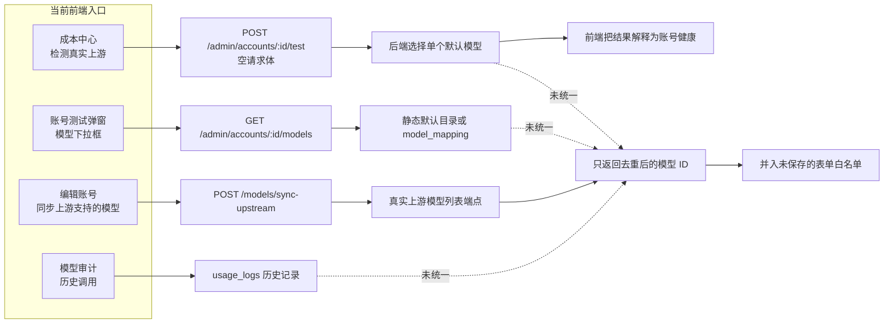

# 上游模型检测失真分析与修复方案

> 状态：已完成代码级诊断，本文是修复设计基线。
>
> 关键结论：当前系统存在真实的上游网络请求，但没有形成真实的“账号 × 模型 × 协议 × 能力”检测系统。成本中心展示的是单个默认模型的账号连接测试，账号测试弹窗展示的是静态默认目录或人工映射，“同步上游支持的模型”只读取模型 ID。三条链路互不统一，因此不能据此判断模型是否真正可调用，更不能支撑自动路由或模型健康算法。前端成本面板还存在刷新失败时成本数据消失、把用户计费产出与成本并列后产生标称混淆、同一数据重复绘制和统计维度过载的问题。

## 阅读指南

本文按以下顺序组织：

1. 先说明当前功能实际做了什么，以及为什么会给人“假功能”的感受。
2. 再给出可复现证据、正式 Findings 和当前调用路径。
3. 最后定义目标数据模型、API、探测算法、调度接入、迁移计划和验收标准。

本文不修改 Token 计费、模型价格、账号倍率或经济预测公式。修复范围包括模型目录发现、模型能力验证、健康证据、调度消费、前端数据保持与口径标注，以及成本面板精简；前端展示层不得自行创造新的成本事实。

## 执行摘要

当前产品把四个不同问题都称为“模型检测”或“上游检测”：

| 名称 | 当前数据源 | 当前能证明什么 | 当前不能证明什么 |
|---|---|---|---|
| 账号测试弹窗模型列表 | 内核静态默认模型、`model_mapping` | 本地知道这些模型名 | 上游当前是否列出、是否授权、是否可调用 |
| 同步上游支持的模型 | 上游模型列表端点 | 上游目录返回过这些模型 ID | 当前账号是否能推理、工具调用是否可用、模型是否限流 |
| 成本中心真实上游检测 | 空请求体调用账号测试端点 | 某个后端默认模型完成过一次最小请求 | 其他模型是否可用、端点能力、首 Token 延迟、模型级健康 |
| 上游模型审计 | 历史 `usage_logs` | 过去请求、发往上游和响应声明的模型 | 当前账号池支持模型清单、未调用模型的能力 |

所以当前功能不是“完全没有发请求”，而是**把真实的单点连接请求错误提升成了模型发现和账号整体健康结论**。

修复不能只换按钮文案，也不能只把 `/models` 结果塞进下拉框。需要建立一套证据驱动的模型能力域：

- 目录发现只产生 `advertised` 证据，不产生“已验证可用”结论。
- 真实推理或真实生产流量才能产生 `verified` 证据。
- 401/403 属于账号或凭据范围，不能写成模型不支持。
- 404、`model_not_found` 等明确模型错误才能产生模型级 `unsupported` 证据。
- 429、超时和 5xx 是临时状态，不得永久污染模型能力。
- 所有结论必须携带来源、时间、协议、端点、状态和过期规则。
- 调度器只能消费高置信、未过期的结论；分数只能排序，不能替代硬证据。
- 成本面板只显示有明确来源、窗口、币种和状态的数据；刷新失败不得把已有事实静默变成 0 或空白。
- `actual_cost` 只能标为用户计费产出，`total_cost`/`account_stats_cost` 只能标为标准价或上游账号成本，采购档案和损失账本必须单独显示。
- 每个事实只允许一个主面板呈现；详细诊断进入按需展开，不再复制同一时间序列和汇总指标。

## 现状调用链



这张图中的四条路径都真实存在，但没有共享统一的模型能力状态，也没有统一的证据语义。

## 证据链

### E-001：成本中心探测没有传模型

- title: 成本中心调用账号测试端点时请求体为空
- observed_at: 2026-08-25
- source_type: file
- source_ref: [frontend/src/api/admin/accounts.ts](../frontend/src/api/admin/accounts.ts#L457)
- content_hash: n/a
- artifact_path: n/a
- repro_command:

  ```powershell
  rg -n -C 10 "export async function testAccount" frontend/src/api/admin/accounts.ts
  ```

- raw_excerpt:

  ```typescript
  apiClient.post<string>(`/admin/accounts/${id}/test`, undefined, {
    responseType: 'text',
    timeout: 60000,
  })
  ```

- linked_workitem: n/a
- supersedes: none

### E-002：后端空模型请求会选择单个默认模型

- title: 账号测试按平台回落到一个硬编码或映射后的默认模型
- observed_at: 2026-08-25
- source_type: file
- source_ref: [backend/internal/service/account_test_service.go](../backend/internal/service/account_test_service.go#L278)
- content_hash: n/a
- artifact_path: n/a
- repro_command:

  ```powershell
  rg -n "DefaultTestModel|selectOpenAIAPIKeyTestModel" backend/internal/service/account_test_service.go backend/internal/pkg
  ```

- raw_excerpt:

  ```text
  OpenAI: gpt-5.4
  Gemini: gemini-2.0-flash
  Anthropic: claude-sonnet-4-5-20250929
  Grok: grokDefaultResponsesModel
  ```

- linked_workitem: n/a
- supersedes: none

### E-003：账号测试弹窗的模型列表来自静态目录

- title: `GET /admin/accounts/:id/models` 不访问上游
- observed_at: 2026-08-25
- source_type: file
- source_ref: [backend/internal/handler/admin/account_handler.go](../backend/internal/handler/admin/account_handler.go#L2606)
- content_hash: n/a
- artifact_path: n/a
- repro_command:

  ```powershell
  rg -n -C 20 "func \(h \*AccountHandler\) GetAvailableModels" backend/internal/handler/admin/account_handler.go
  ```

- raw_excerpt:

  ```go
  response.Success(c, openai.DefaultModels)
  response.Success(c, geminicli.DefaultModels)
  response.Success(c, antigravity.DefaultModels())
  response.Success(c, claude.DefaultModels)
  ```

- linked_workitem: n/a
- supersedes: none

### E-004：内核已经具备真实模型目录同步

- title: `FetchUpstreamSupportedModels` 会按账号协议访问真实模型列表端点
- observed_at: 2026-08-25
- source_type: file
- source_ref: [backend/internal/service/upstream_models.go](../backend/internal/service/upstream_models.go#L74)
- content_hash: n/a
- artifact_path: n/a
- repro_command:

  ```powershell
  rg -n "FetchUpstreamSupportedModels|buildUpstreamModelsRequest|doUpstreamModelsRequest" backend/internal/service/upstream_models.go
  ```

- raw_excerpt:

  ```text
  支持 OpenAI、Anthropic、Gemini、Antigravity、Grok、Kimi、Zhipu、DeepSeek；
  使用账号代理、TLS 指纹、OAuth/API Key 和供应商专用模型目录端点。
  ```

- linked_workitem: n/a
- supersedes: none

### E-005：真实模型同步只提取模型 ID

- title: 上游目录响应被归一化为排序后的字符串数组
- observed_at: 2026-08-25
- source_type: file
- source_ref: [backend/internal/service/upstream_models.go](../backend/internal/service/upstream_models.go#L586)
- content_hash: n/a
- artifact_path: n/a
- repro_command:

  ```powershell
  rg -n -C 30 "func extractUpstreamModelIDs|func dedupeAndSortModelIDs" backend/internal/service/upstream_models.go
  ```

- raw_excerpt:

  ```go
  return dedupeAndSortModelIDs(models), nil
  ```

- linked_workitem: n/a
- supersedes: none

### E-006：同步结果只并入前端表单

- title: 同步按钮把模型字符串合并进 `modelValue`
- observed_at: 2026-08-25
- source_type: file
- source_ref: [frontend/src/components/account/ModelWhitelistSelector.vue](../frontend/src/components/account/ModelWhitelistSelector.vue#L294)
- content_hash: n/a
- artifact_path: n/a
- repro_command:

  ```powershell
  rg -n -C 35 "const syncUpstreamModels" frontend/src/components/account/ModelWhitelistSelector.vue
  ```

- raw_excerpt:

  ```typescript
  for (const model of upstreamModels) {
    if (!newModels.includes(model)) newModels.push(model)
  }
  emit('update:modelValue', newModels)
  ```

- linked_workitem: n/a
- supersedes: none

### E-007：内核已有更强的 Responses 工具能力探测

- title: OpenAI API Key 能力探测会要求模型真实返回 `function_call`
- observed_at: 2026-08-25
- source_type: file
- source_ref: [backend/internal/service/openai_apikey_responses_probe.go](../backend/internal/service/openai_apikey_responses_probe.go#L113)
- content_hash: n/a
- artifact_path: n/a
- repro_command:

  ```powershell
  rg -n -C 40 "ProbeOpenAIAPIKeyResponsesSupport" backend/internal/service/openai_apikey_responses_probe.go
  ```

- raw_excerpt:

  ```text
  请求携带 tool_choice=required；只有响应出现 function_call 才确认工具能力，
  结果写入 accounts.extra.openai_responses_supported。
  ```

- linked_workitem: n/a
- supersedes: none

### E-008：现有测试明确固定了空请求体

- title: 前端 API 测试要求账号测试调用不携带模型
- observed_at: 2026-08-25
- source_type: command
- source_ref: [frontend/src/api/__tests__/admin.accounts.test.spec.ts](../frontend/src/api/__tests__/admin.accounts.test.spec.ts#L32)
- content_hash: n/a
- artifact_path: n/a
- repro_command:

  ```powershell
  corepack pnpm@9 test:run src/api/__tests__/admin.accounts.test.spec.ts src/features/cost-center/__tests__/useCostCenterData.spec.ts src/features/cost-center/__tests__/upstreamTable.spec.ts
  ```

- raw_excerpt:

  ```text
  Test Files  3 passed (3)
  Tests       26 passed (26)
  expect(post).toHaveBeenCalledWith('/admin/accounts/7/test', undefined, ...)
  ```

- linked_workitem: n/a
- supersedes: none

### E-009：项目文档已经承认 `/v1/models` 的边界

- title: 模型列表只能证明网关与鉴权可用
- observed_at: 2026-08-25
- source_type: file
- source_ref: [docs/DEVELOPMENT_LOG_2026-08-05.md](./DEVELOPMENT_LOG_2026-08-05.md#L434)
- content_hash: n/a
- artifact_path: n/a
- repro_command:

  ```powershell
  rg -n -C 5 "/v1/models.*只能证明" docs/DEVELOPMENT_LOG_2026-08-05.md
  ```

- raw_excerpt:

  ```text
  /v1/models 探测只能证明网关和鉴权可用，不能证明某个模型推理一定成功。
  ```

- linked_workitem: n/a
- supersedes: none

### E-010：模型审计是历史事实，不是当前能力

- title: 成本中心模型分析读取历史调用而非当前账号支持清单
- observed_at: 2026-08-25
- source_type: file
- source_ref: [docs/COST_DATA_PROVENANCE.md](./COST_DATA_PROVENANCE.md#L37)
- content_hash: n/a
- artifact_path: n/a
- repro_command:

  ```powershell
  rg -n -C 3 "模型成本分析.*不是当前号池支持模型清单" docs/COST_DATA_PROVENANCE.md
  ```

- raw_excerpt:

  ```text
  模型成本分析不是当前号池支持模型清单，而是所选时间窗口内真实发生过的模型调用历史。
  ```

- linked_workitem: n/a
- supersedes: none

### E-011：刷新或局部失败会清空已显示的成本数据

- title: 前端请求失败时将成本、用量或经济快照置为空，而不是保留并标记旧数据
- observed_at: 2026-08-25
- source_type: file
- source_ref: [frontend/src/features/cost-center/useCostCenterData.ts](../frontend/src/features/cost-center/useCostCenterData.ts#L272)
- content_hash: n/a
- artifact_path: n/a
- repro_command:

  ```powershell
  rg -n -C 8 "accountEconomics.value = null|trend.value = \[\]|accountUsage.value = nextUsage|todayStats.value = \{\}" frontend/src/features/cost-center/useCostCenterData.ts
  ```

- raw_excerpt:

  ```text
  非后台刷新会先把 accountEconomics.value 置为 null；账号清单失败会清空 accounts、todayStats 和 accountUsage；用量刷新使用 nextUsage 替换旧映射；兼容趋势聚合失败会把 trend.value 置为空数组。
  ```

- linked_workitem: n/a
- supersedes: none

### E-012：产出和成本在多个前端口径中并列，存在标称混淆

- title: `actual_cost`、标准价、账号成本和采购成本在卡片、图表和模型表中同时出现，回退值可能被读成实算成本
- observed_at: 2026-08-25
- source_type: file
- source_ref: [frontend/src/views/admin/CostCenterView.vue](../frontend/src/views/admin/CostCenterView.vue#L159)
- content_hash: n/a
- artifact_path: n/a
- repro_command:

  ```powershell
  rg -n -C 3 "windowActualOutputUsd|windowAccountCostUsd|trendStandardCost|actual_cost|accountCostSnapshot|用户 API 计费产出|上游账号调用成本|采购成本 / 产出" frontend/src/views/admin/CostCenterView.vue frontend/src/features/cost-center/components/AdaptiveOperationsCharts.vue frontend/src/features/cost-center/modelCostAnalysis.ts
  ```

- raw_excerpt:

  ```text
  CostCenterView 同时显示“用户 API 计费产出”“上游账号调用成本”“固定账号采购费率”；AdaptiveOperationsCharts 复用同一 financialTrend 绘制“采购成本 / 产出”；modelCostAnalysis 在缺少 account_stats_cost 时以 total_cost × 账号倍率回退并标记 estimated，但不同消费者仍共享 accountCost 数值。
  ```

- linked_workitem: n/a
- supersedes: none

### E-013：同一经济和运行数据被多个面板重复绘制

- title: 成本中心同时渲染旧版趋势、AdaptiveOperationsCharts 和请求量趋势，重复消费相同窗口数据
- observed_at: 2026-08-25
- source_type: file
- source_ref: [frontend/src/views/admin/CostCenterView.vue](../frontend/src/views/admin/CostCenterView.vue#L174)
- content_hash: n/a
- artifact_path: n/a
- repro_command:

  ```powershell
  rg -n -C 8 "ChartPanel title=\"API 产出速率\"|ChartPanel title=\"实时成本速率\"|<AdaptiveOperationsCharts|ChartPanel title=\"真实请求量趋势\"|financialTrend|opsTrend" frontend/src/views/admin/CostCenterView.vue frontend/src/features/cost-center/components/AdaptiveOperationsCharts.vue
  ```

- raw_excerpt:

  ```text
  CostCenterView 先绘制“API 产出速率”和“实时成本速率”，随后传入同一 financialTrend/opsTrend 渲染 AdaptiveOperationsCharts；底部又绘制“真实请求量趋势”。
  ```

- linked_workitem: n/a
- supersedes: none

### E-014：统计维度和明细列超过成本决策所需范围

- title: 成本中心默认暴露多组可切换趋势、模型汇总、Top 8 图、两张宽表和 16 列账号表，缺少按需展开边界
- observed_at: 2026-08-25
- source_type: file
- source_ref: [frontend/src/views/admin/CostCenterView.vue](../frontend/src/views/admin/CostCenterView.vue#L216)
- content_hash: n/a
- artifact_path: n/a
- repro_command:

  ```powershell
  rg -n "<MetricCell|<ChartPanel|<ModelContributionChart|<table|<AdaptiveOperationsCharts|<select" frontend/src/views/admin/CostCenterView.vue frontend/src/features/cost-center/components/AdaptiveOperationsCharts.vue
  ```

- raw_excerpt:

  ```text
  页面默认同时加载经济、请求质量、账号健康、延迟/Token、模型成本、模型路由审计、真实请求量和账号分布等多个统计面板；同一窗口还提供多组下拉切换和宽表明细。
  ```

- linked_workitem: n/a
- supersedes: none

## Findings

### F-001：模型检测名称与真实语义不一致

- title: 单模型连接测试被解释为账号或模型整体健康
- severity: high
- category: design
- status: validated
- evidence_ids: [E-001, E-002, E-008]
- location: `frontend/src/features/cost-center/useCostCenterData.ts:640`
- impact: 一个默认模型成功会让用户误以为账号整体可用；一个默认模型失败会让整个账号在成本中心显示异常，即使其他模型可用。
- confidence: high
- repro_steps:
  1. 在成本中心点击任意账号的“检测真实上游”。
  2. 观察前端发送空请求体。
  3. 观察后端选择单个默认模型。
  4. 观察结果被写入账号级 `AccountProbeState`。
- remediation: 将现有入口改名为“单模型连接测试”，要求显式模型；账号健康与模型能力分开存储和展示。
- optional_attack:

### F-002：成本中心没有消费内核原生模型同步与能力探测

- title: 本地成本扩展绕过了 `FetchUpstreamSupportedModels` 和 Responses 能力证据
- severity: high
- category: design
- status: validated
- evidence_ids: [E-004, E-006, E-007]
- location: `frontend/src/api/admin/accounts.ts:457`
- impact: 内核升级带来的模型同步、协议分支和能力探测不能自动改善成本中心；用户看到的功能长期落后于当前内核。
- confidence: high
- repro_steps:
  1. 检查成本中心 `probeAccount` 调用。
  2. 检查实时同步与能力探测端点。
  3. 确认两者不存在调用关系或共享状态。
- remediation: 建立统一模型能力服务，所有 UI 读取同一服务，成本中心不再直接包装旧账号测试端点。
- optional_attack:

### F-003：缺少可持久化、可过期、可解释的模型证据模型

- title: 当前只保存字符串列表、少数账号级能力布尔值和前端临时状态
- severity: high
- category: design
- status: validated
- evidence_ids: [E-005, E-006, E-007]
- location: `backend/internal/service/upstream_models.go:586`
- impact: 无法回答“哪个账号的哪个模型，在什么协议下，何时通过了哪种能力验证”；也无法安全接入调度算法。
- confidence: high
- repro_steps:
  1. 搜索模型同步返回类型。
  2. 搜索账号模型探测持久化结构。
  3. 确认不存在通用的模型能力证据表或当前状态表。
- remediation: 新增目录快照、能力观察和当前能力状态三类数据结构。
- optional_attack:

### F-004：一次临时错误可以覆盖账号整体状态表达

- title: 前端优先使用最近一次探测错误描述账号状态
- severity: medium
- category: design
- status: validated
- evidence_ids: [E-001, E-002, E-008]
- location: `frontend/src/features/cost-center/upstreamTable.ts:104`
- impact: 模型级 429、单模型不可用或一次网络超时会被提升为账号级异常；成功结果也可能掩盖其他模型故障。
- confidence: high
- repro_steps:
  1. 让默认测试模型返回 429。
  2. 保持同账号另一模型可用。
  3. 观察成本中心把账号标记为“探测限流”。
- remediation: 按错误范围分类；账号、模型、端点、请求四种范围不得互相覆盖。
- optional_attack:

### F-005：测试验证了数据搬运，没有验证产品承诺

- title: 测试全绿仍允许“空模型请求即模型检测”
- severity: medium
- category: design
- status: validated
- evidence_ids: [E-008, E-009]
- location: `frontend/src/api/__tests__/admin.accounts.test.spec.ts:32`
- impact: CI 能持续通过，但不能防止静态目录冒充实时目录、单模型测试冒充模型能力、目录返回冒充推理可用。
- confidence: high
- repro_steps:
  1. 运行三个现有探测相关测试文件。
  2. 确认 26 项测试全部通过。
  3. 检查断言只验证请求形状与状态搬运。
- remediation: 增加跨端集成测试，直接断言目录证据、推理证据和最终状态之间的语义。
- optional_attack:

### F-006：刷新失败导致前端成本事实自动消失

- title: 前端把暂时不可用误处理为没有数据，覆盖了最近一次成功成本快照
- severity: high
- category: design
- status: validated
- evidence_ids: [E-011]
- location: `frontend/src/features/cost-center/useCostCenterData.ts:367`, `frontend/src/features/cost-center/useCostCenterData.ts:426`, `frontend/src/features/cost-center/useCostCenterData.ts:542`
- impact: 网络抖动、单个接口超时或账号列表短暂失败时，用户会看到成本、趋势和用量突然归零/消失，无法区分“真实为零”和“读取失败”；后续刷新还可能丢失未参与本次请求的账号旧用量。
- confidence: high
- repro_steps:
  1. 首次成功加载成本中心并记录趋势和经济快照。
  2. 在下一次自动刷新中让 dashboard、usage 或 economics 请求返回 5xx/超时。
  3. 观察 `trend`、`accountUsage` 或 `accountEconomics` 被置空，而页面未保留同窗口的最近成功快照。
- remediation: 为每个数据源维护 `last_successful_value`、`updated_at`、`requested_window` 和 `stale_reason`；后台刷新失败保留旧值并显示“旧数据/刷新失败”，首次加载失败才显示“不可用”，禁止失败路径写入业务零值。
- optional_attack:

### F-007：用户计费产出被误标或误读为成本

- title: 前端缺少统一的成本事实词典，输出、标准价、账号成本和采购成本在不同组件中可能被当成同一类成本
- severity: high
- category: design
- status: validated
- evidence_ids: [E-012]
- location: `frontend/src/views/admin/CostCenterView.vue:159`, `frontend/src/features/cost-center/components/AdaptiveOperationsCharts.vue:141`, `frontend/src/features/cost-center/modelCostAnalysis.ts:64`
- impact: 管理员可能把 `actual_cost`（用户 API 计费产出）当成上游成本，或把缺少快照时的标准价回退当成账号实算成本，导致毛利、采购决策和模型排行失真。
- confidence: high
- repro_steps:
  1. 在同一窗口加载包含 `actual_cost`、`total_cost` 和 `account_stats_cost` 的 usage 记录。
  2. 对比总览卡片、经济趋势和模型成本表的标签、币种和来源标识。
  3. 删除 `account_stats_cost` 或让价格快照缺失，观察回退值是否仍以成本主值展示。
- remediation: 建立前端事实词典和不可混用类型：`billed_output_usd`、`standard_api_cost_usd`、`account_cost_usd`、`procurement_cny`、`impairment_loss_cny`；每个值必须携带 `source/status/window/currency`，估算和回退只能作为次级字段，禁止把产出命名为成本。
- optional_attack:

### F-008：前端面板重复呈现同一数据

- title: 多个图表和摘要卡片重复使用同一经济/运行时间序列，造成数字并列但口径不一致的风险
- severity: medium
- category: design
- status: validated
- evidence_ids: [E-013]
- location: `frontend/src/views/admin/CostCenterView.vue:174`, `frontend/src/views/admin/CostCenterView.vue:202`, `frontend/src/features/cost-center/components/AdaptiveOperationsCharts.vue:12`
- impact: 页面高度、请求后的渲染成本和认知负担增加；同一窗口在不同组件使用 `usage_logs`、Ops 或回退数据时，用户难以判断哪个数字是权威值。
- confidence: high
- repro_steps:
  1. 打开成本中心总览，记录“API 产出速率”和“实时成本速率”。
  2. 继续向下查看 AdaptiveOperationsCharts 和“真实请求量趋势”。
  3. 对照组件输入，确认多块面板消费同一 `financialTrend`/`opsTrend` 或其派生序列。
- remediation: 为每个指标指定一个 canonical consumer；总览只保留一块综合财务趋势和一块账号/模型真实性摘要，质量、体验和路由明细移入按需展开或详情页；所有复用必须共享同一服务端快照和查询哈希。
- optional_attack:

### F-009：默认统计面板过载，稀释高价值信息

- title: 大量低频或重复统计默认展开，未按决策任务进行渐进披露
- severity: medium
- category: design
- status: validated
- evidence_ids: [E-014]
- location: `frontend/src/views/admin/CostCenterView.vue:216`, `frontend/src/views/admin/CostCenterView.vue:365`
- impact: 关键的账号状态、真实产出和模型核对结果被大量 Token、缓存、趋势、排行和宽表字段掩盖；前端还可能为未使用的明细发起读取和价格查询，增加加载时间与数据漂移面。
- confidence: high
- repro_steps:
  1. 打开成本中心总览并统计默认渲染的 MetricCell、ChartPanel、表格和筛选器数量。
  2. 观察模型成本、路由审计、运行质量和体验统计是否同时请求并显示。
  3. 检查普通运营任务是否需要这些全部维度。
- remediation: 采用“核心摘要 → 真实性核对 → 按需诊断”的三级信息架构；默认仅展示窗口、用户计费产出、上游账号成本、贡献额、可调度账号、模型核对状态和数据新鲜度；Token/缓存/TTFT/路由逐行明细仅在用户选择后加载。
- optional_attack:

## 当前调用路径

### P-001：成本中心账号探测路径

- title: 空模型请求被提升为账号整体健康
- path_type: callflow
- start: 成本中心点击“检测真实上游”
- goal: 成本中心账号状态和延迟单元格
- steps:
  1. action: `CostCenterView.runProbe(account)` 调用 `useCostCenterData.probeAccount` - evidence: E-001 - finding: F-001
  2. action: `accounts.testAccount(id)` 发送空请求体 - evidence: E-001 - finding: F-001
  3. action: `AccountHandler.Test` 接受可选 `model_id`，本次为空 - evidence: E-002 - finding: F-001
  4. action: `AccountTestService` 按平台选择一个默认模型 - evidence: E-002 - finding: F-001
  5. action: SSE 终态被压缩为 `success/message/latency_ms` - evidence: E-008 - finding: F-005
  6. action: 前端把一次结果用于账号级状态和排序 - evidence: E-008 - finding: F-004
- residual_risks: 即使默认模型测试成功，工具调用、流式输出、图片、音频、其他模型和其他协议仍可能不可用。

### P-002：实时目录同步路径

- title: 真实目录返回被降维成表单字符串
- path_type: callflow
- start: 编辑账号点击“同步上游支持的模型”
- goal: 账号表单中的模型白名单
- steps:
  1. action: `ModelWhitelistSelector.syncUpstreamModels` 调用同步 API - evidence: E-006 - finding: F-002
  2. action: `FetchUpstreamSupportedModels` 按账号协议请求真实目录 - evidence: E-004 - finding: F-002
  3. action: 响应被解析为去重排序的模型 ID - evidence: E-005 - finding: F-003
  4. action: 前端把字符串并入 `modelValue` - evidence: E-006 - finding: F-003
- residual_risks: 目录可能包含未授权、灰度、仅特定端点可用或当前限流的模型；同步后仍需管理员保存表单。

### P-003：前端事实从后端快照到面板的展示路径

- title: 刷新失败、口径混用和重复面板共同放大成本误读
- path_type: callflow
- start: 成本中心自动刷新或用户切换观察窗口
- goal: 在不丢失事实的前提下显示精简、可核对的成本与模型状态
- steps:
  1. action: `useCostCenterData.reload` 并行请求账号、dashboard、usage、Ops、模型和经济快照 - evidence: E-011 - finding: F-006
  2. action: 各请求结果被写入共享响应式状态，失败分支可能写入空数组/空对象 - evidence: E-011 - finding: F-006
  3. action: `actual_cost`、标准价、账号成本和采购配置被映射为多个同级指标 - evidence: E-012 - finding: F-007
  4. action: `CostCenterView` 与 `AdaptiveOperationsCharts` 重复渲染 financialTrend/opsTrend - evidence: E-013 - finding: F-008
  5. action: 模型、Token、缓存、延迟和路由宽表默认展开 - evidence: E-014 - finding: F-009
- residual_risks: 即使保留旧快照，旧数据仍可能因超过 TTL 而不适合决策；页面必须显式显示新鲜度、窗口和数据覆盖率，不能用保留旧值掩盖长期不可用。

## 根因分析

### 概念被混用

系统缺少明确术语边界：

| 建议术语 | 定义 | 是否产生调用成本 |
|---|---|---:|
| 模型目录发现 | 读取上游声明的模型列表 | 否 |
| 模型连接测试 | 对一个明确模型发送一次最小请求 | 是 |
| 模型能力验证 | 验证流式、工具、图片、音频、Embedding 等明确能力 | 是 |
| 被动能力观察 | 从真实业务流量提取成功/失败证据 | 不额外产生 |
| 模型历史审计 | 分析 `usage_logs` 中已经发生的请求和响应模型 | 不额外产生 |
| 账号健康 | 凭据、配额、上游可达性等账号范围状态 | 视探测方式而定 |

当前 UI 和代码把前五项交叉使用，导致用户无法判断每个结论的证据等级。

### 功能按页面叠加，而不是按领域收敛

成本中心先增加了一个轻量的 SSE 结果归一化器，以便展示连接耗时；后来上游内核增加了真实模型同步和 Responses 能力探测。合并内核时，两套代码都被保留，但没有建立统一接口。

这不是简单的“忘记调用新函数”，而是缺少一个拥有模型真相的后端领域边界。只在前端改调用仍会继续产生新的分叉。

### 前端状态替换和信息架构没有统一事实边界

成本中心同时维护 `trend`、`financialTrend`、`opsTrend`、`accountEconomics`、`models` 和 `modelRoutes` 等状态。它们分别来自 dashboard、usage_logs、Ops、经济采样和路由审计，刷新时又有不同的清空、回退和缓存策略。没有统一的“最近成功快照 + 当前请求状态”合同时，临时故障会被表现成数据不存在。

展示层也把用户计费产出、标准 API 成本、账号调用成本、固定采购和损失账本放在同一视觉层级，并将同一时间序列交给旧版趋势和 AdaptiveOperationsCharts 两套组件。结果是数值来源和业务含义都需要用户自行猜测，面板越完整，越难判断哪一个数字可以用于决策。

### 当前存储结构无法表达模型能力

现有数据主要分散在：

- `credentials.model_mapping`：管理员配置的请求模型到上游模型映射。
- 模型白名单：允许用户请求的模型名。
- 静态 `DefaultModels`：代码随版本发布的默认目录。
- `accounts.extra.openai_responses_supported`：特定 OpenAI 能力布尔值。
- `accounts.extra.model_rate_limits`：部分模型限流状态。
- `usage_logs`：真实历史调用事实。
- 前端 `AccountProbeState`：页面生命周期内的单次测试结果。

这些字段没有共同主键、证据来源、时间和过期语义。

### 当前算法版本与模型检测无关

成本算法 `1.6.0` 负责成本与经营聚合语义，不是模型能力算法。继续提升该版本号不会自动带来模型检测能力。模型检测应拥有独立的 schema/version，例如 `model_capability_schema=1`，避免再次混用版本含义。

## 修复目标

修复完成后，系统必须能对以下问题给出可解释答案：

1. 上游目录是否声明了模型？
2. 哪个账号、通过哪个协议和端点发现了它？
3. 是否完成过真实文本推理？
4. 是否验证了流式、工具、图片、音频、Embedding 或其他能力？
5. 最近一次成功、失败和限流分别是什么时间？
6. 结论来自主动探测、真实流量、目录声明还是人工覆盖？
7. 证据是否过期？
8. 调度器为什么选择或拒绝该账号模型组合？

## 目标领域模型

### 模型目录快照

新增 `account_model_catalog_snapshots`：

| 字段 | 类型 | 说明 |
|---|---|---|
| `id` | bigint | 快照 ID |
| `account_id` | bigint | 账号 ID |
| `source` | varchar | `openai_models`、`codex_manifest`、`anthropic_models`、`gemini_models`、`antigravity_internal`、`grok_models` |
| `protocol` | varchar | 实际使用的协议 |
| `endpoint` | varchar | 脱敏后的端点标识，不保存凭据 |
| `status` | varchar | `success`、`failed`、`unsupported` |
| `model_count` | int | 返回模型数量 |
| `response_hash` | char(64) | 规范化响应 SHA-256，用于变化检测 |
| `duration_ms` | int | 目录请求耗时 |
| `fetched_at` | timestamp | 获取时间 |
| `error_code` | varchar | 结构化错误代码 |

新增 `account_model_catalog_entries`：

| 字段 | 类型 | 说明 |
|---|---|---|
| `snapshot_id` | bigint | 所属快照 |
| `account_id` | bigint | 冗余账号 ID，便于查询 |
| `model_id` | varchar | 规范化上游模型 ID |
| `display_name` | varchar | 上游显示名，可空 |
| `owned_by` | varchar | 上游所有者，可空 |
| `raw_metadata` | json | 有界、脱敏的公开模型元数据 |

目录快照是上游声明事实，不直接代表可用。

### 能力观察

新增 append-only 表 `account_model_capability_observations`：

| 字段 | 类型 | 说明 |
|---|---|---|
| `id` | bigint | 观察 ID |
| `account_id` | bigint | 账号 ID |
| `model_id` | varchar | 实际上游模型 ID |
| `requested_model` | varchar | 客户端模型名，可空 |
| `protocol` | varchar | `responses`、`chat_completions`、`messages`、`generate_content` 等 |
| `capability` | varchar | `catalog`、`text`、`stream`、`tools`、`vision`、`image_generation`、`tts`、`stt`、`realtime`、`embeddings`、`compact` |
| `outcome` | varchar | `success`、`unsupported`、`rate_limited`、`auth_failed`、`transient_failed`、`inconclusive` |
| `evidence_source` | varchar | `catalog`、`active_probe`、`passive_traffic`、`manual_override` |
| `status_code` | int | 上游 HTTP 状态，可空 |
| `error_code` | varchar | 结构化上游错误代码 |
| `ttft_ms` | int | 首 Token 延迟，可空 |
| `duration_ms` | int | 总耗时 |
| `observed_at` | timestamp | 观察时间 |
| `expires_at` | timestamp | 证据过期时间 |
| `request_fingerprint` | char(64) | 去重用探测模板指纹 |
| `probe_run_id` | bigint | 主动探测运行 ID，可空 |

该表不保存提示词、Token 或凭据原文。

### 当前能力状态

新增 `account_model_capability_states` 作为物化当前状态：

| 字段 | 类型 | 说明 |
|---|---|---|
| `account_id` | bigint | 账号 ID |
| `model_id` | varchar | 上游模型 ID |
| `protocol` | varchar | 协议 |
| `capability` | varchar | 能力 |
| `state` | varchar | `unknown`、`advertised`、`verified`、`degraded`、`rate_limited`、`unsupported`、`stale` |
| `confidence` | decimal | 0 到 1，仅用于解释和排序 |
| `last_success_at` | timestamp | 最近成功 |
| `last_failure_at` | timestamp | 最近失败 |
| `last_observed_at` | timestamp | 最近证据 |
| `evidence_source` | varchar | 当前结论来源 |
| `evidence_id` | bigint | 决定当前状态的观察记录 |
| `version` | int | 乐观锁版本 |

唯一键为 `(account_id, model_id, protocol, capability)`。

### 探测运行

新增 `account_model_probe_runs`：

| 字段 | 类型 | 说明 |
|---|---|---|
| `id` | bigint | 运行 ID |
| `account_id` | bigint | 账号 ID |
| `trigger` | varchar | `manual`、`catalog_changed`、`stale_refresh`、`scheduler_gap` |
| `requested_capabilities` | json | 本次计划验证的能力 |
| `status` | varchar | `queued`、`running`、`completed`、`partial`、`failed`、`cancelled` |
| `budget_requests` | int | 请求预算 |
| `used_requests` | int | 实际请求数 |
| `started_at` | timestamp | 开始时间 |
| `finished_at` | timestamp | 完成时间 |
| `summary` | json | 数量摘要，不含敏感内容 |

## 证据状态机

模型能力状态按证据范围演进：

```text
unknown
  └─ 目录声明 ─> advertised
advertised
  ├─ 主动探测成功/真实流量成功 ─> verified
  ├─ 明确 model_not_found/unsupported ─> unsupported
  ├─ 429 ─> rate_limited
  └─ 超时/5xx/响应不完整 ─> degraded 或 inconclusive
verified
  ├─ 新成功证据 ─> verified（刷新时间与统计）
  ├─ 临时错误 ─> degraded
  ├─ 明确不支持且证据更新 ─> unsupported
  └─ 超过 TTL ─> stale
rate_limited/degraded/unsupported
  ├─ 后续成功 ─> verified
  └─ 超过 TTL ─> stale
stale
  └─ 新证据 ─> 对应当前状态
```

必须遵守以下范围规则：

| 上游结果 | 作用范围 | 能否判模型不支持 |
|---|---|---:|
| 2xx 且满足能力断言 | 模型 + 协议 + 能力 | 否，判 `verified` |
| 404 / `model_not_found` | 模型 | 是 |
| 明确 `unsupported_feature` | 模型 + 协议 + 能力 | 是 |
| 401 / token invalid | 账号凭据 | 否 |
| 403 / entitlement | 账号或租户 | 通常否，除非结构化代码明确模型授权 |
| 429 | 模型或账号临时限流 | 否 |
| 402 | 账号账单或租户 | 否 |
| 5xx / 超时 /断流 | 请求临时故障 | 否 |
| 目录中消失 | 模型目录 | 不能单独判不支持，先标 `stale` |

## 探测策略

### 分级探测

| 级别 | 目标 | 请求 | 默认自动执行 | 成本 |
|---|---|---|---:|---:|
| L0 | 目录发现 | 模型列表端点 | 是 | 无模型调用成本 |
| L1 | 文本最小推理 | 明确模型，最小输入与输出预算 | 是，仅新模型或过期模型 | 低 |
| L2 | 流式与 TTFT | 流式最小输出，验证终态 | 按需 | 低 |
| L3 | 工具调用 | `tool_choice=required` 并验证工具输出 | OpenAI Responses 兼容账号按需 | 中 |
| L4 | 多模态 | 图片输入、图片生成、TTS、STT、Realtime | 仅手动或明确配置 | 中到高 |
| L5 | 长上下文/压缩 | 受控的大输入或远程 compact 探测 | 仅专项运维 | 高 |

默认后台任务只执行 L0 和受预算约束的 L1。不能自动遍历所有媒体模型。

### 自适应调度

探测优先级：

1. 上游目录中新出现的模型。
2. 被调度器需要但当前状态为 `unknown` 或 `stale` 的模型能力。
3. 最近真实请求失败且错误范围不明确的模型。
4. 即将过期的高流量模型证据。
5. 长期无流量、低价值模型。

不应每分钟全量扫描。建议默认预算：

| 约束 | 默认值 |
|---|---:|
| 单账号同时探测 | 1 |
| 全局同时探测 | 4 |
| 单账号每小时 L1 请求 | 12 |
| 单模型成功证据 TTL | 24 小时 |
| 单模型明确不支持 TTL | 6 小时 |
| 429 TTL | 使用上游 reset；缺失时 10 分钟 |
| 网络失败退避 | 1、5、15、60 分钟 |
| 目录快照周期 | 6 小时，支持 ETag/Hash 无变化跳过 |

### 被动证据优先

真实业务流量已经证明模型能力时，不再重复主动探测：

- 成功的非流式响应产生 `text=verified`。
- 成功流式终态产生 `stream=verified` 并记录 TTFT。
- 成功工具调用产生 `tools=verified`。
- 成功图片、音频或 Embedding 请求产生对应能力证据。
- 生产请求失败按相同的范围规则写入观察，但不直接永久封禁模型。

被动证据必须从网关统一终态写入，不能由前端推断。

## 健康与排序算法

### 先分类，再评分

状态是事实分类，分数只是同状态候选之间的排序辅助。禁止使用低分直接判“不支持”。

对于未过期的模型能力状态，定义：

```text
success_posterior = (success_count + 1) / (success_count + failure_count + 2)
freshness = exp(-evidence_age_seconds / ttl_seconds)
latency_score = 1 / (1 + p95_ttft_ms / target_ttft_ms)
source_weight:
  passive_traffic = 1.00
  active_probe    = 0.90
  manual_override = 0.80
  catalog         = 0.35

confidence = clamp(source_weight × freshness, 0, 1)
health_score = 100 × confidence × (
  0.65 × success_posterior +
  0.25 × latency_score +
  0.10 × availability_window_score
)
```

其中：

- `failure_count` 只统计模型或能力范围的明确失败，不包含账号凭据错误。
- `availability_window_score` 来自最近窗口内可调度时间占比。
- 没有 TTFT 样本时不填 0，重新分配权重或显示“无样本”。
- `catalog` 证据最高只能得到 `advertised`，不能仅靠分数升级到 `verified`。

### 调度硬门槛

调度器按以下顺序过滤：

1. 账号状态、凭据、配额和管理员开关。
2. 模型白名单与映射。
3. 请求所需协议和能力。
4. 高置信 `unsupported` 硬排除。
5. 未过期模型限流排除。
6. `verified` 优先，`advertised/unknown` 可按配置参与探索流量。
7. 在候选内复用现有倍率、毛利、粘性、并发和负载评分。

不得把目录未列出直接当作硬排除，因为部分供应商目录不完整。

## API 设计

### 保留兼容端点

`GET /api/v1/admin/accounts/:id/models` 暂时保留，返回“有效模型目录”，但必须增加响应元数据：

```json
{
  "data": [
    {
      "id": "gpt-5.6-sol",
      "display_name": "gpt-5.6-sol",
      "catalog_state": "advertised",
      "source": "codex_manifest",
      "last_observed_at": "2026-08-25T05:00:00Z"
    }
  ],
  "meta": {
    "source": "live_snapshot",
    "snapshot_id": 481,
    "stale": false
  }
}
```

旧客户端只读取 `data[].id`，可以继续工作。

### 新增模型目录端点

```http
GET /api/v1/admin/accounts/42/model-catalog
POST /api/v1/admin/accounts/42/model-catalog/refresh
```

`GET` 支持：

| 参数 | 值 | 说明 |
|---|---|---|
| `view` | `effective` | 合并实时目录、人工映射和静态兜底 |
| `view` | `live` | 只返回最近上游目录快照 |
| `view` | `configured` | 只返回人工白名单与映射 |

`POST refresh` 只刷新目录，不执行模型推理。

### 新增能力端点

```http
GET /api/v1/admin/accounts/42/model-capabilities
POST /api/v1/admin/accounts/42/model-probes
GET /api/v1/admin/model-probe-runs/9021
```

创建探测请求：

```json
{
  "models": ["gpt-5.6-sol", "gpt-5.4"],
  "capabilities": ["text", "stream", "tools"],
  "mode": "bounded",
  "request_budget": 6
}
```

响应：

```json
{
  "run_id": 9021,
  "status": "queued",
  "request_budget": 6
}
```

### 修正账号测试端点

前端不再发送空请求体。最小请求必须明确：

```json
{
  "model_id": "gpt-5.6-sol",
  "mode": "default",
  "prompt": "Reply with OK."
}
```

如果未传 `model_id`，后端可以兼容旧客户端，但响应中必须声明实际测试模型：

```json
{
  "type": "test_complete",
  "success": true,
  "model_id": "gpt-5.4",
  "protocol": "responses"
}
```

## 服务端组件设计

新增后端组件：

| 组件 | 职责 |
|---|---|
| `ModelCatalogService` | 获取、规范化、持久化目录快照 |
| `ModelCapabilityService` | 写入观察并折叠当前状态 |
| `ModelProbePlanner` | 根据变化、过期、流量和预算生成探测计划 |
| `ModelProbeRunner` | 执行供应商/协议专用探测 |
| `ModelEvidenceRecorder` | 从真实网关终态写入被动证据 |
| `ModelCapabilityRepository` | 快照、观察、状态和运行仓储 |
| `ModelCapabilitySchedulerAdapter` | 向现有调度器提供硬过滤与排序信号 |

供应商适配器接口：

```go
type ModelProbeAdapter interface {
    ListModels(ctx context.Context, account *Account) (*CatalogResult, error)
    Probe(ctx context.Context, account *Account, request ProbeRequest) (*ProbeResult, error)
    ClassifyError(statusCode int, body []byte, err error) ProbeOutcome
}
```

不能把所有供应商强行走 OpenAI `/v1/models` 和 Responses。适配器必须复用现有内核的协议实现。

## 前端修复

### 成本中心

将当前按钮改名为“单模型连接测试”，并显示：

- 实际测试模型。
- 实际协议。
- 总耗时和 TTFT，缺失时分别显示“无样本”。
- 本次请求是否产生费用。
- 结果作用范围是模型，不是账号整体。

账号状态仍来自后端账号状态、配额、限流和真实流量，不再由前端临时探测覆盖。

### 成本数据保持与事实词典

成本中心必须把每个数据源建模为以下状态，而不是用空数组代表所有失败：

| 状态 | 首次加载 | 后台刷新 | 数值展示 |
|---|---|---|---|
| `measured` | 显示当前成功快照 | 替换为新快照 | 显示数值、窗口、更新时间和来源 |
| `stale` | 不适用 | 保留最近成功快照并标记刷新失败 | 显示旧值和 `stale_reason`，禁止伪装最新 |
| `empty` | 显示“窗口内无记录” | 仅在服务端确认空结果时使用 | 显示 0 仅限已确认的事实零值 |
| `unavailable` | 显示无数据和错误原因 | 保留旧值并标记不可用 | 不写入 0，不删除其他来源的事实 |
| `partial` | 显示覆盖范围 | 保留可用分片 | 同时显示覆盖率和缺失范围 |

所有成本字段使用固定词典：

| 前端字段 | 含义 | 单位/来源 | 禁止替代 |
|---|---|---|---|
| `billed_output_usd` | 用户 API 计费产出 | USD，`usage_logs.actual_cost` | 不得命名为上游成本或采购成本 |
| `standard_api_cost_usd` | 标准/渠道 API 成本 | USD，价格目录和请求快照 | 不得冒充账号实算成本 |
| `account_cost_usd` | 上游账号调用成本 | USD，`account_stats_cost` 或明确标记的历史回退 | 回退必须显示 `estimated` |
| `procurement_cny` | 固定账号采购投入/费率 | CNY，采购档案 | 不得并入 API 调用成本 |
| `impairment_loss_cny` | 终局封禁损失 | CNY，独立损失账本 | 不得并入用户产出 |

### 成本面板精简方案

将前端信息架构收敛为三个默认工作区，其他数据按需加载：

1. **总览**：观察窗口、用户计费产出、上游账号成本、API 贡献额、可调度账号、数据新鲜度；保留一张综合财务趋势图。
2. **账号与模型核对**：账号可调度状态、模型目录/能力状态、请求模型 → 上游模型 → 响应声明三段核对；保留异常和不一致摘要。
3. **诊断与治理**：数据源状态、窗口覆盖、价格缺失、回退记录和可展开的路由/Token/TTFT 明细。

下列内容不再默认同时出现：旧版“API 产出速率”与“实时成本速率”两套重复图、AdaptiveOperationsCharts 中重复的经济趋势、独立的真实请求量趋势、模型 Top 8 图、全量路由宽表、未采集的“恢复”指标和低频 Token/缓存明细。它们只能作为总览指标的详情或用户主动选择后的诊断数据。

精简不等于删除证据：所有被隐藏的数据仍由统一后端快照提供，详情页必须复用相同的 `source/status/window/updated_at/query_hash`，不得重新计算一套金额。

### 账号测试弹窗

打开弹窗时读取 `view=effective` 模型目录：

- `verified` 模型优先排序。
- `advertised` 显示“目录声明，未验证”。
- `stale` 显示最近验证时间。
- 人工模型保留“手动配置”来源。
- 静态目录只能作为“内置兜底”，不能标“上游可用”。

### 模型能力页

每个账号展示模型矩阵：

| 模型 | 目录 | 文本 | 流式 | 工具 | 图片 | 最近证据 | 来源 |
|---|---|---|---|---|---|---|---|
| `gpt-5.6-sol` | 已声明 | 已验证 | 已验证 | 已验证 | 未检测 | 2 分钟前 | 真实流量 |
| `gpt-5.4` | 已声明 | 已验证 | 未检测 | 不支持 | 不适用 | 1 小时前 | 主动探测 |

操作分为“刷新目录”和“验证能力”，避免继续混用。

### 自动巡检

删除 `AccountsView.vue` 中依赖当前页面、`localStorage` 和前端计时器的“逐账号健康巡检”。替换为服务端探测计划状态：

- 前端只配置开关、预算和周期。
- 服务端负责任务、并发、重试和持久化。
- 多管理员、多桌面实例不会重复探测。
- 页面关闭后任务仍按配置运行。

### 模型核对真实性

模型相关 UI 必须同时展示三个名称和证据层级：

- `requested_model`：客户端请求的模型；
- `upstream_model`：实际发往上游的模型；
- `upstream_response_model`：上游响应声明的模型，可为空。

模型目录返回只能进入 `advertised`；真实推理成功或真实业务流量才能进入 `verified`。401/403 只影响账号或租户范围，429/5xx/超时进入带 TTL 的临时状态，404/`model_not_found` 才能形成模型级 `unsupported`。缺少响应声明必须显示“未观测”，不能计入一致率分母。每条模型结论还必须显示协议、端点、最近证据时间、来源和过期时间。

## 迁移方案

### 阶段 0：立即纠正语义

目标：不改数据库，先停止误导。

- “检测真实上游”改为“单模型连接测试”。
- 结果显示实际模型和协议。
- 不再用临时探测覆盖账号整体健康标签。
- 静态模型列表标记为“内置/配置目录”。
- “同步上游支持的模型”改为“读取上游模型目录”。
- 成本卡片统一使用事实词典，明确区分产出、标准价、账号成本、采购和损失。
- 刷新失败保留最近成功快照并标记旧数据；禁止失败分支清空可见成本。
- 总览只保留一套财务趋势和一个真实性摘要，重复图表与明细改为按需展开。

验收：用户能明确区分目录、连接测试和历史审计。

### 阶段 1：统一目录读取

目标：让账号测试弹窗和编辑账号共用内核实时目录能力。

- 提取 `ModelCatalogService`，包装现有 `FetchUpstreamSupportedModels`。
- 增加内存缓存和来源元数据。
- `GetAvailableModels` 从统一服务读取，静态目录仅作为明确兜底。
- 前端 `testAccount` 支持显式 `model_id`。

验收：同一账号在编辑弹窗与测试弹窗看到同一实时目录和来源。

### 阶段 2：持久化证据

目标：建立目录快照、观察、当前状态和探测运行表。

- 增加数据库迁移与仓储。
- 目录刷新写快照与 diff。
- 现有 OpenAI Responses、compact 和模型限流状态桥接成能力观察。
- 增加数据清理策略，观察保留 30 天，当前状态长期保留。

验收：服务重启、页面关闭和多实例下结论保持一致。

### 阶段 3：主动与被动能力验证

目标：对新模型和关键能力进行成本受控验证。

- 接入网关成功/失败终态作为被动证据。
- 实现 L1 文本和 L2 流式探测。
- 复用现有 OpenAI Responses 工具能力探测作为 L3 适配器。
- 媒体能力仅允许手动运行。
- 实现错误范围分类和 TTL。

验收：目录声明和真实可用状态分开展示；一次 429 不会写成永久不支持。

### 阶段 4：调度与评分接入

目标：让模型证据改善路由，但不破坏现有安全边界。

- 调度器先消费高置信硬状态。
- `verified` 优先，`unknown/advertised` 只进入受控探索流量。
- 在候选内使用健康分数排序。
- 输出调度拒绝原因，例如 `model_capability_unsupported`、`model_capability_stale`。
- Ops 增加模型能力状态和证据来源指标。

验收：调度决定可解释，可关闭新算法快速回退。

### 阶段 5：清理旧路径

目标：移除重复真相源。

- 删除前端定时账号巡检。
- 删除测试弹窗对纯静态模型目录的直接依赖。
- 将零散能力字段迁移到统一状态，同时保留兼容读取期。
- 更新所有文档和 UI 文案。
- 删除重复的经济/请求趋势消费者，默认隐藏低价值 Token、缓存和路由宽表。

验收：代码中不再存在“空模型账号测试即模型检测”的路径。

## 测试方案

### 单元测试

必须覆盖：

- 每种供应商模型目录响应解析。
- 模型 ID 规范化和重复处理。
- 错误范围分类。
- 证据 TTL 与状态折叠。
- 置信度与健康分数边界。
- 429、401、403、404、5xx 和超时不互相误分类。

### 集成测试

使用本地 `httptest.Server` 建立以下场景：

1. 目录返回模型 A、B，A 推理成功，B 返回 `model_not_found`。
2. 目录返回模型 A，A 返回 429，稍后成功。
3. 目录不包含模型 C，但真实业务调用 C 成功。
4. 账号 token 失效，所有模型请求返回 401。
5. Responses 文本成功但工具调用不产生 `function_call`。
6. 流式响应有首 Token 但没有合法终态。
7. 同一账号多个协议对同一模型给出不同能力结论。

### 前端测试

替换当前错误断言：

```typescript
expect(post).toHaveBeenCalledWith(
  '/admin/accounts/7/test',
  expect.objectContaining({ model_id: 'gpt-5.6-sol' }),
  expect.any(Object),
)
```

新增测试：

- 静态、目录声明、已验证和过期状态有不同标签。
- 目录刷新不显示“已验证可用”。
- 单模型失败不把整个账号标红。
- 账号级鉴权失败影响账号，不写模型 `unsupported`。
- 证据来源、时间和协议可见。
- 媒体探测必须二次确认成本。
- 后台刷新失败保留最近成功成本并显示 `stale`，首次加载失败显示 `unavailable`。
- 已确认的零值与接口失败的无数据严格区分；失败不得把旧值改成 0 或空白。
- `actual_cost` 显示为用户计费产出，任何账号成本回退都显示 `estimated` 和回退来源。
- 总览只渲染一个 canonical 财务趋势；详情组件与总览使用同一快照和 query hash。
- 模型目录、实际发往模型和响应声明模型的 mismatch/unknown/verified 标签及分母正确。

### 端到端验收

在 Windows 桌面包内完成：

1. 创建 OpenAI API Key、OpenAI OAuth、Anthropic API Key、Gemini、Grok、Antigravity 和一个国产兼容账号。
2. 刷新目录并验证来源。
3. 对指定模型运行文本、流式和工具能力探测。
4. 重启桌面应用与内核，确认状态持久化。
5. 模拟 429 和 token 失效，确认错误范围。
6. 发送真实业务请求，确认被动证据更新。
7. 查看调度解释，确认选择依据。

### 性能与成本测试

- 1,000 账号、每账号 50 模型时，能力状态列表 P95 小于 300ms。
- 状态查询不得对每行触发独立 SQL。
- 目录未变化时不产生能力探测。
- 自动探测严格遵守请求预算。
- 前端刷新不触发上游网络请求。
- 探测任务不能占用普通用户请求的并发配额。
- 默认总览只发起核心摘要和真实性查询；展开诊断后才加载路由、Token、缓存和 TTFT 明细。
- 同一查询窗口不得因多个面板重复发起相同 dashboard、Ops 或模型价格请求。

## 验收标准

全部满足才可宣称“上游模型检测”完成：

1. UI 不再把目录声明称为“支持”或“已验证”。
2. 成本中心单模型测试必须显示实际模型和协议。
3. 同一账号多个模型可以同时呈现不同状态。
4. 模型状态在服务重启后仍存在。
5. 每个状态都能追溯到证据来源和时间。
6. 401/403 不会把所有模型写为不支持。
7. 429 会按 reset/TTL 恢复，不形成永久结论。
8. 目录中新增模型会进入 `advertised`，不会自动进入 `verified`。
9. 真实流量成功可以升级模型能力状态。
10. 高置信不支持状态能影响调度，并有明确拒绝原因。
11. 前端关闭后服务端自动探测仍可运行。
12. CI 包含目录、推理、能力、状态折叠和调度的跨层测试。
13. 刷新失败保留最近成功快照并标记 `stale`，不会自动消失或显示伪造零值。
14. 所有金额都能通过字段词典追溯到唯一来源、窗口、币种和更新时间。
15. `actual_cost` 永远标为用户计费产出；估算/回退账号成本不能伪装成实算成本。
16. 默认总览不存在重复经济/请求图表；诊断数据按需加载且不复制事实。
17. 前端面板默认只显示核心决策指标，低价值统计和宽表必须主动展开。
18. 模型核对同时呈现 requested/upstream/response 三段名称、协议、证据来源和新鲜度。
19. 目录声明、真实推理、真实流量和人工覆盖在 UI 中有不同状态，不能互相替代。
20. 模型一致率只使用有响应声明的请求，未观测请求单独统计。

## 实施工作包

| 顺序 | 工作包 | 主要文件 | 可独立验收 |
|---:|---|---|---:|
| 1 | 纠正文案与显式模型账号测试 | `accounts.ts`、`CostCenterView.vue`、账号测试弹窗 | 是 |
| 2 | 统一模型目录服务 | `upstream_models.go`、`account_handler.go` | 是 |
| 3 | 数据库迁移与仓储 | `backend/migrations`、`backend/ent/schema`、repository | 是 |
| 4 | 证据折叠与状态机 | 新 `model_capability_*` service | 是 |
| 5 | 被动网关证据 | gateway 成功/失败终态 | 是 |
| 6 | 主动探测执行器 | 供应商适配器、后台 runner | 是 |
| 7 | 模型能力 UI | 账号页、成本中心、Ops | 是 |
| 8 | 调度接入与解释 | scheduler、selection diagnostics | 是 |
| 9 | 删除旧前端巡检 | `AccountsView.vue`、localStorage 迁移 | 是 |
| 10 | 成本事实词典与快照保持 | `useCostCenterData.ts`、`dataState.ts`、成本 DTO | 是 |
| 11 | 精简成本面板与按需诊断 | `CostCenterView.vue`、`AdaptiveOperationsCharts.vue`、诊断组件 | 是 |
| 12 | 全量回归与桌面发布 | Go、Vitest、Rust、GitHub Actions | 是 |

每个工作包必须是纵向切片，不能先创建一批无消费者的数据表，也不能先做 UI 假数据。

## 发布与回滚

建议使用独立功能开关：

```text
model_capability_registry_enabled=false
model_capability_passive_observation_enabled=false
model_capability_active_probe_enabled=false
model_capability_scheduler_filter_enabled=false
```

发布顺序：

1. 先部署数据表和只读写观察逻辑，不影响调度。
2. 开启被动证据并观察数据质量。
3. 开启手动主动探测。
4. 开启预算受控的自动探测。
5. 最后对小比例账号启用调度过滤。

回滚时先关闭调度过滤，再关闭主动探测；保留证据数据以便复盘。旧调度行为不依赖新表，应能立即恢复。

## 可观测性

新增指标：

| 指标 | 类型 | 说明 |
|---|---|---|
| `model_catalog_refresh_total` | counter | 按供应商和结果统计目录刷新 |
| `model_catalog_model_count` | gauge | 每账号最新目录模型数 |
| `model_probe_requests_total` | counter | 按能力和结果统计探测请求 |
| `model_probe_cost_tokens_total` | counter | 探测消耗 Token |
| `model_capability_states` | gauge | 各状态模型数量 |
| `model_capability_state_changes_total` | counter | 状态变化次数 |
| `model_scheduler_rejections_total` | counter | 模型能力导致的调度拒绝 |
| `model_probe_queue_depth` | gauge | 探测队列深度 |

结构化日志必须包含 `account_id`、`model_id`、`protocol`、`capability`、`outcome`、`evidence_source` 和 `probe_run_id`，不得记录凭据或完整提示词。

## 风险与防护

| 风险 | 后果 | 防护 |
|---|---|---|
| 全量逐模型探测 | 成本和限流放大 | 分级、预算、变化驱动、被动证据优先 |
| 目录不完整 | 错误排除可用模型 | 目录缺失只标 stale/unknown |
| 瞬时 429/5xx | 永久污染能力 | 临时状态 + TTL，不写 unsupported |
| 多实例重复探测 | 请求倍增 | 分布式锁和幂等 probe run |
| 探测挤占业务并发 | 用户请求变慢 | 独立低优先级并发池 |
| 模型别名变化 | 状态碎片化 | 保存原始 ID 与规范 ID，版本化规范规则 |
| 上游响应含敏感信息 | 数据泄漏 | 只存结构化代码、Hash 和有界摘要 |
| 新状态错误影响调度 | 大面积无账号 | 功能开关、shadow 决策、可解释回退 |
| 刷新失败清空前端事实 | 成本短暂消失或被读成零 | 最近成功快照、stale 标记、源状态合同 |
| 产出被当作成本 | 毛利和采购决策失真 | 字段词典、币种/来源强制标注、禁止隐式回退 |
| 重复面板口径漂移 | 用户看到相互矛盾的数字 | 单一 canonical consumer、详情按需加载、query hash |
| 统计维度过载 | 关键异常被埋没、加载和查询成本增加 | 核心摘要默认展示、诊断数据主动展开 |

## 决策记录

本方案作出以下明确决策：

1. “目录声明”不等于“支持”，更不等于“已验证”。
2. 账号健康与模型能力是不同作用域。
3. 被动真实流量是优先证据，主动探测用于补缺。
4. 不建立一个不可解释的万能分数；状态先于分数。
5. 不用前端定时器承担后台巡检职责。
6. 不把成本算法版本复用为模型能力 schema 版本。
7. 不直接删除现有端点，先提供兼容响应与迁移期。
8. 调度接入是最后阶段，不允许用未经验证的目录数据直接改变生产路由。
9. 前端失败状态不能覆盖最近成功事实；`stale` 比空白更诚实。
10. 用户计费产出、上游成本、采购投入和封禁损失是四个不同事实域，不能用“成本”统称。
11. 一个指标只有一个默认展示位置，其他位置只能引用同一快照的详情。
12. 精简面板优先保留可行动指标，低价值统计不删除证据但不默认加载。

## 结论

问题不在于 Sub2API 内核完全没有能力。相反，当前内核已经有真实模型目录同步、协议感知请求、OpenAI Responses 工具能力探测、模型级限流和历史模型审计。问题是本地成本控制扩展没有把这些能力收敛成一个统一领域，仍通过空请求体包装旧账号测试端点，并在前端把单点结果解释成更大的产品结论。前端成本中心还把刷新失败当成空数据、把用户计费产出与多类成本放在同一视觉层级，并通过多个组件重复渲染同一时间序列。

因此修复重点不是继续添加更多按钮或静态模型常量，而是建立模型能力证据层、前端成本事实词典和单一面板消费边界。完成阶段 0 到阶段 3 后，产品才可以诚实地称为“上游模型检测”；完成成本面板精简和数据保持验收后，成本数据才具备可持续、可解释的展示基础；完成阶段 4 后，才具备进一步模型健康算法和自动路由的基础。
