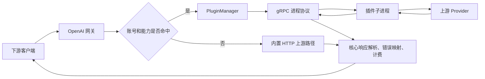

# Sub2API 用户态进程插件体系扩展分析报告

**日期**：2026-09-17

**分析对象**：Sub2API 后端插件运行时、插件包格式、OpenAI 网关接入链路
**结论状态**：可实施，建议采用“能力标识 + 版本化 gRPC 契约 + 独立进程运行时”的渐进式扩展方案。

## 摘要

项目已经具备用户态进程插件的基础设施：插件以 `.s2plugin` 包交付，宿主负责清单校验、签名和文件哈希验证、配置加密、进程生命周期、灰度启用和管理页面，插件通过 gRPC 与宿主通信。当前实现只覆盖 `openai.oauth.outbound_transport.v1`，主要用于替换 OpenAI OAuth 的上游 HTTP 出站传输。

因此，后续增加“内核自定义功能”是可行的，但应理解为扩展 Sub2API 核心后端的用户态能力。插件不能直接变成 Linux/Windows 内核模块，也不应直接访问宿主数据库或内部 Go 对象。合理的方向是把核心能力拆成稳定、版本化、带权限边界的插件能力，例如请求预处理、响应后处理、新 Provider 适配、异步事件订阅和后台任务。

本报告不修改现有代码，目标是为后续第一个具体插件需求提供可评审的架构基线。

## 1. 范围与术语

本文中的“核心”指 Sub2API 的 Go 后端服务，包括网关、账号、上游转发、计费、管理 API 和后台任务。“用户态进程插件”指由宿主启动的独立可执行文件，通过本机 gRPC 协议提供能力。

如果需求是加载 `.ko`、Windows 驱动或其他操作系统内核模块，则不属于当前项目插件体系。此类模块需要独立的驱动工程、签名和部署流程，并会引入系统稳定性与权限风险。

## 2. 现状证据与结论

| Evidence（证据） | Finding（发现） | Path（代码路径） |
| --- | --- | --- |
| `TransportPlugin` 提供 `GetInfo`、`Health`、配置管理和双向流式 `Forward` | 已有跨语言边界清晰的进程协议，可以承载新的能力类型 | [`backend/pkg/pluginapi/v1/plugin.proto`](../backend/pkg/pluginapi/v1/plugin.proto) |
| 宿主使用 HashiCorp go-plugin、gRPC、握手 Cookie 和二进制 SHA-256 校验 | 插件的启动、身份和二进制完整性已有统一入口 | [`backend/pkg/pluginapi/v1/runtime.go`](../backend/pkg/pluginapi/v1/runtime.go)、[`backend/internal/service/plugin_runtime.go`](../backend/internal/service/plugin_runtime.go) |
| `PluginManager` 负责安装、启停、重启、灰度、健康状态和运行时路由 | 可以在现有生命周期上增加通用能力注册和路由 | [`backend/internal/service/plugin_manager.go`](../backend/internal/service/plugin_manager.go) |
| `PluginManifest.Validate` 只接受 `openai.oauth.outbound_transport.v1` | 当前插件系统不是通用扩展平台，新增能力必须改协议、清单和宿主匹配逻辑 | [`backend/internal/service/plugin_manifest.go`](../backend/internal/service/plugin_manifest.go) |
| 网关只在 OpenAI OAuth 账号命中绑定时调用插件，核心继续处理 SSE、错误、用量和计费 | 当前边界是健康的：插件负责上游传输，核心保留业务一致性 | [`backend/internal/service/openai_plugin_transport.go`](../backend/internal/service/openai_plugin_transport.go) |
| 文档明确说明插件是独立进程而非操作系统沙箱 | 进程边界不等于安全隔离，生产环境仍需系统级权限和网络限制 | [`backend/pkg/pluginapi/docs/security.md`](../backend/pkg/pluginapi/docs/security.md) |

当前请求链路可以概括为：

## 3. 当前实现的能力边界

当前系统已经解决了插件交付和运行时管理问题，但能力模型仍然偏窄：

- 一个插件清单只能声明宿主已知的能力；仅在清单中填写未知能力不会自动增加路由。
- `TransportPlugin` 的 `Forward` 语义是“接收完整 HTTP 请求并返回完整 HTTP 响应流”，不适合表达只修改模型参数、只观察事件或执行后台任务的插件。
- OpenAI OAuth 出站能力目前使用单一原子路由和账号 ID 灰度分桶，管理器还会阻止多个同类 OpenAI OAuth 插件同时启用。
- 插件配置经过 `ValidateConfig` 和 `ApplyConfig`，但插件没有通用的宿主服务接口，例如结构化日志、指标、密钥代理、事件发布或受限数据查询。
- 插件进程继承 Sub2API 服务用户能够访问的文件、环境变量和网络权限；签名只证明来源，不能替代沙箱。

这些限制对于当前的 OAuth 传输插件是合理的。把它直接扩大成“任意代码可以插入核心”的机制，会导致协议不稳定、故障传播、权限扩大和升级困难。

## 4. 建议的目标架构

建议把插件能力从单一传输类型扩展为能力注册表。每个能力都有自己的协议版本、输入输出语义、权限范围和生命周期策略。

### 4.1 建议的第一批能力

| 能力标识示例 | 作用 | 典型时机 | 失败策略 |
| --- | --- | --- | --- |
| `request.preprocess.v1` | 修改模型、参数、路由标签或允许/拒绝请求 | 上游选择前 | 默认关闭或按策略拒绝，不能静默改变计费对象 |
| `response.postprocess.v1` | 修改非敏感响应元数据，或对流式数据做受控处理 | 上游响应后 | 超时后回到核心原始响应或终止本次请求，由能力声明决定 |
| `provider.adapter.v1` | 接入新的 Provider、认证方式或特殊协议 | 上游传输阶段 | 失败关闭当前插件路径，避免重复发送请求 |
| `event.sink.v1` | 接收调用成功、失败、计费和账号状态事件 | 异步事件阶段 | 事件可重试，不能阻塞主请求 |
| `background.worker.v1` | 执行同步、探活、统计或周期任务 | 后台调度阶段 | 独立限流和熔断，不影响网关主链路 |

第一版建议只实现 `request.preprocess.v1` 或 `provider.adapter.v1` 其中一个，先验证通用能力注册、路由和故障隔离，再扩展异步能力。

### 4.2 协议设计原则

通用协议应使用新的版本化服务或清晰的能力接口，不要把所有语义继续堆进当前 `Forward` 消息。每次调用至少应包含：

- `request_id`、`trace_id`、截止时间和取消语义；
- 平台、账号类型、账号 ID、用户或分组标识等最小业务上下文；
- 明确的字段白名单和敏感字段标记；
- 插件返回的决策类型，例如 `pass`、`modify`、`deny`、`error`；
- 变更后的结构化字段或流式数据，并附带大小和时间限制；
- `request_sent` 一类的重试判断信息，避免核心重复执行不可幂等请求。

插件只应收到完成其任务所需的数据。原始 OAuth Token、代理密码、完整请求体和数据库连接不应作为通用插件上下文自动暴露。

### 4.3 宿主服务接口

建议增加一个受控的 Host API 层，由宿主实现、插件通过 gRPC 调用：

| Host API | 目的 | 边界 |
| --- | --- | --- |
| `Log` | 结构化日志 | 自动脱敏，不允许插件写入宿主日志格式 |
| `Metric` | 计数、延迟和错误指标 | 只允许预定义指标名和标签 |
| `SecretBroker` | 获取已授权的短时秘密 | 按能力和安装实例授权，禁止任意环境变量读取 |
| `Config` | 读取已校验的插件配置 | 配置仍由宿主加密保存 |
| `EventPublish` | 发布异步事件或请求重试 | 具备队列容量和速率限制 |

核心业务数据的查询和写入应保持在宿主侧，通过明确的命令接口实现，而不是把 Repository 或数据库连接传给插件。

## 5. 需要改造的模块

### 5.1 公开协议和清单

在 `backend/pkg/pluginapi/v1/` 旁增加能力专用的 proto 文件，或者发布 `v2` 协议目录。清单需要从“固定能力校验”改为“已注册能力校验”，并为每个能力声明：协议版本、权限集合、是否同步、超时上限和失败策略。

现有 `plugin_protocol`、`transport_api` 和 `ui_bridge` 应继续保留。新能力使用独立版本号，避免一个新能力迫使已有传输插件升级。

### 5.2 运行时和管理器

`PluginManager` 需要从单一 `route` 扩展为能力路由表，至少支持：

- 一个插件声明多个能力；
- 同一能力配置优先级、账号范围或灰度比例；
- 能力级超时、并发上限、熔断和健康状态；
- 插件进程退出后的能力级隔离；
- 热更新时先启动新实例，再切换路由，保留旧实例回滚窗口。

现有 `pluginRuntime` 可以继续复用进程启动、握手、哈希和停止逻辑，但应将 `TransportPluginClient` 抽象为按能力取得的客户端接口。

### 5.3 网关和业务服务

网关不应在各处直接判断插件 ID。建议引入 `ExtensionDispatcher` 或能力路由服务，由调用方传入标准化的核心上下文，调度器决定是否调用插件。

核心链路仍需掌管认证、权限、账号选择、用量统计、余额和计费。插件的返回结果只能通过明确的决策对象影响这些流程，不能绕过核心写库或直接修改余额。

### 5.4 数据库和管理页面

当前插件安装、绑定、配置和状态模型可以作为基础，但通用能力需要补充：能力版本、权限范围、优先级、作用域、失败策略和运行时统计。管理页面应展示“插件声明了什么能力、获得什么权限、应用到哪些请求”，并将“菜单可见性”和“运行时启用状态”分开。

## 6. 分阶段实施路径

### 阶段一：协议和边界定稿

选定一个真实的第一个插件场景，写出能力说明、输入输出字段、敏感数据清单、超时、重试和失败策略。同步确定 `v1` 兼容规则以及插件能否看到请求体、响应体和账号元数据。

交付物应包括新的 proto、清单 Schema、能力注册表和一份最小插件示例。

### 阶段二：通用运行时

保留现有进程启动和签名校验代码，抽取能力客户端接口，实现能力路由表、健康状态、并发限制、超时和熔断。旧的 OpenAI OAuth 插件继续走现有路径，避免一次迁移影响生产流量。

### 阶段三：核心 Hook 接入

只在一个业务入口接入第一个能力。例如先在上游请求准备完成、发出 HTTP 请求之前调用 `request.preprocess.v1`。接入点必须有明确的“原始上下文、插件决策、核心最终请求”日志和指标。

### 阶段四：权限和部署隔离

在签名包基础上增加能力权限声明、出站域名白名单、文件系统目录限制、环境变量白名单、CPU/内存/进程数限制和平台级沙箱。Linux 可以使用独立低权限用户、systemd 限制或容器；Windows 可以使用低权限账户、Job Object 和网络防火墙策略。

### 阶段五：验证与推广

先以单个租户、账号或固定比例灰度。验证错误率、延迟、插件退出恢复、重复请求保护、计费一致性和回滚，再开放更多 Provider 或异步事件能力。

## 7. 兼容性和迁移方案

建议遵循以下规则：

1. 保留 `plugin_protocol=1` 和现有 `openai.oauth.outbound_transport.v1`，让已发布插件继续运行。
2. 新能力使用独立的能力版本，例如 `request.preprocess.v1`，不通过修改旧 `Forward` 消息隐式扩展。
3. 宿主遇到未知能力时可以安装并展示“不兼容”，但不能启用或把请求发送给它。
4. 插件升级使用新安装目录和新进程，健康检查通过后再切换原子路由。
5. 数据库迁移要保留旧绑定字段，支持回滚到旧管理器和旧插件状态。
6. 任何会影响计费、账号选择或请求重试语义的协议变更，都必须增加版本和集成测试。

## 8. 安全与可靠性要求

插件扩展平台的主要风险不是 gRPC 本身，而是插件获得的业务权限和故障对核心链路的影响。最低要求如下：

| 风险 | 控制措施 | 验收标准 |
| --- | --- | --- |
| 恶意或被替换的插件包 | Ed25519 签名、清单哈希、可信发布者白名单 | 篡改任意运行时或 UI 文件都会拒绝安装或启动 |
| 插件读取过多数据 | 能力级字段白名单、秘密代理、脱敏日志 | 插件无法通过通用接口获得未声明的 Token、密码或数据库连接 |
| 插件阻塞请求 | 调用截止时间、上下文取消、并发限制、熔断 | 插件超时不会无限占用网关连接和 goroutine |
| 插件重复执行请求 | `request_sent` 和幂等性标记 | 上游可能已收到请求时，核心不自动切换账号重试 |
| 插件进程崩溃 | 独立进程、能力级摘除、健康检查和回滚 | 插件退出后核心状态可观测，非目标能力继续工作 |
| 资源耗尽 | 低权限账户、CPU/内存/文件/网络限制 | 插件无法拖垮宿主或访问无关目录和域名 |

当前文档已明确“独立进程不是操作系统沙箱”。在正式开放第三方插件前，必须补齐部署级隔离，否则签名插件仍然具有宿主服务用户的访问权限。

## 9. 测试和验收清单

新增能力至少应覆盖以下测试：

- 协议：版本协商、未知字段、超时、取消、流式分块和错误编码；
- 清单：能力 ID、能力版本、权限声明、目标平台、签名和文件哈希；
- 路由：能力匹配、作用域、优先级、灰度和多插件冲突；
- 生命周期：启动、健康检查、配置热更新、优雅停止、崩溃重启和回滚；
- 核心一致性：认证、账号选择、计费、用量统计、错误映射和重试语义；
- 安全：路径穿越、未授权秘密读取、未声明出站域名、资源超限和敏感日志；
- 兼容性：现有 OpenAI OAuth 插件和没有插件时的内置路径；
- 集成：真实插件子进程、数据库状态、管理 API、管理页面和多实例恢复。

建议保留一个最小测试插件，能够人为触发延迟、拒绝、崩溃、部分响应和“请求已发送但响应失败”等情况，作为每次宿主升级的回归基线。

## 10. 结论和决策建议

扩展现有用户态进程插件体系是可行的，项目当前的包格式、签名、gRPC、生命周期和管理页面可以作为基础。需要改变的是能力模型和宿主 Hook，而不是重写整个插件系统。

推荐的第一步是选定一个边界清晰的真实需求，优先选择“请求预处理”或“Provider 适配”中的一个，完成协议、最小插件、能力路由和故障测试。完成第一种能力后，再复用相同的运行时和权限模型扩展响应处理、异步事件和后台任务。

不建议把插件设计成可以直接调用 Repository、修改余额、读取全部 Token 或任意拦截核心请求的“万能模块”。核心保留业务一致性，插件通过小而稳定的能力契约参与流程，后续升级和回滚会更可控。
