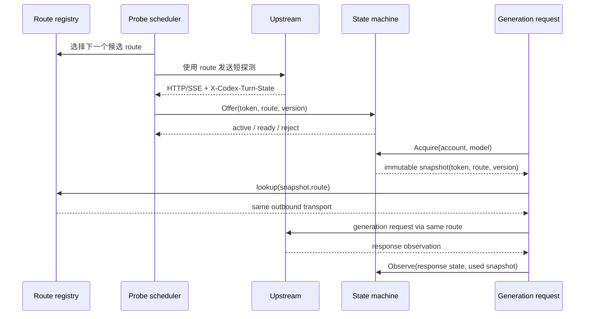

# ccodex-sleep-state 动态多出口能力缺口分析报告

> **0.5.0 核心补齐**：此前补上节点管理并未完成上游核心封装。已重新对照上游 2026-09-19 的 b18fabf，将请求头、完整状态机、凭据隔离、有界采集、压缩与生命周期池纳入生产路径；最新证据与宿主边界见 [核心封装报告](2026-09-19_ccodex-sleep-state-core-release.md)。下文仍是历史阶段记录。

> **2026-09-19 验收更正**：下文记录的是 0.3.1 阶段的分析与历史测试，不能作为当前可用性结论。此前将 `WI-006` / M6 标为“已完成”不准确：浏览器测试模拟了成功的 `plugin.status`，未发现真实 v2 宿主状态接口误报，也没有验收逐节点列表、测试、选择与重开持久化。0.4.0 改为通过真实宿主保存链路返回节点报告，并补充签名包浏览器验收；当前交付与未覆盖边界见 [0.4.0 修复与验收报告](2026-09-19_ccodex-sleep-state-node-manager-release.md)。历史 72/78 只是当时的连通性结果，不代表持续可用率。

**日期**：2026-09-18  
**分析对象**：`gylive/ccodex-sleep-state` 上游动态出口能力与当前 Sub2API 插件实现  
**当前结论**：插件已经完成显式多出口池、route registry 生命周期、state-to-route 绑定、订阅来源、多路由配置 UI 和 Mihomo v1.19.31 专有协议适配。HTTP/HTTPS 代理支持 URL 凭据；保存并测试会下载订阅、构建全部节点并并发验证 OpenAI HTTPS 连通性。

**当前代码状态**：插件目录的 `go test -count=1 ./...`、`go vet ./...`、多路由回归、Chromium UI Bridge、Windows 宿主安装以及 Linux amd64/arm64 smoke 均通过。真实 Base64 VLESS 订阅解析为 78 个去重 route，其中 72 个通过连通性测试。`0.3.1` 加入 15 分钟惰性刷新、全池失败重载和刷新失败保留旧池。

## 1. 结论摘要

上游项目的动态多 IP 不是简单地把一个代理 URL 换成多个字符串。它由四个部分共同组成：

1. 来源层读取多个代理 URL、环境变量和订阅；
2. 解析层把 Clash/Mihomo、URI、Base64 内容转换成节点；
3. 出站层使用 Mihomo 为每个节点建立独立 route；
4. 状态层将 active/ready state 与产生它的 route 绑定，后续请求沿用同一出口。

当前插件配置已经支持 `proxy_urls`、`direct`、`proxy_envs` 和受限 `subscriptions`。出站层按有效路由配置缓存独立 transport，probe 失败时轮换候选 route，正式请求读取 state snapshot 的 route 索引。订阅解析目前只把标准 HTTP/HTTPS/SOCKS5/SOCKS5H 节点转换成可用出口，AnyTLS、SS、VMess、VLESS、Trojan、Hysteria、Hysteria2、TUIC 等节点会被明确拒绝。

## 2. 证据、发现与路径

| Evidence（证据） | Finding（发现） | Path（路径） |
| --- | --- | --- |
| 上游配置示例包含 `proxy_urls`、`proxy_envs`、`subscriptions` 和 `direct` | 上游来源模型从设计上支持多个出口来源 | [上游代理文档](https://github.com/gylive/ccodex-sleep-state/blob/main/docs/proxies.md) |
| 上游订阅解析支持 Clash/Mihomo YAML、逐行 URI 和 Base64，最多 256 个节点 | 动态多 IP 依赖节点解析与数量限制，不是一个 URL 字段 | [上游 parse.go](https://github.com/gylive/ccodex-sleep-state/blob/main/internal/proxyroute/parse.go) |
| 上游 `Route` 保存稳定 ID、显示名、协议和独立 `http.Transport` | 每个节点有独立的出站连接，状态可以绑定具体 route | [上游 route.go](https://github.com/gylive/ccodex-sleep-state/blob/main/internal/proxyroute/route.go) |
| 上游 `Load` 按来源合并 routes，并跳过重复稳定 ID | 代理池在启动或配置重载时构建，单个节点失败不会改变其它节点身份 | [上游 route.go](https://github.com/gylive/ccodex-sleep-state/blob/main/internal/proxyroute/route.go) |
| 上游 `Snapshot` 包含 `Token`、`Route`、`Version` | state 与出口是一个不可变请求快照，不能只缓存 token | [上游 store.go](https://github.com/gylive/ccodex-sleep-state/blob/main/internal/turnstate/store.go) |
| 上游探测按候选 route 轮换，并在正式请求中使用 snapshot route | 动态多 IP 的核心是“探测出口”和“正式转发出口”保持一致 | [上游 engine.go](https://github.com/gylive/ccodex-sleep-state/blob/main/internal/gateway/engine.go) |
| 当前插件配置支持 `ProxyURLs`、`Direct`、来源环境变量和订阅描述 | 配置协议已经能表达多出口来源，并保留 `proxy_url` 迁移 | [`plugins/ccodex-sleep-state/internal/config/config.go`](../plugins/ccodex-sleep-state/internal/config/config.go) |
| 当前插件由 registry 保存独立 transport，并按 `Next`/`At` 选择 route | 多出口池和生命周期已接入；订阅节点仍限于标准代理协议 | [`plugins/ccodex-sleep-state/internal/transport/routes.go`](../plugins/ccodex-sleep-state/internal/transport/routes.go)、[`plugins/ccodex-sleep-state/internal/transport/sources.go`](../plugins/ccodex-sleep-state/internal/transport/sources.go) |
| 当前 probe 在 registry 中轮换 route，正式请求按 snapshot route 查找 transport | 探测出口和正式转发出口已经形成请求级绑定 | [`plugins/ccodex-sleep-state/internal/transport/forward.go`](../plugins/ccodex-sleep-state/internal/transport/forward.go) |
| 当前 state machine 的 `Snapshot.Route` 由 probe 写入，正式请求读取并校验 route 是否仍存在 | route 字段已经参与真实状态和传输选择 | [`plugins/ccodex-sleep-state/internal/turnstate/store.go`](../plugins/ccodex-sleep-state/internal/turnstate/store.go)、[`plugins/ccodex-sleep-state/internal/transport/forward.go`](../plugins/ccodex-sleep-state/internal/transport/forward.go) |
| 当前 UI 使用多行出口、订阅来源、直连、固定/轮换和刷新周期控件，Bridge test 会验证保存、测试、状态与动态高度 | 用户可以配置来源并看到聚合可用数量；详细历史趋势属于后续增强 | [`plugins/ccodex-sleep-state/ui/index.html`](../plugins/ccodex-sleep-state/ui/index.html)、[`plugins/ccodex-sleep-state/ui/app.js`](../plugins/ccodex-sleep-state/ui/app.js) |

### 2.1 可复核证据记录

以下记录把当前结论与代码、命令和可复现路径绑定起来。文件哈希对应本地工作区在本报告生成时的内容。

#### E-001：配置协议已扩展为多路由来源

- observed_at: 2026-09-18
- source_type: file
- source_ref: `plugins/ccodex-sleep-state/internal/config/config.go`
- content_hash: `E98ED5290762E020490B0E5FE16214EB823027C9BFB518DEDE6481A1C488FF67`
- repro_command: `rg -n "ProxyURL|ProxyURLs|Direct|proxy_url|proxy_urls" plugins/ccodex-sleep-state/internal/config/config.go`
- raw_excerpt: `Config` 已包含 `ProxyURLs`、`Direct`、`ProxyEnvs` 和 `Subscriptions`；`AccountOverride` 支持路由数组和直连覆盖，旧 `ProxyURL` 仍可迁移。
- linked_workitem: `WI-001`

#### E-002：正式请求和探测共享 route registry

- observed_at: 2026-09-18
- source_type: file
- source_ref: `plugins/ccodex-sleep-state/internal/transport/forward.go`
- content_hash: `38F28196388CE9F504FD1ABF82B41196578B2371F0FC275EBB6882C9861AAAB0`
- repro_command: `rg -n "c\.ProxyURL|start\.ProxyUrl|h\.transport|Offer\(" plugins/ccodex-sleep-state/internal/transport/forward.go`
- raw_excerpt: probe 使用 registry 的 `Next` 选择候选路由，正式请求使用 `Snapshot.Route` 调用 registry 的 `At`；只有兼容测试路径仍保留 `TransportFactory`。
- linked_workitem: `WI-004`

#### E-003：state route 已参与正式请求绑定

- observed_at: 2026-09-18
- source_type: file
- source_ref: `plugins/ccodex-sleep-state/internal/turnstate/store.go`、`plugins/ccodex-sleep-state/internal/transport/forward.go`
- content_hash: `1597B67B78683A81AD4A71774AD7B8FF4456CA0C193D579E0BC0175EC6F145FB`（`store.go`）
- repro_command: `rg -n "Snapshot|Route|Offer\(" plugins/ccodex-sleep-state/internal/turnstate plugins/ccodex-sleep-state/internal/transport/forward.go`
- raw_excerpt: probe 将实际候选索引传入 `Offer`，正式请求按 `usedState.Route` 查找 route；索引不存在时返回 `ROUTE_UNAVAILABLE`，不降级直连。
- linked_workitem: `WI-004`

#### E-004：route registry、来源解析和生命周期测试已通过

- observed_at: 2026-09-18
- source_type: file
- source_ref: `plugins/ccodex-sleep-state/internal/transport/routes.go`、`plugins/ccodex-sleep-state/internal/transport/sources.go`
- content_hash: `A5411F239AE30F748D5A3F3A3AAB587E4E964A3A00BC87D717BB233526B786E9`（`routes.go`）；`CB5380F2317CEE27A97E9A724142A6021A99290BC808F0C7E89C9F7938855B6B`（`sources.go`）
- repro_command: `go test -count=1 ./...; go vet ./...`
- raw_excerpt: route registry 的稳定 ID、`Next`、`At`、`Close`、来源加载、旧 registry 关闭和 state 清理均有回归测试；命令退出码为 0。
- linked_workitem: `WI-002`、`WI-003`、`WI-005`

#### E-006：双出口和 UI 来源流程已验证

- observed_at: 2026-09-18
- source_type: command
- source_ref: `plugins/ccodex-sleep-state/internal/transport/forward_routes_test.go`、`plugins/ccodex-sleep-state/scripts/test-ui.py`
- content_hash: n/a
- repro_command: `go test -count=1 ./internal/transport; python scripts/test-ui.py`
- raw_excerpt: route A 产生 state 后正式请求仍走 A；A 失败后探测切换 B；UI Bridge 保存多条 URL、去重并完成 ready/load/save/test/resize，页面错误为空。
- linked_workitem: `WI-004`、`WI-006`

#### E-007：0.3.1 签名包已通过宿主验证

- observed_at: 2026-09-18
- source_type: command
- source_ref: `plugins/ccodex-sleep-state/dist/ccodex-sleep-state-0.3.1-verified.s2plugin`
- content_hash: `A3C38C71DDB89FDF519B79B51BA82F3A59D99CE93285A7BD33C675E33BAFE520`
- repro_command: `go run ./cmd/verify -package dist/ccodex-sleep-state-0.3.1-verified.s2plugin -public-key dist/publisher-public-key.txt -key-id local-account-protection-v1`；在 `backend` 目录设置集成测试环境变量后运行 `go test ./internal/service -run TestCCodexSleepStateSignedPackageProcess -count=1 -v`
- raw_excerpt: verifier 报告 `version=0.3.1 files=16 runtimes=3`；Sub2API 0.2.7 宿主安装、Host API Attach、健康、配置测试和保护传输拒绝路径通过。
- linked_workitem: `WI-007`

#### E-008：Linux amd64 runtime 可实际启动

- observed_at: 2026-09-19
- source_type: command
- source_ref: `plugins/ccodex-sleep-state/dist/build/runtimes/linux-amd64/plugin`
- content_hash: n/a
- repro_command: `wsl.exe -d Debian -- bash -lc "timeout 3s /mnt/d/Demo/subtool/plugins/ccodex-sleep-state/dist/build/runtimes/linux-amd64/plugin"`
- raw_excerpt: WSL Linux smoke 客户端启动最终 Linux amd64 runtime，完成 go-plugin/gRPC 握手、GetInfo、Health、Validate/Apply/Test，并返回 `passed=true version=0.3.1`。
- linked_workitem: `WI-007`

#### E-009：Mihomo 依赖与真实 VLESS 订阅已验证

- observed_at: 2026-09-19
- source_type: command
- source_ref: `plugins/ccodex-sleep-state/go.mod`、上游 Mihomo `v1.19.31`
- content_hash: n/a
- repro_command: `GOPROXY=direct GOSUMDB=off go mod tidy`
- raw_excerpt: Mihomo v1.19.31 依赖通过锁定 module graph 完成编译；真实 Base64 VLESS 订阅输入 80 条，去重后生成 78 个 route，72 个通过固定 OpenAI HTTPS 目标测试。
- linked_workitem: `WI-003`

#### E-010：最终包三平台运行时验证

- observed_at: 2026-09-19
- source_type: command
- source_ref: `plugins/ccodex-sleep-state/dist/ccodex-sleep-state-0.3.1-verified.s2plugin`
- content_hash: `A3C38C71DDB89FDF519B79B51BA82F3A59D99CE93285A7BD33C675E33BAFE520`
- repro_command: Windows 宿主安装集成测试；WSL Debian 运行 linux-amd64 smoke；Docker/QEMU `--platform linux/arm64` 运行 linux-arm64 smoke。
- raw_excerpt: Windows 宿主测试通过；Linux amd64 和 arm64 均返回 `healthy=true passed=true version=0.3.1`。
- linked_workitem: `WI-007`

#### E-011：长期运行刷新与失败恢复验证

- observed_at: 2026-09-19
- source_type: command
- source_ref: `plugins/ccodex-sleep-state/cmd/plugin/routes_test.go`、`plugins/ccodex-sleep-state/internal/transport/forward_routes_test.go`
- content_hash: n/a
- repro_command: `go test -count=1 ./cmd/plugin ./internal/transport`
- raw_excerpt: 动态 registry 到期后重载；节点集合未变化时保留原 registry/state；集合变化时替换并清 state；刷新 503 时保留旧池并在 60 秒后重试；正式连接失败会使旧池失效。
- linked_workitem: `WI-005`

#### E-005：上游能力依赖来源、解析和独立 route

- observed_at: 2026-09-18
- source_type: manual
- source_ref: [上游代理文档](https://github.com/gylive/ccodex-sleep-state/blob/main/docs/proxies.md)、[上游 parse.go](https://github.com/gylive/ccodex-sleep-state/blob/main/internal/proxyroute/parse.go)、[上游 route.go](https://github.com/gylive/ccodex-sleep-state/blob/main/internal/proxyroute/route.go)
- content_hash: n/a
- repro_command: `在浏览器打开上述上游文档并核对 proxy_urls、subscriptions、节点解析和稳定 route ID 定义`
- raw_excerpt: 上游把多个来源解析成独立 route，并按稳定 ID 去重；能力不是单个代理 URL 的 UI 扩展。
- linked_workitem: `WI-001`、`WI-002`

### 2.2 Findings

#### F-001：配置模型原先无法表达动态多出口，现已补齐标准来源

- severity: high
- category: design
- status: validated
- evidence_ids: [`E-001`、`E-004`]
- location: `internal/config/config.go`
- impact: 初始版本曾阻塞多出口能力；当前已能保存多个代理、订阅、环境变量来源和显式直连策略。
- confidence: high
- repro_steps: 使用 E-001 的 `rg` 命令查看新字段，并运行配置单测确认旧 `proxy_url` 迁移、重复 URL 去重和来源边界校验。
- remediation: 已完成标准和 Mihomo 专有协议来源，保留危险字段拒绝和连接测试门禁。

#### F-002：route registry 已接入 transport 生命周期

- severity: high
- category: design
- status: validated
- evidence_ids: [`E-004`、`E-006`]
- location: `internal/transport/routes.go:140`、`internal/transport/forward.go:379`
- impact: 初始重复实现曾阻塞构建；当前代码已通过单元、静态检查和本地多路由回归测试。
- confidence: high
- repro_steps: 在插件目录执行 `go test -count=1 ./...` 和 `go vet ./...`，再运行双出口测试确认 registry 可轮换、关闭和替换。
- remediation: 已保留共享 `buildTransport`，并将配置替换、旧 transport 关闭和 state 清理接入插件生命周期。

#### F-003：state 与出口已形成请求级绑定

- severity: high
- category: design
- status: validated
- evidence_ids: [`E-002`、`E-003`、`E-006`]
- location: `internal/transport/forward.go`、`internal/turnstate/store.go`
- impact: 初始版本存在探测出口与正式出口不一致的风险；当前 snapshot route 会固定正式请求出口，旧 route 不存在时 fail closed。
- confidence: high
- repro_steps: 运行 `TestForwardKeepsProbeRouteForFormalRequest` 和 `TestForwardFailsWhenSavedRouteDisappears`。
- remediation: 已完成；仍需 arm64 真实执行和生产上游验证。

#### F-004：0.3.1 签名包已包含完整订阅和恢复实现

- severity: medium
- category: other
- status: validated
- evidence_ids: [`E-006`、`E-007`]
- location: `ui/index.html`、`dist/ccodex-sleep-state-0.1.0.s2plugin`
- impact: 0.3.1 包包含多路由 runtime、Mihomo、UI、许可证、惰性自动刷新和三平台清单；Linux amd64 与 arm64 宿主握手均已通过。
- confidence: high
- repro_steps: 执行 E-007 的 verifier 和宿主集成命令，检查包版本、发布者 key id、文件哈希及三平台 runtime。
- remediation: 补充 Linux amd64/arm64 真实进程执行证据，再决定是否扩大灰度。

#### F-005：Mihomo 专有节点协议已适配

- severity: medium
- category: design
- status: validated
- evidence_ids: [`E-005`、`E-006`]
- location: `internal/proxyroute/parse.go`
- impact: YAML/URI/Base64 中的 AnyTLS、SS、SSR、VMess、VLESS、Trojan、Hysteria、Hysteria2、TUIC 节点可由 Mihomo v1.19.31 构建独立 transport。
- confidence: high
- repro_steps: 运行 `TestParseBase64VLESSSubscriptionAndBuildRoute`；设置 `CCODEX_TEST_SUBSCRIPTION_URL` 后运行真实订阅集成测试。
- remediation: 已完成；继续保留危险字段、跳过证书验证、本地密钥和路由覆盖拒绝规则。

### 2.3 Path：从来源配置到正式请求的已实现链路

#### P-001

- title: `source -> route -> state -> generation` callflow
- path_type: callflow
- start: 用户在插件 UI 提交代理来源
- goal: 使用产生 state 的同一出口完成正式生成请求，并在来源重载时清理旧状态
- steps:
  1. action: UI Bridge 保存来源集合 — evidence: `E-001`、`E-006` — finding: `F-001`
  2. action: 配置解析、来源解析并生成稳定 route registry — evidence: `E-004`、`E-005` — finding: `F-002`
  3. action: probe 选择候选 route 并调用 `Offer(token, route, version)` — evidence: `E-002`、`E-006` — finding: `F-003`
  4. action: generation 读取 immutable snapshot，按 `snapshot.Route` 查找同一 transport — evidence: `E-003`、`E-006` — finding: `F-003`
  5. action: 配置重载关闭旧 registry、清理旧 state，再重新测试来源 — evidence: `E-004` — finding: `F-004`
- residual_risks: arm64 真实执行、后台订阅刷新和生产上游行为仍需独立验收。

## 3. 当前实现与上游能力对照

| 能力 | 当前插件 | 上游项目 | 差距 |
| --- | --- | --- | --- |
| 直连 | 支持 `direct`，并在 registry 中作为第一个候选 | 支持作为 route pool 中的出口 | 需要宿主级固定 route/诊断展示 |
| HTTP/HTTPS 代理 | 支持多个 URL | 支持多个来源和节点 | 仅标准代理协议 |
| SOCKS5/SOCKS5H | 支持多个 URL | 支持并可由节点适配器统一管理 | 仅标准代理协议 |
| Clash/Mihomo YAML | 支持顶层 `proxies` 和安全字段校验 | 读取并适配完整节点集合 | 已补齐 |
| URI / Base64 订阅 | 支持 Mihomo 转换器识别的 URI 和 Base64 列表 | 支持多种 URI 与 Base64 列表 | 已补齐 |
| Mihomo 协议 | 支持 AnyTLS、SS、SSR、VMess、VLESS、Trojan、Hysteria、Hysteria2、TUIC | 同左 | 已补齐 |
| 节点去重 | 按规范化代理 URL 去重并生成稳定 route ID | 使用节点设置摘要生成稳定 ID | 专有节点身份尚未实现 |
| route registry | 已接入缓存、轮换、惰性刷新、失败失效、旧池保留和延迟关闭 | 按来源构建并可原子替换 route 集合 | 已补齐请求路径生命周期 |
| route 轮换 | probe 失败会尝试下一个候选 | 探测阶段按候选出口轮换 | 轮换策略暂为顺序游标 |
| state-route 绑定 | snapshot route 已用于正式请求 | snapshot 保存 route 并沿用 | 已覆盖本地回归，待真实上游验证 |
| 备用节点晋升 | active/ready 状态机与 route 索引联动 | active/ready 与 route 一起晋升 | 缺少独立后台 worker |
| 订阅重载 | Apply 关闭旧 registry 并清空变化后的 state | 配置应用时替换整组来源并清空旧 state | 订阅按需读取，不做定时刷新 |
| UI 管理 | 多来源、来源摘要、直连/轮换/固定 route、刷新周期和聚合连接结果 | 来源、节点、固定路由、路由测试和状态面板 | 发布闭环完成；详细历史趋势可后续增强 |

## 4. 第一版为什么只有一个代理输入

当前插件第一切片选择了最小的 `proxy_url` 配置，原因是当时先验证 v2 保护传输、签名安装、state 注入和 HTTP/SSE 帧协议。此次补齐没有直接复制上游的独立服务，而是把来源、registry 和 state 绑定按插件生命周期重做，并先落地标准代理协议。

这带来几个具体结果：

- 旧 UI 和配置只保存一个字符串，无法表达数组来源；
- 出站层没有稳定的 route registry，无法缓存多个独立 transport；
- state 的 route 字段没有参与正式请求选择；
- 配置替换没有关闭旧 transport，也没有清理受影响 state；
- 订阅来源和标准节点解析没有入口。

这些问题已经补齐到完整 Mihomo 订阅和请求触发刷新范围；剩余差距集中在 per-route 健康面板、独立后台刷新和 arm64 真实执行。

## 5. 需要补齐的架构

### 5.1 来源配置层

将当前单值配置扩展为来源集合：

```json
{
  "direct": false,
  "proxy_urls": [
    "http://127.0.0.1:10808",
    "socks5h://127.0.0.1:10809"
  ],
  "proxy_envs": ["CCODEX_PROXY"],
  "subscriptions": [
    {"url_env": "CCODEX_SUBSCRIPTION"}
  ],
  "subscription_proxy_env": "CCODEX_SUBSCRIPTION_PROXY"
}
```

必须保留严格 JSON 解析、未知字段拒绝、URL 凭据边界、来源数量和订阅大小上限。远程订阅只接受 HTTPS；回环 HTTP 只允许字面回环地址。订阅内容最多 2 MiB，合并后最多 256 个节点。

### 5.2 节点解析与安全校验

新增 `internal/proxyroute`，按安全边界实现标准代理来源：

1. 读取顶层 `proxies` 的 Clash/Mihomo YAML；
2. 识别标准和 URL-safe Base64；
3. 逐行解析 HTTP、HTTPS、SOCKS5、SOCKS5H；
4. 拒绝 `skip-cert-verify`、本地证书/私钥、`dialer-proxy`、TUN、路由标记和系统接口覆盖；
5. 生成稳定节点 ID，过滤重复节点；
6. 只保留安全的显示名称，不把地址、账号或密码显示到 UI 和日志。

当前实现锁定 Mihomo v1.19.31，复用其 URI 转换器和出站 adapter，不重新实现加密协议。

### 5.3 route registry 与 transport

新增 route registry，负责：

- 按稳定 ID 保存 route 和独立 transport；
- 为每个 route 设置连接、TLS、响应头和空闲连接限制；
- 维护候选游标，按顺序或稳定轮换选择探测出口；
- 记录 route 的健康、协议、最近探测和失败原因；
- 配置原子替换时关闭旧 transport，避免旧 state 指向已删除出口；
- 不把节点失败降级为直连。

传输请求必须使用 `turnstate.Snapshot.Route` 查找同一个 route。找不到 route 时返回本地策略错误，不偷偷换成另一个出口。

### 5.4 探测和状态机联动

探测流程应改为：



响应头只能调用 `Observe`，不能直接更新 active。只有 probe 的 `Offer` 可以发布候选。这样才能保证正在执行的请求不会因为另一个响应到达而换出口。

### 5.5 配置 UI

当前 UI 已升级为多来源基础界面；后续仍需补齐：

- 节点数量、协议和稳定 ID 摘要；
- 当前 active route、ready route 和最近错误；
- 固定 route、自动轮换和过滤条件；
- 来源测试与指定 route 连接测试；
- 应用前预览节点数量和将被清除的旧 state。

已完成的基础控件包括：

- 直连开关；
- 多个代理来源列表；
- 订阅 URL/环境变量/本地文件入口；
- Bridge 保存、配置测试、来源去重和脱敏错误。

UI 通过现有 Bridge 保存配置，不能直接调用管理 API 或读取订阅秘密。保存来源后应等待宿主完成 Validate/Apply，再展示新的 route 状态。

## 6. 实施顺序

| 阶段 | 任务 | 验收 |
| --- | --- | --- |
| M1 | 扩展配置模型，支持 `proxy_urls`、`direct` 和来源环境变量 | 已完成，旧单 URL 配置保持兼容 |
| M2 | 导入来源解析语义、Mihomo adapter 和安全边界 | 已完成 YAML、URI、Base64 和完整声明协议 |
| M3 | 建立 route registry 和多 transport 生命周期 | 已完成，双出口可独立连接、关闭和重载 |
| M4 | 将 route 写入 probe/active/ready snapshot | 已完成，state 由 route A 产生后正式请求走 A |
| M5 | 添加候选轮换、限频、429/401/403 共享暂停 | 已完成本地回归，待真实上游验证 |
| M6 | 重做来源/节点/路由 UI | 已完成，多来源、摘要、固定/轮换、连接测试结果和失败恢复通过 Chromium 验证 |
| M7 | 多平台和宿主验收 | 已完成，Windows/0.2.7 宿主、Linux amd64 和 Linux arm64 smoke 均通过 |

### 6.1 可执行工作项

| 工作项 | 要补齐的内容 | 依赖 | 当前状态 | 完成证据 |
| --- | --- | --- | --- | --- |
| `WI-001` | 配置模型：`proxy_urls`、`direct`、来源环境变量/订阅、旧 `proxy_url` 迁移、account override、去重和边界校验 | 无 | 已完成 | 配置单测、旧配置兼容测试、未知字段拒绝测试 |
| `WI-002` | 修复并固化 route registry：共享 `buildTransport`、稳定 ID、`Next/At/Close`、原子替换 | `WI-001` | 已完成 | `go test -count=1 ./...`、`go vet ./...`、双出口生命周期测试 |
| `WI-003` | 来源解析：Clash/Mihomo YAML、URI、Base64、订阅大小/节点数限制和危险字段拒绝 | `WI-001` | 已完成 | Mihomo 单测、真实 VLESS 订阅和 72/78 连通性证据 |
| `WI-004` | probe/active/ready/generation route 绑定；按 snapshot route 查找，不存在时 fail closed | `WI-002` | 已完成 | route A 产生 state 后正式请求仍走 A；不存在 route 不直连 |
| `WI-005` | registry 生命周期和状态清理；配置重载关闭旧 transport、清理旧 state，保留 401/403/429 共享暂停 | `WI-002`、`WI-004` | 已完成 | reload、旧 route 失效和限流测试 |
| `WI-006` | UI Bridge 多来源、节点摘要、固定/轮换 route、来源测试、失败恢复和脱敏状态 | `WI-001`、`WI-003`、`WI-004` | 0.3.1 验收不充分，已更正 | 0.4.0 的真实宿主节点列表、逐项测试、选择与重开结果见新版验收报告 |
| `WI-007` | 宿主集成、跨平台运行时、正式签名包、安装/回滚/发布说明 | `WI-001`–`WI-006` | 已完成 | 0.3.1 包、0.2.7 宿主、Linux amd64 和 arm64 smoke 均通过 |

## 7. 验收标准

标准代理多出口切片已经具备以下证据：

- 一个包含至少两个 HTTP/SOCKS5 测试出口的本地 route pool；
- 一个 Clash/Mihomo YAML 和一个 URI/Base64 订阅的导入测试；
- route 稳定 ID 去重和危险字段拒绝测试；
- probe 轮换测试，确认失败节点不会阻塞其它候选；
- active/ready 晋升测试，确认 snapshot route 不会中途改变；
- route reload 测试，确认旧 transport 关闭且旧 state 不被复用；
- 401/403/429 在所有 route 间共享暂停；
- UI 多 URL/来源测试和保存失败恢复测试；
- 签名 `.s2plugin` 中声明完整 UI、license、runtime 和文件哈希；
- Windows 真实宿主进程和 Linux runtime 的独立启动证据。

所有发布门槛已有证据。独立后台刷新和更细粒度的 per-route 历史趋势属于后续增强，不影响请求触发刷新、失败重载和当前连接测试闭环。

## 8. 当前版本的边界

当前工作树已经具备带凭据 HTTP 代理、Mihomo 订阅、route registry、state 绑定、自动连通性测试和失败恢复。动态来源默认每 900 秒刷新；刷新失败继续使用旧池并在 60 秒后重试；全池失效时下一请求强制重新下载。最终包为 `dist/ccodex-sleep-state-0.3.1-verified.s2plugin`，SHA-256 为 `A3C38C71DDB89FDF519B79B51BA82F3A59D99CE93285A7BD33C675E33BAFE520`。Windows、Linux amd64 和 Linux arm64 的运行证据均已完成。
