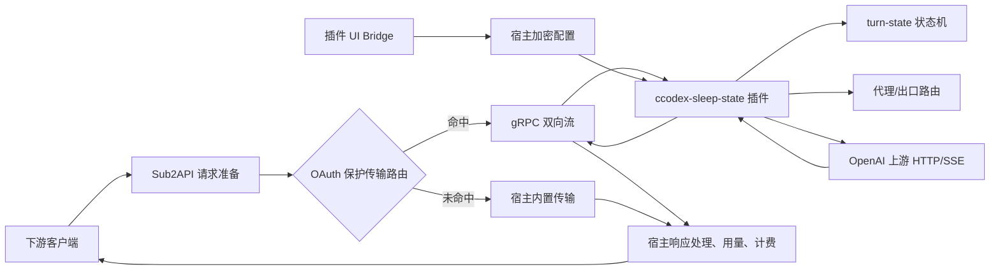

# ccodex-sleep-state 插件化任务规划

> **当前交付已升级至 0.5.0**：现已直接内嵌上游 b18fabf 的网关与状态机核心，补齐关键请求头、账号/凭据隔离、主备采集、压缩协议和生命周期池。实现与实测范围见 [核心封装报告](2026-09-19_ccodex-sleep-state-core-release.md)；下文保留初始规划与历史状态。

> **2026-09-19 状态更正**：本文件保留初始规划与历史实施记录。此前的 UI 验收未覆盖真实 v2 宿主状态接口和逐节点管理，不足以证明最终用户可用。当前版本为 0.4.0，推荐内核 0.2.7 / 桌面 0.3.4；包、修复证据和剩余验证边界统一见 [0.4.0 修复与验收报告](2026-09-19_ccodex-sleep-state-node-manager-release.md)。下文 0.3.1 包名、哈希和原始宿主基线仅用于历史追溯。

**日期**：2026-09-18  
**目标**：将 [`gylive/ccodex-sleep-state`](https://github.com/gylive/ccodex-sleep-state) 的 turn-state 核心能力改造成 Sub2API 可安装的 `.s2plugin`。  
**规划状态**：代码开发与本地验收完成；生产部署和真实账号流量验收待外部环境  
**推荐宿主基线**：桌面 0.3.0、内核 0.2.5、扩展 1.3.0

> [!IMPORTANT]
> 现有 `ccodex-sleep-state` 可执行文件不能直接压缩成插件包。第一阶段应交付“OAuth-only、process 模式、v2 `openai.oauth.protection_transport.v1`”插件；API Key/relay、Codex 配置接管、独立本地服务和完整后台管理面板不属于第一阶段范围。

### 当前实现状态

已完成 `plugins/ccodex-sleep-state/` 的第一实施切片：

- v2 `ExtensionHandler`、`TransportHandler`、`HostAware` 入口；
- 严格 JSON 配置、账号覆盖、active/ready 内存状态机、按账号/模型隔离；
- HTTP/HTTPS/SOCKS5 出站、HTTP/SSE 响应帧转发、按需探测和 state 注入；
- 缺 state 的失败关闭路径、请求不重放语义和基础 Host API 遥测；
- UI Bridge 配置页；
- Windows amd64、Linux amd64、Linux arm64 runtime 打包器和签名验证器。
- 目标仓库提交号、关键源码 SHA-256 和适配边界 provenance。

已验证：`go vet ./...`、`go test -count=1 ./...`、真实插件进程 smoke、宿主签名安装、Chromium UI Bridge、本地双出口 TLS 上游路由绑定测试、标准 YAML/URI/Base64 来源解析，以及三平台 `.s2plugin` 清单/哈希/Ed25519 签名验证。尚未宣称正式桌面、宿主数据库、灰度路由和生产上游验收通过；Mihomo 专有协议、后台 worker 和 API Key/relay 仍按本规划留在后续范围。

当前完整订阅分享包为 `plugins/ccodex-sleep-state/dist/ccodex-sleep-state-0.3.1-verified.s2plugin`，沿用已有发布者 `local-account-protection-v1`，SHA-256 为 `A3C38C71DDB89FDF519B79B51BA82F3A59D99CE93285A7BD33C675E33BAFE520`。该包加入订阅自动刷新和全池失败重载，按 Sub2API 0.2.7 验证；Linux amd64 和 arm64 runtime 均完成真实 smoke 握手。

## 1. 目标与边界

### 1.1 第一阶段目标

交付一个由 Sub2API 宿主启动、通过 gRPC/go-plugin 握手、可签名安装的保护传输插件，完成以下闭环：

- 接收宿主已经选定的 OpenAI OAuth 请求；
- 按账号、模型和配置选择探测出口；
- 采集并校验 `X-Codex-Turn-State`；
- 在允许的请求中注入当前有效 state；
- 通过 HTTP/SSE 转发上游响应，并观察响应中的 state；
- 在 state 不可用、上游拒绝、超时或传输失败时明确失败，不重放已发送的生成请求；
- 通过插件 UI Bridge 完成配置保存、测试和状态展示；
- 生成包含多平台运行时、清单、资源哈希和 Ed25519 签名的 `.s2plugin`。

### 1.2 明确不包含

以下功能保留在独立程序或后续宿主扩展中，不纳入第一阶段验收：

| 功能 | 原因 |
| --- | --- |
| 修改、备份和恢复 Codex `config.toml` | 插件应接收宿主请求，不应通过本地配置接管请求入口 |
| `127.0.0.1:17841` 独立 HTTP 服务 | 插件由宿主通过 RPC 启动，管理页面使用 UI Bridge |
| OpenAI API Key / relay 全部模式 | 当前保护传输能力的作用域固定为 OpenAI OAuth |
| 容器模式运行 | 保护传输需要真实出站网络，当前容器网络隔离会拒绝启动 |
| 任意 WebSocket 协议转换 | 目标项目当前只承诺 HTTP/SSE |
| 未注册的 `background.worker.v1` 调度能力 | 当前宿主未提供可安装的后台 worker 路由 |
| 计费、账号选择、重试和核心响应解析 | 这些仍由 Sub2API 宿主负责 |

## 2. 依据与关键发现

| Evidence（证据） | Finding（发现） | Path（路径） |
| --- | --- | --- |
| 目标项目 README 将其定义为“一个服务，一个本地网页”，并提供 `setup`、`serve`、`doctor` 等独立命令 | 当前项目是独立本地服务，不是 Sub2API 插件运行时 | [目标 README](https://github.com/gylive/ccodex-sleep-state/blob/main/README.md)、[目标 main.go](https://github.com/gylive/ccodex-sleep-state/blob/main/cmd/ccodex-sleep-state/main.go) |
| 目标服务自行监听回环地址、启动 HTTP server，并在退出时恢复 Codex 配置 | 不能原样保留服务生命周期和配置接管逻辑 | [目标 service.go](https://github.com/gylive/ccodex-sleep-state/blob/main/internal/service/service.go)、[目标 patch.go](https://github.com/gylive/ccodex-sleep-state/blob/main/internal/codexconfig/patch.go) |
| 目标网关读取请求凭据，选择代理，改写请求头并处理上游响应状态 | 核心能力应落在保护传输的双向流，而不是普通预处理 Hook | [目标 handler.go](https://github.com/gylive/ccodex-sleep-state/blob/main/internal/gateway/handler.go)、[目标 architecture.md](https://github.com/gylive/ccodex-sleep-state/blob/main/docs/architecture.md) |
| Sub2API 预处理接口不能读取 Authorization，也不能处理完整响应流；只允许受限请求体和参数修改 | `request.preprocess.v1` 不足以实现 turn-state 注入和响应观测 | [`docs/PLUGIN_DEVELOPMENT.md`](./PLUGIN_DEVELOPMENT.md) |
| `openai.oauth.protection_transport.v1` 显式提供当前凭据转发、请求体、账号保护元数据和出站网络 | 这是第一阶段唯一匹配完整需求的已注册能力 | [`backend/pkg/pluginapi/docs/protection-transport.md`](../backend/pkg/pluginapi/docs/protection-transport.md) |
| `.s2plugin` 要求 `manifest.json`、`signature.json`、runtime、UI 和文件哈希 | 交付物不能只有 exe 或源码 ZIP | [`backend/pkg/pluginapi/docs/package-format.md`](../backend/pkg/pluginapi/docs/package-format.md) |

## 3. 目标架构



插件进程只负责出站传输和保护策略。宿主继续负责认证、账号选择、模型映射、计费、重试策略、插件路由、签名校验和生命周期。

## 4. 分阶段任务

### P0：基线冻结与协议确认

**目标**：在编码前锁定宿主、SDK 和目标源码版本，避免按错误协议实现。

- [x] 确认测试宿主包含 `openai.oauth.protection_transport.v1`，并记录内核 0.2.5、扩展 1.3.0 和桌面 0.3.0 基线。
- [x] 固定 `ccodex-sleep-state` 的源码提交、许可证、`go.mod` 和第三方依赖清单。
- [x] 从目标项目提取可复用模块边界：`turnstate`、探测逻辑、代理路由、SSE 分类和响应状态机。
- [x] 建立行为基线：state 形状、TTL、冷却、失败码、请求不重放和 HTTP/SSE 路径。
- [x] 明确 OAuth-only 约束，并在清单设计中禁止声明 API Key 或未知能力。

**完成条件**：形成源码提交号、依赖快照、能力清单和行为基线；所有后续任务引用同一版本。

### P1：拆分可复用核心

**目标**：保留状态算法，去除对独立本地服务和 Codex 配置文件的依赖。

- [x] 将 `internal/turnstate` 提取为插件内部包，保持解析、TTL、active/ready、版本和候选淘汰语义。
- [x] 将探测请求改为接收插件配置和宿主请求快照，不从本地 Codex 配置读取凭据。
- [x] 将代理初始化逻辑集中在 `internal/transport`，由插件配置初始化出口，禁止自动扫描非回环网络。
- [x] 将响应状态分类、429/401/403 冷却和 `request_sent` 语义整理为独立模块。
- [x] 删除或隔离 `net.Listen`、浏览器启动、运行时 JSON、配置恢复和文件接管代码。

**完成条件**：核心包可以在没有本地 HTTP listener、Codex `config.toml` 和独立 CLI 的情况下通过单元测试运行。

### P2：实现 v2 插件适配层

**目标**：让核心逻辑符合 Sub2API 的 ExtensionHandler 和保护传输协议。

- [x] 新增插件入口，实现 `pluginv2.Serve` 和 `ExtensionHandler`。
- [x] 实现 `GetInfo`，使插件 ID、版本、协议版本、能力和清单完全一致。
- [x] 实现严格的 `ValidateConfig`、原子 `ApplyConfig`、有界 `TestConfig` 和快速 `Health`。
- [x] 实现 `TransportHandler.Forward`，把 `ForwardRequest` 帧转换为受限 HTTP 请求，把响应头、body chunk、end/error 转回宿主帧。
- [x] 正确处理客户端取消、响应头超时、SSE flush、上游连接错误和已发送请求标记。
- [x] 只对允许的 Responses / Responses Compact / Chat Completions 路径执行策略；其他路径透明转发或明确拒绝。
- [x] 不在插件中重复执行账号选择、计费、重试或用量解析。

**完成条件**：独立插件进程能通过宿主握手、健康检查、配置测试和最小请求/响应流测试。

### P3：配置模型与 UI Bridge

**目标**：将独立网页管理面板改为宿主托管的插件配置 UI。

- [x] 设计严格 JSON 配置：注入开关、严格/兜底策略、模型规则、探测冷却、出口和账号覆盖。
- [x] 拒绝未知字段、额外 JSON 值、越界 TTL、非法代理 URL 和过大的订阅内容。
- [x] 将现有静态页面拆为 `ui/index.html`、`ui/app.js` 和本地 CSS；禁止 CDN、远程脚本和自建管理端口。
- [x] 实现 `ready → config.load → config.save → config.test` Bridge 流程。
- [x] 每个 Bridge 消息校验来源窗口、Bridge Token、请求 ID，并在页面卸载时清理未完成请求。
- [x] 将诊断信息限制为状态、计数、耗时和脱敏错误，不显示 Authorization、完整 state、订阅 URL 或代理密码。

**完成条件**：宿主插件管理页可以加载 UI、保存配置、恢复旧配置并执行一次有界连接测试。

### P4：清单、构建和签名

**目标**：生成可安装、可验证、可回滚的正式插件包。

- [x] 创建唯一插件 ID、语义化版本、作者、兼容内核范围和测试版本列表。
- [x] 声明 `openai.oauth.protection_transport.v1` 及最小必要权限：请求元数据、请求体、凭据转发、出站网络、账号保护和原始请求基线。
- [x] 为 Windows amd64、Linux amd64 和 Linux arm64 构建匹配宿主的 runtime；禁止将 Windows 二进制放入 Linux container 包。
- [x] 生成 `manifest.json` 的运行时路径和文件 SHA-256；执行包路径、重复文件、缺失文件和未声明文件检查。
- [x] 在项目外生成并保护 Ed25519 私钥，签名后输出 `.s2plugin`、SHA-256、发布者公钥和版本说明。
- [x] 建立源码包、第三方声明、构建参数和源码提交号的 provenance 记录。

**完成条件**：正式宿主能够在不执行插件代码的检查阶段验证包、显示权限和发布者指纹，并在信任后完成安装。

### P5：测试与安全验收

**目标**：覆盖协议、状态机、网络边界和故障路径。

- [x] 运行核心单元测试：state 解析、TTL、模型/账号隔离和状态哈希。
- [x] 运行协议契约测试：GetInfo、Health、配置验证、Apply 和响应帧；取消和宿主超时仍待集成测试。
- [x] 运行真实进程 smoke 和宿主签名安装测试：启动、go-plugin 握手、Host API Attach、GetInfo、Health、配置保存、TestConfig 和保护传输拒绝路径；真实上游响应流和进程排空仍待宿主级测试。
- [x] 用合成 TLS 上游验证 401、403、429、503、响应头超时、缺失 state、state 形状变化和 SSE 错误事件；生产上游仍不在自动测试范围。
- [x] 验证生成请求异常只调用上游一次、真实宿主映射 `RequestSent=true`，且 `TestPluginRequestSentErrorDoesNotFailOver` 禁止换号重放；用量和计费仍由宿主响应链负责。
- [x] 验证 UI 不读取 Cookie、localStorage、管理员 Token、宿主数据库或环境变量，不加载远程资源，并完整校验 Bridge 消息。
- [x] 验证包内无私钥文件/PEM 私钥标记、Codex 凭据配置、运行时口令和未声明文件；测试包只含合成数据。
- [x] 在临时宿主安装和合成 OAuth 测试账号上验证单账号路由：指定账号命中保护传输，其它账号回到内置路径；未触碰生产数据库或全量流量。

**完成条件**：SDK 测试、插件进程集成测试、包验证和 UI Bridge 测试全部通过；所有未支持能力都有明确拒绝或降级行为。

### P6：交付与运维

**目标**：让第三方可以安全安装、升级、回滚和排错。

- [x] 编写安装说明：宿主版本、process 模式、发布者信任、灰度启用和停用顺序。
- [x] 编写配置参考：默认值、范围、失败策略、代理限制和敏感字段处理。
- [x] 编写升级/回滚说明，保持能力、权限和作用域不变；增加权限必须重新安装。
- [x] 提供 `.s2plugin`、SHA-256、发布者公钥、变更日志、许可证和第三方声明。
- [x] 记录已验证平台、未验证平台、测试宿主版本和已知限制，不把合成上游和交叉编译结果写成生产保证。

**完成条件**：接收者无需 Go、Node.js 或源码即可完成安装、配置、测试和卸载；发布材料可独立复核。

## 5. 计划中的目录结构

```text
plugins/ccodex-sleep-state/
├── cmd/plugin/main.go                 # pluginv2.Serve 入口
├── cmd/smoke/main.go                  # 真实进程握手和配置 smoke
├── internal/transport/forward.go      # ExtensionHandler + Forward
├── internal/turnstate/                 # 从目标项目提取的状态机
├── internal/transport/                 # 受限出口和代理适配
├── internal/config/                    # 严格配置模型和校验
├── ui/index.html                       # UI Bridge 入口
├── ui/app.js
├── ui/style.css
├── manifest.source.json
├── go.mod
├── go.sum
├── README.md
├── CHANGELOG.md
├── docs/INSTALL.md
├── docs/VERIFICATION.md
├── THIRD_PARTY_NOTICES.md
└── dist/                               # 忽略目录，仅放本地构建产物
```

目录结构是规划目标，不代表当前目录已经创建。目标仓库的原始独立服务源码应通过 provenance 保存，不直接复制其 `cmd` 和 `internal/service` 作为插件入口。

## 6. 验收矩阵

| 验收域 | 必须证明的结果 | 失败时的处理 |
| --- | --- | --- |
| 安装 | 签名、哈希、清单、runtime 和 UI 全部通过 | 拒绝安装，不启动插件 |
| 兼容性 | 宿主版本和已声明能力匹配 | 标记不兼容，不进入流量 |
| 请求 | 仅处理命中的 OpenAI OAuth 保护传输 | 未命中走宿主内置路径 |
| State | 合格 state 才注入，账号/模型不串用 | 严格模式返回本地策略错误，兜底模式只允许一次普通转发 |
| 网络 | 代理、TLS、响应头和 SSE 流正确传递 | 报告连接错误和 `request_sent`，禁止盲目重放 |
| 故障 | 超时、退出、非法帧和熔断有界 | 按 `fail_closed` 终止当前请求，保留旧配置 |
| 配置 | 未知字段拒绝，Apply 原子切换 | 数据库或插件失败时恢复上一份配置 |
| 安全 | 不记录凭据、完整 state、正文和订阅秘密 | 阻止发布，删除敏感产物后重新构建 |
| 计费 | 插件不重复计费、不改变核心用量记录 | 集成测试失败则禁止灰度 |
| 运维 | 可停用、升级、回滚和卸载 | 保留旧版本和旧配置，不强制切换流量 |

## 7. 主要风险与决策

| 风险 | 影响 | 处理决策 |
| --- | --- | --- |
| 目标项目依赖 Mihomo，运行时体积和跨平台复杂度较高 | 构建时间、包大小、审计范围增加 | 第一阶段只保留已验证的出口类型；不承诺完整订阅协议覆盖 |
| 保护传输只支持 OAuth | API Key 用户无法获得同等功能 | 明确写入清单和 README；API Key 另行设计 provider 能力 |
| 插件运行在 process 模式 | 不具备 OS 沙箱保证 | 只安装可信签名包，使用最小权限和单账号灰度 |
| 后台探测没有独立 worker 能力 | 进程重启后状态丢失，后台调度边界不稳定 | 第一阶段以请求触发探测为主；后台刷新待宿主注册 worker 能力后实现 |
| UI Bridge 不等于本地管理 API | 现有面板的长连接、路由测试和修复流程需要重写 | 先实现配置和有界测试，复杂诊断通过脱敏状态和日志完成 |
| state 形状是经验规则，不是官方质量指标 | 容易误把长度变化当作模型质量结论 | 文档和 UI 使用“经验校验”表述，不承诺提升模型质量或额度 |

## 8. 第一实施切片

首个可合并切片只做以下内容：

1. 固定目标源码和 Sub2API SDK 版本。
2. 创建独立插件目录和 `pluginv2.Serve` 最小入口。
3. 实现 `GetInfo`、`Health`、严格空配置和最小 `Forward` 回显测试。
4. 接入一个真实或合成上游，验证请求帧、响应头、SSE chunk、end/error 和取消。
5. 先不接 Mihomo 全部协议、不修改 Codex 配置、不迁移独立管理服务。

该切片通过后再引入 turn-state 状态机和代理路由，能够尽早确认插件协议、宿主路由和包签名链路没有结构性问题。

## 9. 交付物清单

- 插件源码和固定依赖；
- `manifest.source.json`；
- `ui/` 配置页面；
- Windows/Linux 目标 runtime；
- 签名 `.s2plugin`；
- SHA-256 文件和发布者公钥；
- 安装、配置、升级、回滚和故障排查文档；
- 单元、契约、进程集成和 UI Bridge 测试结果；
- 第三方许可证、源码提交号和构建 provenance。

## 10. 下一步

完整多路由、Mihomo 订阅和惰性自动刷新已经完成。部署阶段应在独立开发数据库和真实测试账号上安装 `0.3.1-verified`，执行小范围灰度，核对生产 TLS、上游返回、用量和计费后再决定是否扩大范围。独立后台定时刷新和 API Key/relay 仍需要新的宿主能力。
