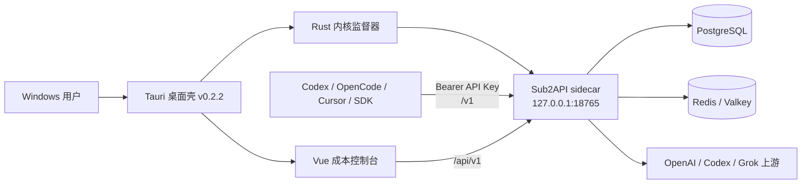
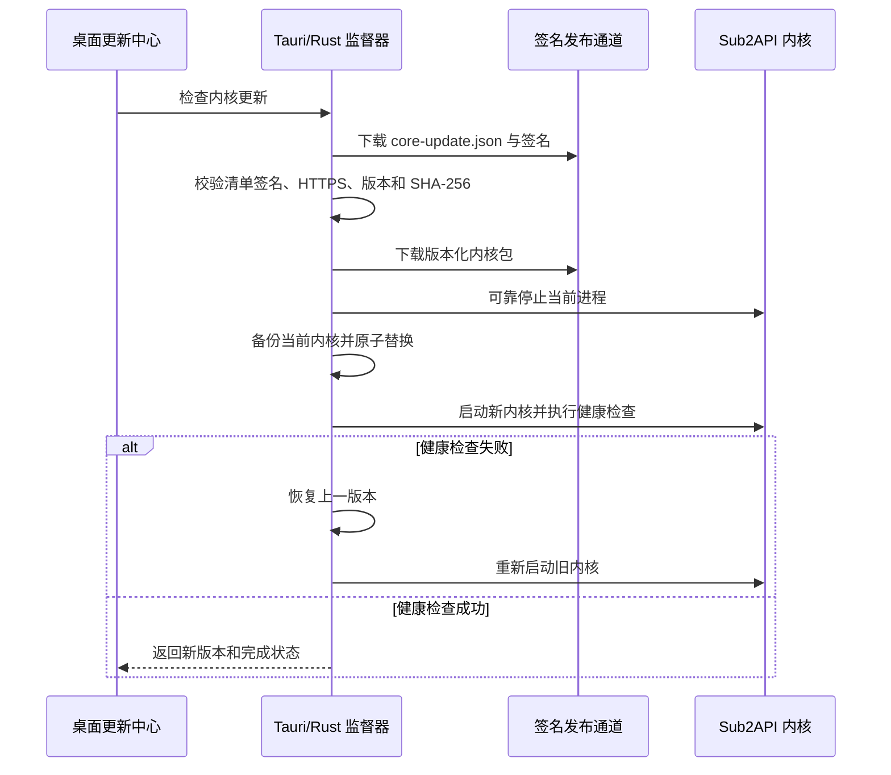

# Sub2API Cost Console 近期开发日志

> 记录周期：2026-08-04 至 2026-08-05  
> 桌面版本：`0.2.2`  
> 受管内核版本：`0.1.170-21-g825ca7b1`  
> 成本算法版本：`1.0.0`  
> 上游基线提交：`825ca7b1fc9335f904bc077f051de815fb61e47f`  
> 上游仓库：[`Wei-Shaw/sub2api`](https://github.com/Wei-Shaw/sub2api)  
> 本项目：[`renqw2023/sub2api-cost-console`](https://github.com/renqw2023/sub2api-cost-console)

## 1. 本轮目标与结果

本轮开发将原有 Sub2API 管理端扩展为面向 Windows 用户的成本运维桌面工具，重点完成了以下工作：

- 建立 Tauri 2 Windows 桌面外壳，并将本地服务端口固定为 `127.0.0.1:18765`。
- 还原并优化资产总览、上游排行、OAuth 号池三套成本运营面板。
- 号码加入系统后立即按加入时间累计采购成本。
- 增加快速安装与高级连接两种数据库配置模式。
- 将 Sub2API 内核作为受管 sidecar 随桌面端启动、停止、升级和回滚。
- 建立桌面安装包更新与内核更新两条相互独立的版本通道。
- 显示桌面版本、真实上游内核版本、成本算法版本和上游提交号。
- 修复 Windows 时区数据缺失导致内核无法重启的问题。
- 禁止桌面模式调用上游原生整包更新，统一进入受签名保护的内核更新流程。
- 优化成本控制台尺寸、圆角、密度和顶部导航，同时保持原有深色配色。
- 新增 API 接入中心，为 Codex、OpenCode、Cursor、Cline 和 SDK 用户生成本地接入配置。
- 将面板自动刷新调整为默认开启、每 30 秒刷新，并在窗口重新获得焦点时立即刷新。
- 将本地网关延迟与上游模型首 Token 延迟分开显示，避免错误归因。

## 2. 版本关系

桌面程序、受管内核和成本算法必须分别记录版本，三者不能混为一个版本号。

| 组件 | 当前版本 | 来源 | 用途 |
|---|---|---|---|
| 桌面应用 | `0.2.2` | `frontend/src-tauri/tauri.conf.json` | 窗口、安装包、桌面交互和 updater |
| 受管 Sub2API 内核 | `0.1.170-21-g825ca7b1` | `frontend/CORE_VERSION` | 本地 API 网关、管理 API、调度与账号逻辑 |
| 成本算法 | `1.0.0` | `frontend/ALGORITHM_VERSION` | 采购成本折算、累计成本和面板口径 |
| 上游提交 | `825ca7b1...` | `frontend/UPSTREAM_SUB2API_COMMIT` | 证明当前内核实际绑定的上游源码基线 |

这套设计解决了两个可追溯性问题：

1. 桌面界面更新不代表成本算法发生变化。
2. 上游发布新版本不代表当前安装包已经使用该内核。

用户在软件中看到的内核版本必须是当前正在运行的真实版本，而不是 GitHub 上的最新版本。只有内核升级成功并通过健康检查后，显示版本才会变化。

## 3. 关键提交时间线

| 提交 | 时间（America/Los_Angeles） | 内容 |
|---|---|---|
| `3ced835a3` | 2026-08-04 05:27 | 新增桌面成本运维控制台 |
| `215c9bbb9` | 2026-08-04 07:29 | 新增受管内核更新和桌面发布流水线 |
| `3f5de7969` | 2026-08-04 07:35 | 修复并校验 Tauri 发布签名链 |
| `7a4788f9f` | 2026-08-04 07:51 | 生成确定性的桌面更新清单 |
| `d2991427c` | 2026-08-04 07:56 | 修复 GitHub Release 资产命名匹配 |
| `045ee5243` | 2026-08-04 08:31 | 增加品牌、Logo、上游归属和版权说明 |
| `2b7d9c778` | 2026-08-05 02:05 | 新增数据库安装模式与首次运行向导 |
| `da6b10460` | 2026-08-05 03:18 | 绑定并展示真实上游内核版本 |
| `70db327b4` | 2026-08-05 04:34 | 轮换 updater 签名密钥和发布清单公钥 |
| `57ea566b9` | 2026-08-05 05:31 | 在内核中嵌入 Windows 时区数据 |
| `87eccf7d9` | 2026-08-05 06:39 | 桌面更新统一改走受管内核通道 |
| `64f7240c7` | 2026-08-05 07:20 | 优化成本控制台组件比例与圆角 |
| `85e369b41` | 2026-08-05 09:02 | 新增 Agent API 接入中心和实时刷新 |

## 4. 桌面运行架构



桌面端不再依赖用户手动启动一个外部 Go 服务。Tauri/Rust 层负责：

- 启动安装包内的 Sub2API sidecar。
- 将服务限制在 `127.0.0.1:18765`。
- 记录运行阶段、最后日志、内核版本和数据目录。
- 内核异常退出后按策略自动重启。
- 更新前停止内核，替换完成后重新启动。
- 新内核健康检查失败时恢复上一版本。

桌面数据目录位于当前用户的应用数据目录，不随安装包覆盖。卸载或升级桌面程序不应删除数据库配置、内核运行数据和回滚副本。

## 5. 成本面板与算法

### 5.1 工作区

成本控制台目前包含四个工作区：

1. **资产总览**：综合评分、成功率、TTFT、API 产出、采购成本和可用账号。
2. **上游排行**：逐账号展示状态、评分、采购成本、API 产出、失败率和探测数据。
3. **OAuth 号池**：按 Free、K12、Plus 等套餐统计账号数量、采购成本、产出和剩余预期。
4. **API 接入**：管理本地 Agent 接入地址、API Key、模型列表、配置模板和延迟诊断。

快捷键为 `Ctrl/Cmd + 1/2/3/4`。

### 5.2 成本起算规则

没有自定义成本档案时：

```text
started_at = account.created_at
```

即账号或号码加入 Sub2API 后立即开始累计采购成本。

周期费用统一折算为小时费率：

```text
hourly_rate = amount / billing_cycle_hours
elapsed_hours = max(0, now - started_at) / 3,600,000
accrued_cost = hourly_rate * elapsed_hours
```

支持的计费周期：

- `hourly`
- `daily`
- `weekly`
- `monthly`，按 730 小时折算
- `one_time`

当前成本算法版本固定记录为 `1.0.0`。后续若修改默认套餐价格、汇率、计费周期或累计规则，必须同步提升 `ALGORITHM_VERSION`，并记录迁移前后的口径。

## 6. 首次运行与数据库安装

### 6.1 快速安装

快速安装面向普通桌面用户，但前提是本机已安装并启动 Docker Desktop。

向导会执行：

- 检测 Docker CLI 和 Docker Engine。
- 检测本地 PostgreSQL、Redis/Valkey 以及保留端口是否已被占用。
- 使用固定镜像版本创建隔离的 PostgreSQL 16 和 Valkey 容器。
- 只将数据库端口绑定到 `127.0.0.1`。
- 随机生成数据库密码。
- 创建持久化卷并配置容器自动重启。
- 等待服务健康后自动写入桌面后端配置。

若检测到同名容器、现有数据库或端口冲突，快速安装会停止并引导用户进入高级连接，不会覆盖用户已有数据。

### 6.2 高级连接

高级连接适合以下用户：

- 已有 Docker Compose、NAS 或云数据库。
- 已安装本地 PostgreSQL/Redis。
- 需要手动指定主机、端口、用户、密码、数据库名或 TLS。
- 不希望桌面端创建受管容器。

Docker 不可用时不会静默安装未经验证的 Windows 第三方 Redis/Valkey 替代品，而是明确要求用户准备 PostgreSQL 和 Redis/Valkey，再通过高级连接完成配置。

### 6.3 未改用 SQLite、MySQL 或 MongoDB 的原因

当前 Go/Ent 后端、事务语义、查询、迁移、缓存、队列和限流均围绕 PostgreSQL 与 Redis/Valkey 建立。将数据库替换为 SQLite、MySQL 或 MongoDB 不是简单修改连接字符串，而是高风险的数据层重写。

因此本轮保持上游技术栈兼容：

- 服务器部署继续使用 PostgreSQL + Redis/Valkey。
- 桌面快速模式通过 Docker 降低安装门槛。
- 专业用户通过高级模式连接现有基础设施。

## 7. 受管内核更新

### 7.1 为什么不能调用上游原生整包更新

上游原生 `/admin/system/update` 会尝试更新整个 Sub2API 程序并自行退出。在桌面 sidecar 场景中，这会造成：

- 下载过程长时间没有桌面级进度反馈。
- 原生进程退出后，Tauri 壳无法可靠判断更新阶段。
- 用户从上游原生页面难以返回成本控制台。
- 更新文件可能与正在运行的 sidecar 互相占用。
- 失败时缺少桌面级原子替换和回滚保障。

因此桌面构建已明确禁止：

- `POST /api/v1/admin/system/update`
- 桌面模式下的原生整包回滚

桌面用户必须从“版本与更新”进入受管内核更新中心。

### 7.2 受管更新流程



更新通道地址由桌面运行时固定指向项目 Release 的 `core-channel`，清单和清单签名分开下载。内核包同时验证签名与 SHA-256，避免只依赖网络传输安全。

### 7.3 Windows 时区重启故障

曾出现以下错误：

```text
invalid timezone "Asia/Shanghai": unknown time zone Asia/Shanghai
```

原因是 Windows 受管内核运行环境不保证存在完整 IANA 时区数据库。修复方式是在 Go 内核中导入 `time/tzdata`，把时区数据编译进二进制。该修复保证安装后首次启动、自动升级后重启和回滚重启均能解析 `Asia/Shanghai`。

## 8. API 接入中心

### 8.1 桌面本地地址

外部 Agent 必须使用：

```text
http://127.0.0.1:18765/v1
```

不能使用：

```text
http://tauri.localhost
```

`tauri.localhost` 只属于桌面 WebView 内部来源，Codex CLI、OpenCode、Cursor、Cline 和其他本机程序无法把它当成 Sub2API 网关地址。

### 8.2 已实现能力

API 接入中心提供：

- 选择当前用户的启用 API Key。
- API Key 脱敏显示。
- 跳转到 API Key 管理页。
- 使用 `GET /v1/models` 测试鉴权与模型列表。
- 测试过程不发起模型推理，因此不产生模型调用成本。
- 自动填充当前 Key 可用模型。
- 生成 Codex CLI、OpenCode、Cursor、Cline、Python、Node.js 和 PowerShell/curl 配置。
- 单独复制 `OPENAI_API_KEY` 设置命令。
- 明确提示桌面程序退出后，本地接口会停止。

完整 API Key 不会直接写入大段配置预览中；配置模板只引用环境变量。用户应为不同 Agent 创建独立 Key，以便统计请求、Token、成本和限额。

## 9. 自动刷新与性能诊断

### 9.1 刷新策略

成本控制台现在默认开启自动刷新：

```text
刷新间隔：30 秒
窗口重新获得焦点：立即刷新
页面从后台恢复可见：立即刷新
已有请求未完成：不启动重叠刷新
```

“最近 1 小时、6 小时、24 小时、7 天”表示统计观察窗口，不表示用户必须等待相应时间才会看到数据。

### 9.2 同一环境中的高延迟说明

日志中出现的本地管理 API 延迟约为 `68–131 ms`，例如：

```text
GET /api/v1/admin/ops/dashboard/snapshot-v2
GET /api/v1/admin/groups/usage-summary
GET /api/v1/subscriptions/active
```

这些请求走 `127.0.0.1`，属于本地管理接口、数据库查询和前端聚合开销。

而 `/v1/responses` 中几十秒到数分钟的 TTFT 和总耗时通常来自：

- 上游模型首 Token 等待。
- 上游账号排队或限流。
- 代理链路质量。
- 账号切换与恢复。
- `XHigh` 推理强度带来的计算时间。
- 大上下文、工具调用或流式响应持续时间。

API 接入中心因此将以下指标分开显示：

- 本地 `/v1/models` 探测延迟。
- 上游 TTFT P95。
- 上游总耗时 P95。

本轮没有用缩短前端刷新间隔来掩盖上游模型延迟，也没有把上游一分钟响应错误归因于本地 `127.0.0.1` 网络。

## 10. UI 设计调整

本轮保持深绿、荧光黄、浅蓝和低饱和警告色不变，主要调整组件几何关系：

- 顶部导航由占满整列的尖锐矩形改为更紧凑的分段控制布局。
- 面板和卡片增加适度圆角，但不使用夸张药丸形容器。
- 减少无意义的空白和超大组件高度。
- 为工具按钮使用 Lucide 图标，并保留明确的文字标签或提示。
- 固定关键统计组件尺寸，避免加载状态和数字变化造成布局跳动。
- 为小屏幕增加单列布局和按钮换行策略。
- 避免卡片嵌套卡片，图表和统计区保持连续的工作台结构。

## 11. 注册失败与本地后端连接

早期注册页面提示无法连接：

```text
无法连接 Sub2API 后端
http://127.0.0.1:18765/api/v1
```

根因不是注册表单，而是桌面壳已经显示，受管后端或数据库尚未就绪。当前处理方式为：

- Tauri 启动时先启动受管内核。
- 桌面启动门在后端健康检查成功前显示明确运行阶段。
- 首次使用时进入数据库安装/连接向导。
- 后端就绪后才进入注册或登录页面。
- 桌面 WebView CORS 来源与 `127.0.0.1:18765` 本地 API 配置保持一致。

## 12. 签名、构建与发布

### 12.1 本地构建

```powershell
cd frontend
corepack pnpm@9 install --frozen-lockfile
corepack pnpm@9 desktop:build
```

NSIS 安装包输出目录：

```text
frontend/src-tauri/target/release/bundle/nsis/
```

最近一次本地验证产物：

```text
Sub2API Cost Console_0.2.2_x64-setup.exe
SHA256: 85F1D93F8C434E9574C72652240BC12F699E81A7F5AE9156470EF1920270921B
```

该文件是本地签名验证产物，不等同于 GitHub Actions 构建或正式 GitHub Release。

### 12.2 签名材料

正式构建需要：

```text
TAURI_SIGNING_PRIVATE_KEY
TAURI_SIGNING_PRIVATE_KEY_PASSWORD
```

约束：

- 私钥和密码只能保存在本机安全目录或 CI Secret 中。
- 私钥、密码文件和 `.tauri` 目录不得提交到 Git。
- `tauri.conf.json` 和 Rust 运行时只保存公钥。
- 更换私钥意味着更换 updater 信任根；已有用户无法验证新私钥签出的更新，除非先通过旧信任根发布过渡版本。

### 12.3 GitHub Actions 工作流

仓库已建立：

- `.github/workflows/desktop-release.yml`
- `.github/workflows/core-release.yml`

桌面发布流水线负责：

- Windows Runner 构建。
- Go sidecar 构建。
- Tauri NSIS 安装包构建与签名。
- GitHub Release 创建。
- updater JSON 与签名上传。
- 安装包 SHA256 文件生成。
- 独立 `core-channel` 更新资产发布。

内核发布流水线负责只更新受管内核，不要求重新安装桌面壳。

### 12.4 当前 GitHub 阻塞

2026-08-05 手动触发 `Desktop Release` 时，GitHub 返回：

```text
HTTP 422: Actions has been disabled for this user.
```

这是 `renqw2023` 账号的账户级 Actions 限制，不是 workflow 语法或仓库代码错误。网页中的“Run workflow”、`gh workflow run`、Tag 推送和 API dispatch 都无法绕过该限制。

在 Actions 权限恢复前：

- 可以在本机构建并签名安装包。
- 可以把 `.exe`、`.sig` 和 SHA256 文件上传到 OSS、COS、R2、Gitee Release 或网盘。
- 可以手动创建 Release 并上传本地产物，但这不属于 GitHub Runner 构建。
- 不能声称安装包来自 GitHub Actions。

## 13. 验证记录

本轮已执行并通过：

- `corepack pnpm@9 typecheck`
- 针对成本中心新增组件与相关视图的 ESLint 检查
- `git diff --check`
- 成本模型 Vitest：9 项测试通过
- `corepack pnpm@9 exec vite build --mode desktop`
- Rust release 构建
- NSIS 安装包生成
- Tauri 本地签名与 `.sig` 生成
- SHA256 校验生成

桌面构建时如果 `target/release` 中的 `sub2api-cost-console.exe` 或 `sub2api-backend.exe` 正在运行，Windows 会返回 `PermissionDenied / 拒绝访问`。重新构建前应先关闭正在运行的仓库构建产物；这不会删除用户数据或数据库容器。

## 14. 已知限制

1. GitHub Actions 目前因账号限制不可用，`v0.2.2` 尚未由 GitHub Runner 正式发布。
2. 当前 GitHub Release 最新桌面版本仍为 `v0.2.0`；本地 `0.2.2` 不应冒充仓库正式 Release。
3. 同版本安装包不会触发 updater。验证自动更新时必须将桌面版本提升到 `0.2.3` 或更高。
4. 快速安装依赖 Docker Desktop；没有 Docker 时必须选择高级连接。
5. 本地接口只监听 `127.0.0.1`，不能直接供其他电脑访问。
6. 对外或局域网开放 API 需要单独配置监听地址、TLS、防火墙和访问控制。
7. `/v1/models` 探测只能证明网关和鉴权可用，不能证明某个模型推理一定成功。
8. 真正的模型请求测试会产生上游调用和成本，界面必须明确提示。

## 15. 下一阶段

建议按以下顺序继续：

1. 解决 GitHub 账号级 Actions 限制，恢复仓库 CI。
2. 将桌面版本提升到 `0.2.3`，通过 GitHub Runner 生成正式 Release。
3. 在干净 Windows 10/11 环境验证快速安装、注册、登录和卸载重装。
4. 验证从旧内核检查更新、下载、签名校验、停止、替换、健康检查和回滚的完整流程。
5. 为 API 接入中心增加按 Agent/API Key 的请求、Token、成本和限额统计。
6. 增加可选的最小模型请求测试，并在执行前提示会产生费用。
7. 对高 TTFT 账号增加代理、排队、切号和失败恢复维度的诊断明细。
8. 补充数据库备份、恢复和迁移向导。

## 16. 主要文件索引

| 文件 | 作用 |
|---|---|
| `frontend/src/views/admin/CostCenterView.vue` | 成本控制台四个工作区、30 秒刷新和窗口恢复刷新 |
| `frontend/src/features/cost-center/model.ts` | 成本算法和累计成本规则 |
| `frontend/src/features/cost-center/useCostCenterData.ts` | 面板数据聚合与竞态控制 |
| `frontend/src/features/cost-center/components/CostApiAccessPanel.vue` | Agent API 接入、配置模板与延迟诊断 |
| `frontend/src/views/user/KeysView.vue` | API Key 管理及桌面本地地址修正 |
| `frontend/src/features/desktop/DesktopBackendGate.vue` | 桌面内核启动门与故障显示 |
| `frontend/src/features/desktop/DesktopUpdateCenter.vue` | 桌面/内核版本与更新交互 |
| `frontend/src/views/setup/SetupWizardView.vue` | 快速安装和高级连接向导 |
| `frontend/src-tauri/src/desktop_runtime.rs` | sidecar 生命周期、内核更新、签名校验与回滚 |
| `frontend/src-tauri/src/setup_environment.rs` | Docker、端口、PostgreSQL 和 Valkey 环境检测与部署 |
| `frontend/src-tauri/build.rs` | 将版本文件绑定到 Rust 构建 |
| `backend/internal/pkg/timezone/timezone.go` | 嵌入 IANA 时区数据库 |
| `backend/internal/handler/admin/system_handler.go` | 禁止桌面原生整包更新并引导受管更新 |
| `.github/workflows/desktop-release.yml` | 桌面安装包 GitHub Release 流水线 |
| `.github/workflows/core-release.yml` | 独立受管内核发布流水线 |
| `frontend/scripts/prepare-desktop-release.mjs` | 桌面更新清单与校验文件生成 |
| `frontend/scripts/prepare-core-release.mjs` | 内核更新清单、签名和版本化资产生成 |

---

本日志只记录已经实现和实际验证的行为。任何尚未通过 GitHub Runner、干净系统安装或真实升级链路验证的内容，均在“已知限制”和“下一阶段”中明确标注。
